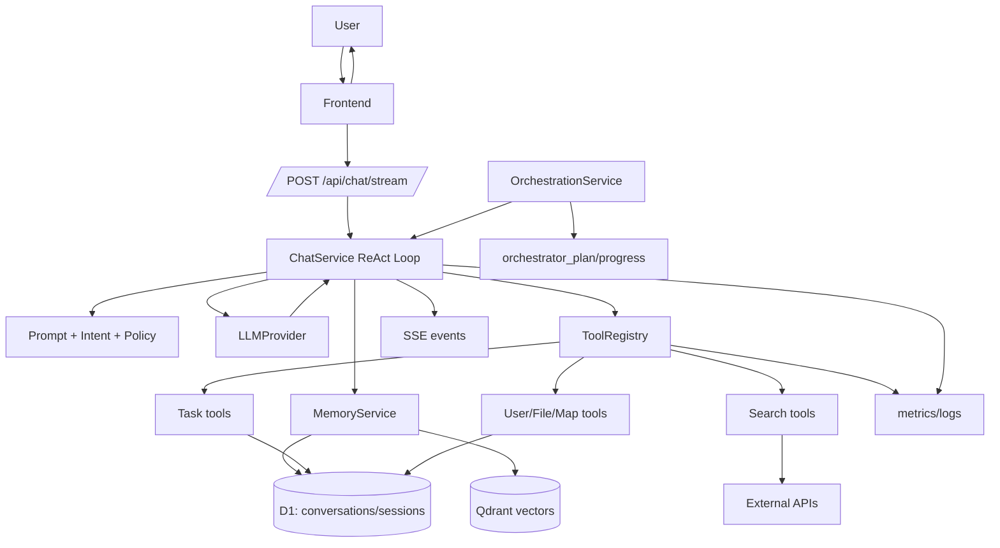

# 架构总览串讲（20 分钟）

本文用于一场完整串讲，覆盖四个主题：

- Tools 可插拔与统一执行
- 轻量多 Agent 编排
- 记忆体系（短期+长期）
- 可观测性（SSE + metrics）

并与 `ChatService` ReAct 主循环形成闭环叙事。

## 目录

- [1. 总体叙事框架（你可以这样开场）](#1-总体叙事框架你可以这样开场)
- [2. 总体架构图（1 页）](#2-总体架构图1-页)
- [3. 20 分钟讲稿（完整版）](#3-20-分钟讲稿完整版)
- [4. 5 分钟串讲版](#4-5-分钟串讲版)
- [5. 2 分钟快讲版](#5-2-分钟快讲版)
- [6. Q&A 速答（跨主题）](#6-qa-速答跨主题)
- [7. 关联文档（讲前准备）](#7-关联文档讲前准备)

---

## 1. 总体叙事框架（你可以这样开场）

这套系统的核心目标不是“做一个会聊天的 AI”，而是“做一个可执行、可验证、可运营的 AI 助理运行时”。  
实现上，我们把架构拆成五层：

1. ReAct 主循环（`ChatService`）
2. 工具运行时（`ToolRegistry`）
3. 轻量编排层（`OrchestrationService`）
4. 记忆层（D1 + Qdrant + RAG）
5. 可观测层（SSE + metrics）

一句话总结：**让模型做决策，让系统做约束，让数据做证据**。

---

## 2. 总体架构图（1 页）

---

## 3. 20 分钟讲稿（完整版）

## 0) 开场（1 分钟）

今天我讲的是这个项目的系统架构，而不是某个模型参数。  
我们解决的核心问题是：如何把“会说的 LLM”变成“会做事、可验证、可追踪”的执行系统。

---

## 1) 主心骨：ReAct 运行时（4 分钟）

`ChatService` 是主心骨。它不是一次性调用模型，而是循环：

- 模型生成
- 工具调用
- 回填工具结果
- 再生成

直到收敛或达到上限。  
这让回答建立在真实执行结果上，而不是模型猜测。

关键能力：

- 动态工具面收窄
- required 强制调用
- 门禁与重试
- 最终统一落库

所以我们把“文本生成”升级成“状态机执行”。

---

## 2) Tools：可插拔与统一治理（4 分钟）

第二层是工具运行时。  
所有工具都通过统一协议接入，由 `ToolRegistry` 做统一注册和执行。

好处有三点：

- 新增工具不侵入主链路
- 错误/埋点/审计路径一致
- 可按场景动态收窄工具集

这就是为什么任务、搜索、用户资料、文件、地图工具可以并存，并且还能保持可控。

---

## 3) Orchestration：轻量多 Agent（4 分钟）

第三层是轻量编排。  
`OrchestrationService` 先做步骤分解，决定是单步还是多步。

- 单步：直接降级普通对话
- 多步：发计划事件，注入编排上下文

在执行层面实现 task/route 分流，并用阶段门控保证顺序。  
例如任务写入没确认成功前，不进入路线步骤。

这让系统具备“多步骤执行能力”，但又不牺牲主链路稳定性。

---

## 4) Memory：短期+长期标准组合（3 分钟）

第四层是记忆。  
短期记忆来自 D1 会话历史，长期记忆来自 Qdrant 向量检索。

请求时：

- 先拉会话内最近消息
- 再做语义召回
- 把召回结果一部分作为引用发给前端，一部分注入模型上下文

检索失败可降级继续。  
所以记忆层是增强，不是可用性单点。

---

## 5) Observability：不是黑盒（3 分钟）

第五层是可观测。  
我们同时做了：

- SSE 事件（用户可见）：status/tool_call/citation/tool_result_meta/done
- Metrics（工程可见）：tool_execute/search_executed/llm_chat_stream 等

这让“用户看到的卡顿”与“工程定位的原因”可以对齐。  
系统从黑盒聊天，变成可运营运行时。

---

## 6) 收尾（1 分钟）

最后用三句话总结：

1. ReAct 是执行引擎，不是聊天技巧。  
2. Tools/Orchestration/Memory/Observability 是四个关键支柱。  
3. 我们的架构目标是：**可执行、可验证、可观测、可演进**。

---

## 4. 5 分钟串讲版

我们可以把架构理解为一个“有约束的 AI 执行系统”。  
核心是 `ChatService` 的 ReAct 循环，保证模型在需要时先调用工具、再基于结果继续推理。  
工具层通过 `ToolRegistry` 统一注册执行，做到可插拔和统一治理。  
复杂请求由 `OrchestrationService` 做轻量多步编排，支持 task/route 分流与阶段门控。  
记忆层采用 D1 会话历史 + Qdrant 语义检索，并输出 RAG 引用。  
可观测层通过 SSE 事件和 metrics 打通用户体验与工程诊断。  
所以这套系统不是黑盒聊天，而是可落地的 Agent Runtime。

---

## 5. 2 分钟快讲版

我们这套架构的重点是把 LLM 变成“可执行系统”。  
主链路是 ReAct：模型生成、工具执行、结果回填、再生成。  
工具层可插拔，统一由 `ToolRegistry` 管理；复杂需求有 `OrchestrationService` 做轻量多 Agent 分步执行。  
记忆层用 D1 + Qdrant + RAG 引用，保证连贯与召回。  
可观测层用 SSE + metrics，让流程可见、问题可查。  
一句话：我们做的是可验证的执行引擎，而不是只会说话的聊天框。

---

## 6. Q&A 速答（跨主题）

- **问：是不是过度工程？**  
  答：如果只做聊天是过度，但做任务执行和多步骤操作，这是必要工程化。

- **问：和普通 function calling 最大区别？**  
  答：我们是运行时状态机：策略收窄、门禁校验、回填循环、可观测与持久化一致性。

- **问：为什么强调可观测？**  
  答：没有可观测，agent 出问题只能猜。可观测是可运营前提。

---

## 7. 关联文档（讲前准备）

- `chat_service.md`
- `context_engineering.md`
- `prompt_engineering.md`
- `tools_plugable.md`
- `orchestration_light_multi_agent.md`
- `memory_architecture.md`
- `observability.md`
- `intent.md`
- `multi_agent.md`
- `one_page_overview.md`
