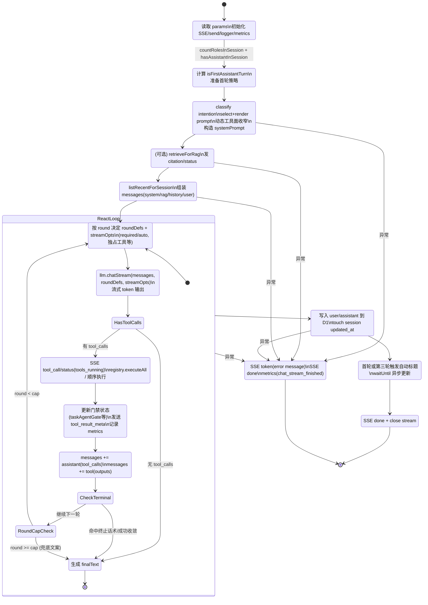

# ChatService 状态机与执行流说明

本文档面向演示与工程复盘，描述 `ChatService` 在当前项目中的内部状态机、读图要点与事件-状态转移表。

## 目录

- [演讲顺序导航（按时长）](#演讲顺序导航按时长)
- [ChatService 内部状态机图](#chatservice-内部状态机图)
- [读图要点](#读图要点)
- [事件-状态转移表](#事件-状态转移表)
- [备注](#备注)
- [演讲者备注版（口播提词）](#演讲者备注版口播提词)
- [常见 Q&A 速答（现场应答版）](#常见-qa-速答现场应答版)
- [反质疑清单（挑刺问题应对）](#反质疑清单挑刺问题应对)

---

## 演讲顺序导航（按时长）

### 12 分钟完整版（技术评审/深度分享）

1. `ChatService 内部状态机图`
2. `读图要点`
3. `事件-状态转移表`
4. `演讲者备注版（口播提词）`
5. `常见 Q&A 速答（现场应答版）`
6. `反质疑清单（挑刺问题应对）`

### 5 分钟版（对内同步/方案评审）

1. `读图要点`
2. `演讲者备注版（口播提词）` 中的 `90 秒串讲版`
3. `常见 Q&A 速答（现场应答版）`（选 3-4 个高频问题）
4. `反质疑清单（挑刺问题应对）`（选 2 个挑战问题）

### 2 分钟快讲版（面试/临时汇报）

1. `演讲者备注版（口播提词）` 中的 `90 秒串讲版`
2. `读图要点`（只讲前 3 条）
3. `反质疑清单（挑刺问题应对）` 任选 1 条作收尾

### 现场速查建议

- 先讲“主干路径 + 核心回环”，再讲“为什么可靠（门禁/上限/可观测）”。
- 如果时间被压缩，优先保留 `90 秒串讲版 + 1 条质疑应对`。
- 如果听众偏业务，减少状态细节，多讲“先动作、后反馈、可追踪”的价值。

## ChatService 内部状态机图

## 读图要点

- 主干路径是 `Init -> SessionInspect -> IntentAndPrompt -> MemoryRetrieve -> LoadHistory -> ReactLoop -> Persist -> TitleAsync -> Done`。
- 核心回环在 `ReactLoop`：`CallLLM -> (有工具?) -> ExecuteTools -> AppendBack -> 下一轮`。
- `ReactRoundStart` 是策略入口：决定本轮工具集合与 `required/auto`。
- `PostToolState` 是可靠性核心：更新门禁状态（如任务写入确认）、上报工具元信息与埋点。
- `RoundCapCheck` 防无限循环；达到上限会走兜底文本收敛。
- 持久化在回环结束后统一执行，保证 user/assistant 成对落库的一致性。
- `TitleAsync` 是非阻塞后处理：利用 `waitUntil` 异步做自动标题更新，不拖慢主响应。
- 异常路径统一收口到 `Error`：仍返回错误 token + `done`，确保前端连接有明确终止语义。

## 事件-状态转移表

| 当前状态 | 事件 | 条件（Guard） | 动作（Action） | 下一个状态 |
|---|---|---|---|---|
| `Init` | 请求进入 | 参数完整 | 初始化 `send`/logger/metrics，发送 `status: connected` | `SessionInspect` |
| `SessionInspect` | 读取会话计数完成 | 会话可用 | 计算 `isFirstAssistantTurn` 等首轮标志 | `IntentAndPrompt` |
| `IntentAndPrompt` | 意图识别完成 | always | 选模板、渲染 prompt、决定工具面与强制策略 | `MemoryRetrieve` |
| `IntentAndPrompt` | 发生异常 | always | 记录错误并发错误 token | `Error` |
| `MemoryRetrieve` | RAG 成功 | memoryService 可用 | 检索记忆、发送 `citation` | `LoadHistory` |
| `MemoryRetrieve` | RAG 跳过/失败 | memoryService 不可用或超时 | 发送 `status: memory_skipped`（可选） | `LoadHistory` |
| `MemoryRetrieve` | 发生异常 | 严重异常 | 记录错误并发错误 token | `Error` |
| `LoadHistory` | 历史加载完成 | always | 按 `session_id` 组装 messages | `ReactRoundStart` |
| `LoadHistory` | 发生异常 | always | 记录错误并发错误 token | `Error` |
| `ReactRoundStart` | 新一轮开始 | `round < cap` | 计算 `roundDefs` + `streamOpts` | `CallLLM` |
| `CallLLM` | 模型返回 | 无 `tool_calls` | 生成/收敛 `finalText` | `FinalizeText` |
| `CallLLM` | 模型返回 | 有 `tool_calls` | 发送 `tool_call` 事件，准备执行工具 | `ExecuteTools` |
| `CallLLM` | 发生异常 | always | 记录错误并发错误 token | `Error` |
| `ExecuteTools` | 工具执行完成 | always | 执行 `ToolRegistry`，收集 outputs/meta | `PostToolState` |
| `PostToolState` | 状态更新完成 | always | 更新门禁变量、发 `tool_result_meta`、记埋点 | `AppendBack` |
| `AppendBack` | 上下文回填完成 | always | `messages += assistant(tool_calls)+tool(outputs)` | `CheckTerminal` |
| `CheckTerminal` | 命中终止条件 | 门禁终止/已收敛 | 写入终止或最终文本 | `FinalizeText` |
| `CheckTerminal` | 未终止 | always | 进入轮次判断 | `RoundCapCheck` |
| `RoundCapCheck` | 继续循环 | `round + 1 < cap` | 递增 round | `ReactRoundStart` |
| `RoundCapCheck` | 达到上限 | `round + 1 >= cap` | 生成上限兜底文本 | `FinalizeText` |
| `FinalizeText` | 主循环结束 | always | 准备持久化数据 | `Persist` |
| `Persist` | 写库成功 | always | 写 user/assistant，更新 session 时间 | `TitleAsync` |
| `Persist` | 发生异常 | always | 记录错误并发错误 token | `Error` |
| `TitleAsync` | 条件满足 | 首轮/三轮且 `title_source=auto` | 异步生成并更新标题（`waitUntil`） | `Done` |
| `TitleAsync` | 条件不满足 | always | 跳过标题生成 | `Done` |
| `Done` | 收尾 | always | 发送 `done`，关闭 SSE | `[*]` |
| `Error` | 异常收敛 | always | 发送错误 token + `done`，记录完成埋点 | `[*]` |

## 备注

- 本状态机是当前实现的工程抽象，便于分享、评审、回归测试清单编写。
- 若后续引入更强的工作流编排（DAG/barrier/retry policy），建议在 `ReactLoop` 外层新增 `OrchestratorLoop` 状态域。

## 演讲者备注版（口播提词）

以下提词按状态机主干顺序编排，每段 1-2 句，可直接照着讲。

| 状态/阶段 | 口播提词 |
|---|---|
| `Init` | 这是一次对话请求的入口。我们先完成流式输出通道、日志和埋点初始化，并立刻给前端一个 `connected` 状态。 |
| `SessionInspect` | 这里会读取会话内已有的 user/assistant 计数，判断是否首轮助手回合。这个标志会影响首轮资料引导与标题策略。 |
| `IntentAndPrompt` | 先做意图分类，再选模板并渲染变量。关键是这一段会做“工具面收窄”和“是否 required”的策略决策。 |
| `MemoryRetrieve` | 如果记忆服务可用，我们先做 RAG 检索并把命中作为 `citation` 发给前端。即使检索超时也会降级，不阻断主对话。 |
| `LoadHistory` | 短期上下文按 `session_id` 读取，不混全局消息，避免多会话串话。随后组装成完整 messages 进入主循环。 |
| `ReactRoundStart` | 每一轮开始都重新计算本轮可见工具与调用策略。也就是说，策略是“轮次感知”的，而不是固定一次到底。 |
| `CallLLM` | 模型流式生成时可能直接给最终文本，也可能给 `tool_calls`。这一步是 ReAct 的分叉点。 |
| `ExecuteTools` | 一旦有工具调用，后端统一走 `ToolRegistry` 执行，并把执行过程实时通过 SSE 反馈。 |
| `PostToolState` | 这里更新门禁状态，比如任务写入确认、重试计数，并发出 `tool_result_meta`。这一步决定系统是否“可验证”。 |
| `AppendBack` | 工具结果不会只放日志，而是以 `tool` 消息回填到模型上下文。下一轮模型看到的是“真实执行结果”，不是猜测。 |
| `CheckTerminal` / `RoundCapCheck` | 命中终止条件就收敛；未收敛则继续下一轮。达到轮次上限会兜底，避免无限循环。 |
| `Persist` | 主循环结束后统一落库 user/assistant 消息，并更新会话时间。这样能保证消息对的一致性。 |
| `TitleAsync` | 首轮或第三轮时会异步生成标题。这里用 `waitUntil`，不阻塞用户主响应。 |
| `Done` | 流程完成后发送 `done` 并关闭 SSE，前端据此安全收尾。 |
| `Error` | 任何阶段异常都统一收口：返回错误 token + `done`。即使失败，也保证协议层面“有始有终”。 |

### 90 秒串讲版（可直接念）

`ChatService` 的流程可以概括为“先准备、再循环、后持久化”。准备阶段完成意图、提示词、工具策略和记忆检索；随后进入 ReAct 主循环：模型先生成，有工具就执行并把结果回填，再让模型继续生成，直到收敛或达到上限；最后统一把 user/assistant 写入 D1，并异步处理自动标题。整个过程通过 SSE 持续对外发状态、工具调用和引用命中，所以它不是黑箱聊天，而是一个可观测、可控制、可验证的执行引擎。

## 常见 Q&A 速答（现场应答版）

| 问题 | 速答（20-40 秒） |
|---|---|
| 为什么要做“工具结果回填上下文”？ | 不回填的话，模型只能“猜工具可能做了什么”。回填后模型下一轮读到的是结构化真实结果，能基于事实继续推理，显著降低“口头成功、实际失败”。 |
| 为什么不让模型一次性回答完？ | 一次性回答适合纯知识问答，但业务场景有真实动作和外部状态。多轮 ReAct 让模型“边做边看边调整”，这是从聊天到执行的关键。 |
| `toolChoice=required` 会不会太死板？ | 只在关键场景启用，比如任务写入、事实检索首轮。目的不是全局强制，而是把高风险环节从“建议调用”升级为“协议约束”。 |
| `required` 是否能保证一定调用“正确工具”？ | 不能。`required` 只保证“要调用某个工具”。我们再叠加工具面收窄、门禁校验和重试策略，才能把正确率拉到工程可用。 |
| 为什么要有轮次上限？ | 防止无限循环、成本失控和长尾卡死。上限不是失败，而是系统保护机制；达到上限会给可解释兜底文案，保证请求可终止。 |
| 为什么历史按 `session_id` 而不是按用户最近消息？ | 按会话隔离可以避免多主题串线。用户在不同会话并行讨论不同任务时，上下文不会互相污染。 |
| SSE 为什么要有这么多事件，不只 token？ | token 只能展示“在输出字”。我们增加 status/tool_call/citation/tool_result_meta，让前端能解释“系统正在做什么”，提升透明度和信任感。 |
| 工具调用失败怎么办？ | 失败会进入标准输出链路：记录埋点、返回可解释结果、必要时继续下一轮或降级，不会静默吞错。用户能看到明确反馈。 |
| 为什么持久化放在循环末尾？ | 这样可以把一轮 user/assistant 成对写入，保证一致性。中间态主要通过事件流暴露，最终态再落库。 |
| 自动标题为什么异步处理？ | 标题是增强体验，不是主路径。异步化可以降低主请求延迟，优先保证用户尽快看到回答。 |
| 如果 memory/RAG 超时，会不会整轮失败？ | 不会。记忆检索是可降级组件，超时后会继续主链路并给状态提示，保证核心对话可用性。 |
| 这个架构和普通 function-calling demo 最大差别是什么？ | demo 通常只有“模型调一次工具”。我们是完整运行时：动态工具策略、强制调用、门禁、回填循环、SSE可观测、持久化一致性与后处理。 |

### 面试官追问加深（可选 10 秒补充）

- “核心不是会不会调工具，而是把工具调用做成**可控状态机**。”  
- “我们把 LLM 从文本生成器，升级成了一个有边界、有证据链的执行引擎。”  
- “如果只看回答质量，这是模型能力；如果看动作可靠性，这是系统设计能力。”  

## 反质疑清单（挑刺问题应对）

> 用法建议：先“承认边界”，再“说明控制点”，最后“给证据路径”。

| 质疑 | 回应话术（建议） | 证据点（项目内） |
|---|---|---|
| 这不就是普通 function calling 吗？ | 表面相似，但我们做的是运行时，不是单次调用。关键差别是动态工具面、required 强制、门禁校验、回填循环、SSE可观测和落库一致性。 | `ChatService` 回环、`ToolRegistry` 统一执行、`SSE` 多事件协议 |
| “required” 也不能保证正确调用，有什么意义？ | 对，单独 `required` 不够，所以我们是三件套：工具面收窄 + required + 结果门禁。它把失败空间从“无限”压到“可控”。 | `task-mutation-intent`、`chat-service` 回合策略、`task-agent-state` 门禁 |
| 规则这么多，会不会太脆弱？ | 规则层确实有维护成本，但这是把高风险场景工程化的必要代价。我们把规则聚焦在关键路径，普通场景仍保持模型自主。 | 仅关键意图启用强制策略；其余回合 `auto` |
| 你们是不是过度工程，牺牲了响应速度？ | 会有额外开销，但这是可控的：有轮次上限、异步后处理、失败降级。我们优先保证“可完成动作”和“可解释结果”。 | `MAX_REACT_ITERATIONS`、`waitUntil` 标题异步、memory 超时降级 |
| 为什么不直接把业务逻辑写死，不让模型决策？ | 写死流程能做固定场景，但扩展成本高。我们保留模型在工具空间内的策略能力，同时用系统约束保证关键动作可靠。 | 动态工具集 + 门禁组合 |
| RAG 不稳定怎么办？ | RAG 是增强层，不是主路径。检索失败会降级继续对话，不会让整轮不可用。 | `memory_skipped` 状态与超时兜底 |
| 工具失败会不会被模型“润色成成功”？ | 这是我们重点防的。工具结果回填为结构化消息，门禁看 `ok` 字段，关键场景需要确认通过才允许成功话术。 | `confirm_tool_creation`、`reduceTaskAgentGateAfterTool` |
| 多轮循环会不会无限跑、烧钱？ | 不会。每请求有明确上限，达到上限给兜底响应并结束，保证可终止和成本边界。 | `MAX_REACT_ITERATIONS` 与事实检索特定上限 |
| 这套方案换模型会不会失效？ | 抽象层统一了 `toolChoice` 和消息协议，provider 负责映射到各厂商参数。迁移模型主要改 provider，不改主循环。 | `LLMProvider`、`gemini-provider`、`qwen-provider` |
| 你们怎么证明它“真的更可靠”？ | 看三类证据：工具调用轨迹、门禁命中与重试日志、最终落库一致性。可靠性不是主观感觉，而是可审计的执行链。 | `tool_execute` 埋点、`tool_invocations`、D1 对话与任务记录 |
| 这会不会让提示词太复杂、难维护？ | 是的，复杂度会上升。我们通过模板化、状态机化和文档化来控复杂度，后续可进一步配置化。 | `PromptService` + 本文档状态机/转移表 |
| 如果模型厂商变更 API 语义怎么办？ | 影响主要收敛在 provider 层。运行时仍基于统一接口和状态机，业务层改动最小。 | `LLMProvider` 抽象边界 |

### 质疑应对模板（30 秒）

可以按这个固定结构回答：

1. **先承认**：这个质疑成立，单点方案确实有边界。  
2. **再说明**：我们不是靠单点，而是“策略约束 + 运行时门禁 + 可观测证据链”的组合。  
3. **给证据**：指出对应状态、埋点、落库记录或具体代码路径。  
4. **补路线**：说明下一步优化方向（配置化、工作流化、指标化）。

示例短句：

- “你说得对，`required` 单独不够，所以我们叠加了工具收窄和确认门禁。”  
- “我们不追求零失败，而是追求‘失败可见、可恢复、可审计’。”  
- “这套设计的核心价值不是更会说，而是动作结果可被系统验证。”  
