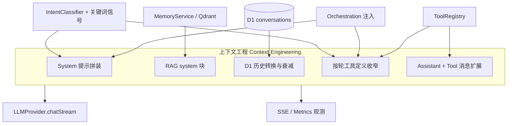

# 上下文工程（Context Engineering）

本文作为独立主题，描述**当前实现里「模型可见上下文」如何被裁剪、增强与约束**，以及它与记忆、工具、多 Agent、意图、可观测性等模块的**交界与数据流**。

> **边界**：上下文工程关注「喂给模型的 token 与工具面」；不负责业务持久化细节（但会消费记忆与工具结果）。

## 目录

- [1. 在本项目中，上下文工程指什么](#1-在本项目中上下文工程指什么)
- [2. 上下文分层与拼装顺序](#2-上下文分层与拼装顺序)
- [3. 与各主题文档的交界（关系与交互）](#3-与各主题文档的交界关系与交互)
- [4. 关键实现索引](#4-关键实现索引)
- [5. 设计权衡](#5-设计权衡)
- [6. 演进建议](#6-演进建议)
- [7. 10 分钟讲稿](#7-10-分钟讲稿)
- [8. 5 分钟讲稿](#8-5-分钟讲稿)
- [9. 2 分钟讲稿](#9-2-分钟讲稿)
- [10. 快速 Q&A](#10-快速-qa)

---

## 1. 在本项目中，上下文工程指什么

可以概括为四件事：

1. **System 侧**：系统提示如何由「模板 + 用户画像槽位 + 动态追加块」拼成，并如何随场景变化（时钟、搜索关闭、任务纪律、编排子步说明等）。
2. **记忆侧**：长期语义召回（RAG 文本块）与短期会话历史（D1）如何进入同一条 `messages` 数组，以及历史如何做**时间衰减与截断**。
3. **工具侧**：每一轮 API 调用暴露给模型的 **ToolDefinition 列表**不是常量全集，而是按意图、编排模式、专责 Agent **动态收窄**；ReAct 循环中再注入 **assistant tool_calls + tool 结果**。
4. **可观测侧**：上下文构建与流式阶段通过 **SSE / metrics** 对外显式化，便于调试「模型当时到底看见了什么策略」。

---

## 2. 上下文分层与拼装顺序

### 2.1 进入主 ReAct 循环前：首轮 `LLMMessage[]` 骨架

`ChatService.handleMessageStream` 在流式主循环前组装的典型顺序为：

1. **`role: system`**：`promptService.render(...)` 产出主系统提示（内含当前轮可选的**工具定义列表** `toolsForPrompt` 的序列化/说明，取决于模板实现）。
2. **`role: system`（可选）**：`ragContextBlock` — 来自 `MemoryService.retrieveForRag`，即长期向量记忆的检索摘要块。
3. **多条 `user` / `assistant`**：由 `conversationRowsToLlmMessages` 从 D1 近期会话行转换而来（带**按时间与意图衰减的截断/折叠**）。
4. **`role: user`**：本轮用户输入。

这与 `memory_architecture.md` 中的「D1 短期 + Qdrant RAG 两路进 prompt」一致；**RAG 单独占一条 system 切片**，便于与主 system 解耦。

**走读案例**：用户问「早～还记得昨天我们都聊了啥吗？」时，哪些内容真正进入上下文、RAG 是否召回聊天记录、跨会话边界如何——见 **`memory_architecture.md` §3.7**。

### 2.2 System 提示内部的「动态追加」逻辑（同一 blob，多源拼接）

在同一段最终 `systemPrompt` 字符串上，按条件叠加（顺序与条件以代码为准），包括但不限于：

- **时钟块** `formatSystemClockBlock()`（置前，减轻模型忽略「当前时间」的问题）。
- **首轮资料引导**（首条 assistant 回复前）。
- **路线场景**下的工具引用提示 `ROUTE_QUERY_TOOL_CITATION_HINT`。
- **Serper 未注册**时的能力说明 `SERPER_DISABLED_SYSTEM_APPEND`。
- **联网找图 / 事实检索**专段的纪律说明（`WEB_IMAGE_FORCE_SYSTEM_APPEND` / `FACTUAL_SEARCH_FORCE_APPEND`）。
- **任务突变**收窄时的强制首轮说明（编排 Task Agent 与普通任务域略有不同）。
- **任务写入纪律** `TASK_MUTATION_SYSTEM_APPEND`（当本轮工具列表含写任务类工具时）。
- **编排 Task / Route 子步**追加：`buildOrchestrationTaskAgentSystemAppend` / `buildOrchestrationRouteAgentSystemBlock`。
- **编排层通用追加** `orchestrationSystemAppend`。

以上全部是 **context engineering**：通过**文本策略**改变模型在**同一用户话**下的行为边界。

### 2.3 ReAct 循环内：每轮扩展上下文

每一轮模型若返回 `tool_calls`：

- `messages` 追加 **`assistant`**（含 `content` 与 `tool_calls`）。
- 再为每个调用追加 **`tool`** 消息（`content` 为工具 JSON 输出，`tool_call_id` 与 `ToolRegistry` 约定一致）。

随后进入下一轮 `chatStream`；**工具定义集合 `roundDefs` 仍可按轮次变化**（例如首轮仅 `search`、仅 `amap_*`、仅任务域工具等），这是**对 API 上下文的另一维工程**。

---

## 3. 与各主题文档的交界（关系与交互）

| 主题文档 | 与上下文工程的关系 | 交互方式（简述） |
|----------|-------------------|------------------|
| **`memory_architecture.md`** | 长期记忆如何**注入**上下文 | `retrieveForRag` → 第二条 system（`ragContextBlock`）+ SSE `citation`；与 D1 历史并列，**不改变** ReAct 工具协议本身 |
| **`tools_plugable.md`** | 工具作为**可变 API 上下文** | `ToolRegistry.getDefinitions()` 提供全集；`ChatService` 按策略选 `toolsForPrompt` / `roundDefs`；执行结果回填为 `tool` 消息 |
| **`multi_agent.md` / `orchestration_light_multi_agent.md`** | **角色模式**改写 system 与工具面 | 编排注入 `orchestrationSystemAppend`、Task/Route 专责参数 → 收窄工具、`tool_choice`、顺序执行与门禁（上下文 + 运行时策略一体） |
| **`intent.md`** | **意图 → 模板与策略的前置路由** | `IntentClassifier.classify` → `PromptService.selectTemplate`；并与关键词、`route_query`、任务突变信号等**共同决定**工具面与追加文案 |
| **`prompt_engineering.md`** | **主 system 模板的存储与渲染** | D1 `prompt_templates` + `render` 槽位；与本文的 RAG/历史/tool 消息拼装前后衔接；策略长文见 `chat-service` 常量 |
| **`observability.md`** | 上下文的**外显与度量** | SSE：`status` / `intention` / `citation` / `tool_call` / `token` / `orchestrator_progress` 等；`logLlmMessagesSnapshot`、`recordMetric` 记录轮次与工具规模 |
| **`chat_service.md`** | 状态机承载上述逻辑的**主轴** | 同一文件中串联：意图 → system 拼装 → RAG → 历史 → 多轮工具循环与门禁 |

### 3.1 关系总览图

---

## 4. 关键实现索引

| 能力 | 主要位置 |
|------|-----------|
| 首轮 `messages` 组装 | `backend/src/chat/chat-service.ts`（`messages = [system, rag?, ...history, user]`） |
| 历史截断与时间衰减 | `backend/src/chat/history-for-llm.ts`（`conversationRowsToLlmMessages`） |
| 意图与模板 | `backend/src/intent/intent-classifier.ts`、`PromptService`（由 `chat-service` 调用） |
| System 动态追加与工具面决策 | `chat-service.ts`（`toolsForPrompt`、`roundDefs`、`streamOpts.toolChoice` 等） |
| RAG 检索与引用块 | `backend/src/memory/memory-service.ts`（`retrieveForRag`） |
| 工具执行与回填 | `backend/src/tools/tool-registry.ts` + `chat-service` ReAct 循环 |

---

## 5. 设计权衡

- **优点**
  - 模板 + 条件追加，使**同一套 ChatService** 能覆盖闲聊、路线、搜索、任务写入、编排子步等多种「上下文人格」。
  - RAG 与主 system 分离，便于失败降级（无 RAG 仍对话）。
  - 工具面收窄降低误调用，是**上下文工程与策略工程**的结合。
- **代价**
  - System 字符串变长，需警惕**淹没效应**（故有时钟块置前、专段追加等技巧）。
  - 条件分支多，**可读性与可测试性**依赖日志与快照（见可观测性）。
  - 多模块交界：改意图或编排时，要同步检查**工具列表与追加文案**是否一致。

---

## 6. 演进建议

- 将「追加块」与「工具面规则」逐步**表格化/配置化**，减少硬编码长字符串分散在 `chat-service.ts`。
- 对关键路径做 **fixture 级 golden test**（脱敏后的 `messages` 快照），防止无意改动上下文。
- 明确 **Context Budget**：对 RAG 条数、历史窗口、system 最大长度做统一预算与裁剪策略文档化。

---

## 7. 10 分钟讲稿

上下文工程在这套系统里，就是：**在进模型之前，把所有该让模型「看见」的东西，按顺序和策略拼好**。

第一层是 **system**。它不是静态的：先选意图和模板，再渲染用户昵称、偏好，再决定这一轮 **API 里挂哪些工具定义**——全量还是只给高德、只给搜索、只给任务域。然后是一串条件追加：当前时间、是否禁用联网搜索、任务写入纪律、编排里当前子步要遵守什么。这些都是为了在同一用户问题下，**收窄模型的行动空间**。

第二层是 **记忆**。短期记忆从 D1 拉最近消息，但不是全文堆进去，而是按时间和意图做截断和折叠，避免老对话占满窗口。长期记忆走 Qdrant，检索结果单独放在另一条 system 里，形成「相关历史记忆」块，同时通过 citation 事件给前端展示来源。

第三层是 **ReAct 循环**。模型一旦发起 tool call，我们就把 assistant 和 tool 结果写回消息列表，再进下一轮；而且每一轮的工具列表还可以再变。所以上下文工程不只是首包，而是**随轮次演化的动态上下文**。

它和几份主题文档的关系很直接：记忆文档讲的是 D1 和 RAG **怎么进**上下文；工具文档讲的是工具定义和执行结果 **怎么进出**消息；多 Agent 和编排文档讲的是 **谁在什么时候改写** system 和工具面；意图文档讲的是 **路由到哪套模板和策略**；可观测性讲的是我们怎么 **向外证明**当前阶段和调用。最后，ChatService 状态机把这些串成一条轴。

代价是 system 会越来越长，分支会变多，所以后续要适当配置化、做快照测试，否则很难安全演进。

---

## 8. 5 分钟讲稿

上下文工程在这里就是三件事：**怎么拼 system、怎么拼历史与 RAG、怎么在多轮里塞工具结果**。

意图决定模板和一大块策略；编排和专责模式会再往 system 里加「当前子步」说明，并收窄每轮能看到的工具。D1 提供近期对话，但会做时间衰减；Qdrant 提供 RAG 块单独一条 system。模型调工具后，我们把输出写回 messages 再请求下一轮。

它和记忆、工具、多 Agent、意图、可观测性都是**交界关系**：记忆和工具是「内容来源」，意图和编排是「策略来源」，可观测性是「验证我们拼得对不对」的手段。

---

## 9. 2 分钟讲稿

上下文工程 = **进模型前的消息与工具面设计**。System 由模板加一堆按场景追加的纪律文本；历史来自 D1 并会截断；RAG 来自 Qdrant 单独一条 system；ReAct 里再叠 assistant 和 tool 消息。意图和编排决定用哪套模板、哪些工具；可观测性用 SSE 和 metrics 把阶段和调用露出来。ChatService 把这一切串在主循环里。

---

## 10. 快速 Q&A

- **问：上下文工程和 Prompt Engineering 有什么区别？**  
  **答**：Prompt 常指「写好的提示词文本」；这里更广，还包括**历史裁剪、RAG 注入、工具列表按轮变化、tool 结果回填**，即**整条 LLM 输入管线**。

- **问：为什么 RAG 不放 user 里而要单独 system？**  
  **答**：实现上便于与主 system 解耦、失败时整段省略；同时语义上强调「检索到的证据」与「用户原话」分层（具体模板仍可调整）。

- **问：最该小心的坑是什么？**  
  **答**：**工具面与 system 纪律不一致**（例如 system 要求 add_task，但工具列表里没注册）；或编排与意图组合后**条件分支漏测**。

- **问：和 `chat_service.md` 会不会重复？**  
  **答**：`chat_service.md` 侧重**状态机与事件转移**；本文侧重**模型可见上下文的构成与跨模块交界**，互补阅读。
