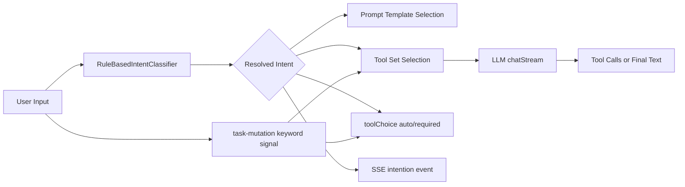

# 意图识别设计（Intent Classification）

本文作为独立主题，介绍当前系统中的“意图识别”能力：原理、设计、实现、权衡与演讲稿。

## 目录

- [1. 意图识别在系统里的作用](#1-意图识别在系统里的作用)
- [2. 当前实现概览](#2-当前实现概览)
- [3. 识别策略与规则设计](#3-识别策略与规则设计)
- [4. 与 ChatService 的联动（关键）](#4-与-chatservice-的联动关键)
- [5. 结构图（从输入到策略）](#5-结构图从输入到策略)
- [6. 设计权衡](#6-设计权衡)
- [7. 未来演进路线](#7-未来演进路线)
- [8. 10 分钟讲稿](#8-10-分钟讲稿)
- [9. 5 分钟讲稿](#9-5-分钟讲稿)
- [10. 2 分钟讲稿](#10-2-分钟讲稿)
- [11. 一句话 Q&A](#11-一句话-qa)

---

## 1. 意图识别在系统里的作用

意图识别不是“给回复贴标签”，而是主链路路由器，直接影响：

- 选哪个 prompt 模板（`prompt_templates.scenario`）
- 首轮工具面是否收窄（任务/搜索/路线）
- 是否触发强制工具调用（`toolChoice=required`）
- 后续编排策略（如 route 专责轮）

换句话说，它是 ReAct 主循环的“前置策略控制器”。

---

## 2. 当前实现概览

- 接口：`IntentClassifier.classify(userInput): Promise<string>`
- 默认实现：`RuleBasedIntentClassifier`
- 已定义意图（`KNOWN_INTENTS`）：
  - `greeting`
  - `task_operation`
  - `interview`
  - `research`
  - `route_query`
  - `file_upload`
  - `workspace_operation`
  - 以及 fallback：`default`

实现位置：

- `backend/src/intent/intent-classifier.ts`
- 接入点：`backend/src/chat/chat-service.ts`

---

## 3. 识别策略与规则设计

### 3.1 顺序优先（first match wins）

规则按数组顺序匹配，先命中先生效。  
这让我们可以显式控制冲突场景，例如：

- `file_upload` 放在 `workspace_operation` 前，避免“上传到工作空间”被误判为工作空间管理。

### 3.2 fallback 不作为显式正则

`default` 不写全通配规则（避免提前吞掉所有输入），只在全部规则不命中时返回 `default`。

### 3.3 规则是“可注入”的

`RuleBasedIntentClassifier` 构造函数支持注入自定义规则表，便于：

- 集成测试
- A/B 策略试验
- 未来替换为 LLM 分类器

---

## 4. 与 ChatService 的联动（关键）

`ChatService` 中意图识别结果会驱动四类决策：

1. **模板选择**
   - `promptService.selectTemplate(intention)`
2. **工具面收窄**
   - 如 `route_query` 可收窄到 `amap_*`
   - 图像/事实检索场景可收窄到 `search`
3. **强制调用策略**
   - 特定场景把 `toolChoice` 设为 `required`
4. **意图后修正（第二层信号）**
   - `task-mutation-intent` 会再做关键词判定，纠正仅靠主意图可能遗漏的任务写入场景

也就是说，系统不是“只有一层意图识别”，而是“主分类 + 任务突变信号”的双层策略。

---

## 5. 结构图（从输入到策略）

---

## 6. 设计权衡

- **优点**
  - 快速、稳定、可解释（比黑盒分类更容易调试）
  - 无额外模型调用成本
  - 可通过规则顺序做精细冲突控制
- **不足**
  - 规则维护成本会随场景增长
  - 语义泛化能力有限（长尾表达可能漏判）
  - 多语种/跨语义风格时需要持续补规则

---

## 7. 未来演进路线

- 规则 + LLM 混合分类（先规则，后低成本 LLM 兜底）
- 建立意图评估集（离线回放 + 精确率/召回率指标）
- 将部分策略规则配置化（减少硬编码）

---

## 8. 10 分钟讲稿

意图识别在我们系统里不是附属功能，而是策略入口。  
每次用户输入先经过 `IntentClassifier`，再决定 prompt、工具集合和调用策略。  
所以它直接影响系统是“只回答”还是“执行动作”。

当前实现是 `RuleBasedIntentClassifier`，识别 `greeting/task_operation/interview/research/route_query/file_upload/workspace_operation/default` 这些意图。  
我们采用“顺序优先”规则：先命中先生效，这样冲突可控。  
例如上传相关规则放在 workspace 规则前，避免误判。

识别结果进入 `ChatService` 后，会触发四件事：  
第一，选模板；第二，工具面收窄；第三，是否 required 强制工具调用；第四，发 `intention` 事件给前端。  
这里还有一个工程细节：我们额外有 `task-mutation` 信号层，专门补任务写入场景。  
也就是说即使主意图没判成 task_operation，只要关键词命中任务突变语义，仍能触发任务工具强制链路。

为什么这样设计？  
因为纯规则分类虽然快，但有漏判风险；而任务写入是高风险动作，不能靠“模型自己悟”。  
所以我们做双层策略，提升关键路径可靠性。

权衡也很明确：  
规则法可解释、成本低、延迟小，但随着场景增长维护压力会上升。  
后续路线是“规则 + LLM 兜底”的混合分类，并通过回放评估集持续校准。

一句话总结：  
我们把意图识别做成“策略编排入口”，而不是“语义标签器”。

---

## 9. 5 分钟讲稿

在这个系统里，意图识别决定后续执行策略。  
`RuleBasedIntentClassifier` 先把输入映射到已知意图，再由 `ChatService` 根据意图选择模板、工具面和调用策略。  
规则是顺序优先，所以我们能处理冲突输入，比如上传和工作空间场景。  
此外还有 `task-mutation` 二层信号，专门兜底任务写入类语义。  
这样做的目标是：关键动作场景宁可保守也要可靠。

---

## 10. 2 分钟讲稿

我们的意图识别是主链路路由器，不只是标签。  
它先用规则分类输入，再驱动模板选择、工具收窄和是否强制调用工具。  
同时我们叠加了任务突变信号做二次兜底，确保高风险任务写入场景不漏判。  
所以它的价值在于“策略控制与可靠执行”，而不只是语义归类。

---

## 11. 一句话 Q&A

- **问：为什么不用纯 LLM 分类？**  
  答：规则法更可解释、低成本、低延迟，当前阶段更稳；后续可叠加 LLM 兜底。

- **问：规则会不会越来越难维护？**  
  答：会，所以我们把它定位为“可演进中间态”，并已预留可注入规则与混合分类路线。
