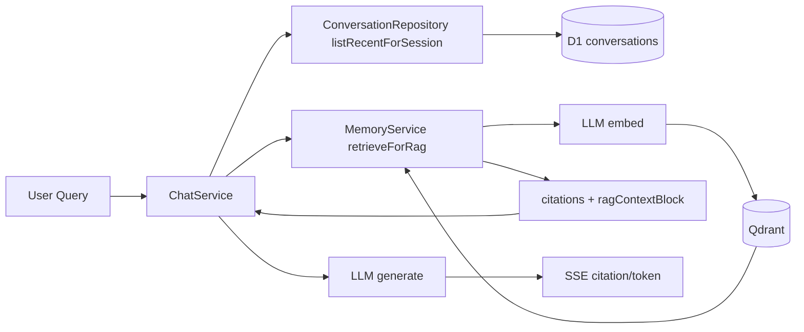

# 短期 + 长期记忆架构（D1 + Qdrant + RAG）

本文对应主题：

- 短期+长期记忆雏形
- 会话历史（D1）+ 向量记忆（Qdrant）+ RAG 引用输出
- RAG 检索为**单路** Qdrant 向量检索（非多索引并行融合）；与 D1 近期窗口是**两路进 prompt**，见 §3.4
- **无向量后精排（rerank）**：当前仅用 Qdrant 相似度 + `minScore` + `limit`；是否需要与如何加，见 §3.5
- **GraphRAG**：当前未实现；与向量 RAG 互补的规划见 **§3.6** 及技术文档 [`graphrag_integration_plan.md`](../technical/graphrag_integration_plan.md)
- **端到端案例**：用户问「还记得昨天聊了什么吗？」时系统如何用 D1 / RAG / 时钟拼装上下文，见 **§3.7**

## 目录

- [1. 记忆分层原理](#1-记忆分层原理)
- [2. 架构图](#2-架构图)
- [3. 相关实现](#3-相关实现)
- [4. 设计权衡](#4-设计权衡)
- [5. 演进建议](#5-演进建议)
- [6. 10 分钟讲稿](#6-10-分钟讲稿)
- [7. 5 分钟讲稿](#7-5-分钟讲稿)
- [8. 2 分钟讲稿](#8-2-分钟讲稿)

---

## 1. 记忆分层原理

### 1.1 为什么要分层

单一历史窗口会遇到两类问题：

- 会话变长后上下文预算不够
- 跨轮次/跨资料的“语义相关信息”难召回

因此采用两层：

- **短期记忆（Session-local）**：D1 会话历史，保证当前线程连续性
- **长期记忆（Semantic）**：Qdrant 向量检索，按相关性召回历史片段或文档片段

---

## 2. 架构图

---

## 3. 相关实现

### 3.1 短期记忆（D1）

- `ConversationRepository.listRecentForSession(sessionId, limit)`  
- 按 `session_id` 获取最近 N 条并正序回放
- 避免“全用户混排历史”导致主题串线

### 3.2 长期记忆（Qdrant）

`MemoryService` 负责：

- `addToMemory(...)`：文本向量化后写入向量库
- `retrieveWithScores(...)`：按 `user_id` + 可选过滤召回
- `retrieveForRag(...)`：产出
  - `citations`（结构化引用，用于前端展示）
  - `ragContextBlock`（注入 system/context）

过滤维度支持：

- `semantic_type`
- `folder_path`
- `tags`

### 3.3 RAG 注入方式

`ChatService` 在进入主循环前调用 `retrieveForRag`：

- 发 `citation` SSE 事件
- 将 `ragContextBlock` 追加到消息上下文
- 检索失败时降级继续（`memory_skipped`）

这使记忆层是“增强能力”，不是可用性单点。

### 3.4 RAG 检索路径：是否「多路召回」

**结论（按业界常说的「多路 RAG」）**：当前实现**没有**「对多个独立数据源各检索一遍再融合」的多路召回；RAG 侧是 **一次 query embedding + 一次 Qdrant 向量检索**（单一 collection / 单一 `search` 请求）。

**实现要点**（对应 `MemoryService.retrieveWithScores` → `VectorStore.search`）：

- 对用户当前输入（或检索 query）只做 **一次** `embed`。
- 只做 **一次** `vectorStore.search(vector, filter, limit)`；可选的 `semantic_type` / `folder_path` / `tags` 等是在**同一次检索**里缩小过滤条件，**不是**再起第二路检索。
- 返回结果里可以混有 **对话片段**与**文档片段**：靠 payload 里的 `type: 'conversation' | 'document'`（及 `file_id` 等）区分来源语义。这是 **单路向量检索、命中多种内容类型**，不要与「多索引并行召回」混淆。

**与短期记忆一起进模型时的表述**：

- 从用户视角，一轮对话的上下文里往往同时有：**D1 上的本会话近期消息**（`listRecentForSession`）和 **RAG 块**（`ragContextBlock` + `citations`）。这是 **两种进 prompt 的通道**。
- 其中 **RAG 模块本身**仍是上述 **单路** Qdrant 检索；**没有**例如「向量库 + 全文库 hybrid」「多 collection 各查 topK 再 merge」等实现。

若后续要做真正的多路召回，典型方向包括：多 collection 并行 search 与重排序、BM25 + 向量混合、或外接第二知识库再融合——均需额外工程与合并策略。

### 3.5 RAG 精排（rerank）：现状、必要性与架构思考

#### 现状：有没有做 rerank？

**没有。** `MemoryService.retrieveWithScores` 的流程是：

1. 对 query **一次** `embed`，**一次** `vectorStore.search`（为通过 `minScore` 过滤，会将 `limit` 放大为 `rawLimit ≈ max(limit×4, limit)` 多取候选，属**召回扩窗**）。
2. 用 **Qdrant 返回的 `score`**（余弦相似度语境）过滤 `minScore`，再 **`slice(0, limit)`** 截断。

**没有对候选片段做第二阶段的交叉编码器 / LLM / 学习式重排序**；最终顺序即过滤后保留的向量检索顺序。

#### 现在有没有必要上 rerank？

**多数情况下暂不必须**，原因包括：

- **Top-K 很小**（默认 `limit = 5`），向量检索分数在「同一 embedding 空间」下往往已足够区分明显不相关片段。
- **单路召回**，没有「多路合并后需统一尺度」的问题；rerank 的典型刚需场景是 **hybrid（稀疏+稠密）或多源 topK 拼接**后分数不可比。
- **延迟与超时**：主链路已有 `MEMORY_RAG_TIMEOUT_MS`（`ChatService`）；再加 rerank 服务或二次模型调用会吃同一预算，需单独评估。

**何时值得考虑**：用户反馈「引用了错误记忆片段」、同意图下 **语义近邻抢前排**、或未来引入 **多路召回 / 更长候选列表** 时，rerank 的收益会明显上升。

#### 将来若要增加 rerank，可如何设计（架构级，非当前实现）

| 层级 | 思路 | 解决的问题 | 主要代价 |
|------|------|------------|----------|
| **轻量规则** | 按 `type`、`file_id`、时间衰减、`semantic_type` 对向量分做加权或 tie-break | 业务可解释的偏置（如优先文档 vs 对话） | 非语义，防不了「内容像但不相关」 |
| **交叉编码器 rerank** | 对 (query, passage) 用小模型打相关分，在 topM（如 20）上重排后取 topK | 比双塔向量更准的「逐对」相关性 | 延迟、部署（Worker 内或侧车）、模型选型 |
| **LLM rerank** | 让模型输出排序或剔除；仅用于小 M | 强语义判断 | 成本高、需严格 JSON 协议与超时 |
| **多路后的 rerank** | 与 §3.4 的 hybrid/多 collection 配套：先融合候选再统一 rerank | 分数尺度不一 | 系统复杂度显著上升 |

**接入点建议**（与现有代码形态对齐）：

- 在 **`MemoryService.retrieveWithScores` 返回前** 插入可选步骤：`rerankHits(query, hits, { maxInput: M })` → 仍返回 `MemoryHit[]`，保证 **`retrieveForRag` / citation / ragContextBlock** 顺序一致。
- **可配置**：`MemoryRetrieveOptions` 扩展 `rerank?: 'off' | 'cross_encoder' | ...`，默认 `off`，便于灰度。
- **可观测**：对 rerank 前后顺序打日志或 metric（如 `memory_rerank_delta`），便于 A/B。
- **超时**：rerank 耗时计入现有 RAG 超时或单独子超时，**失败则回退为向量序**，避免拖死主链路。

#### 文档放在哪里：单独 `rag.md` 还是并入本文？

**当前建议：并入本文（`memory_architecture.md`）即可。**

- RAG 在本项目中**不是独立子系统**，而是 **MemoryService + ChatService 注入** 的一条链路；与 D1 短期记忆、Qdrant 写入、§3.4 单路/多路讨论**强相关**，读者应在同一叙事里看完「召回 →（可选）精排 → 注入」。
- 若未来出现：**多路 RAG 平台化、离线评测集、chunk 策略与版本化知识库、独立 SLA**，再拆 **`docs/presentation/rag.md`**（或 `docs/technical/rag.md`）专讲「检索子系统」，并在本文保留**摘要 + 链接**。

### 3.6 GraphRAG 结合规划（摘要）

> **完整技术规划**（数据模型、阶段路线、与 Workers 约束、检索路由）：见 **[`docs/technical/graphrag_integration_plan.md`](../technical/graphrag_integration_plan.md)**（**§9** 为「每轮更新会话内轻量图」专章）；与下一阶段总方案对齐见 **[`tech_design_ai_bot_v1_3.md`](../technical/tech_design_ai_bot_v1_3.md)** §6、§10。

**GraphRAG 相对纯向量 chunk RAG 的技术特点（为何要规划）**

- 在 **TextUnit** 之上显式构建 **实体 — 关系 —（社区）— 社区摘要**，支持 **Local**（实体邻域 + 原文）、**Global**（社区级摘要）与 **Hybrid** 检索，改善 **全局综述、多跳关系、跨片段聚合** 等向量 top-K 不易覆盖的问题。
- **成本与复杂度更高**（多轮 LLM 抽取/摘要、图计算、异步建索引），适合 **分阶段** 引入，且需 **异步 Job** 而非单次请求内建全图。

**与当前系统的关系**

- **保留** 现有 Qdrant 向量路径；Graph 索引 **增量异步** 构建，`user_id` 隔离与现有一致。
- 在线侧通过 **Query 路由** 在 `vector_only` / `graph_*` / `hybrid` 间选择；**超时或未就绪时降级为纯向量**（与现有 RAG 降级思想一致）。
- 与 §3.4「多路召回」、§3.5「rerank」衔接：**Hybrid** 可在融合向量命中与图检索结果后做统一精排。

**建议阶段（详见技术文档 §6）**

| 阶段 | 要点 |
|------|------|
| Phase 0 | 指标与评测基线 |
| Phase 1 | 实体增强（异步抽取） |
| Phase 2 | 关系图 + Local 检索 MVP |
| Phase 3 | 社区检测 + Global 检索 |
| Phase 4 | Hybrid + rerank |

### 3.7 案例走读：用户问「早～还记得昨天我们都聊了啥吗？」

用于评审或对外讲解时，把 **短期记忆 / 长期 RAG / 上下文拼装** 串成一条可复述的链路。**以下与当前后端实现一致**（`ChatService`、`MemoryService`、`ConversationRepository`、`history-for-llm`）。

#### 问题在问什么

- **时间指代**：「早」「昨天」依赖模型结合 **system 里的时钟块**（`formatSystemClockBlock()`，东八区当前日期时间）做理解。
- **内容指代**：「聊了啥」期望来自 **可追溯的上下文**，而不是单独的记忆 API。

#### 系统实际走了哪几步

1. **意图 + 模板**  
   `IntentClassifier` → 多为 **`default`** 类；`PromptService.selectTemplate` 渲染主 system（人设、工具列表等）。

2. **向量 RAG（Qdrant）**  
   `retrieveForRag(用户原话, user_id)`：用**这句问话**做 embedding，在 Qdrant 里按用户过滤检索，得到 `ragContextBlock` + SSE `citation`。  
   **要点**：当前入库向量以 **上传文件切片**为主（`addToMemory(..., 'document')`）；**没有**在每次对话后自动把聊天记录写入向量库。因此 RAG **通常不会**「语义召回昨天的聊天原文」，除非碰巧与某文档片段相似。

3. **短期会话历史（D1）**  
   `listRecentForSession(session_id, 20)`：只拉 **当前会话** 最近 **20 条** `conversations` 行，再 `conversationRowsToLlmMessages` 转成 user/assistant 消息。  
   **要点**：若用户 **换了新会话/新线程**，昨天在 **另一个 `session_id`** 里的内容 **不会**出现在这条历史里。

4. **历史时间衰减**（`conversationRowsToLlmMessages`）  
   相对 **本批历史里 `created_at` 最新的一条** 计算间隔：非末尾若干条若过「旧」，会被 **软截断**（约 400 字）或 **硬折叠**为一行占位说明（默认阈值约 10 分钟 / 60 分钟量级，`route_query` 时放宽）。因此「昨天」的轮次若仍在 20 条内，也可能 **细节被压缩**，只保留较新的尾巴全文。

5. **拼进模型**  
   `messages ≈ [主 system（含时钟）, 可选 RAG system 块, ...历史..., 当前 user]` → `chatStream`。  
   **没有**名为「回忆昨天」的专用工具；模型在可见上下文内组织回答。

#### 产品/架构上容易误解的点

| 误解 | 实际情况 |
|------|----------|
| 「有 RAG 就能记住昨天聊过的话」 | RAG 当前**不等于**聊天日志向量库；昨天对话主要靠 **同会话 D1 历史**。 |
| 「换了个会话还能续上昨天」 | **不能**自动跨 `session_id` 拉历史；需产品层「选历史会话」或未来 **跨会话检索** 设计。 |
| 「模型一定记得很清楚」 | 受 **20 条上限** 与 **时间衰减** 约束；久远的轮次可能已被截断或折叠。 |

#### 与 `context_engineering.md` 的关系

同一请求里 **D1 历史与 RAG 块如何并排进 `messages`**，见 [`context_engineering.md`](./context_engineering.md) **§2.1**；本案例是其 **记忆侧**的具体实例。

---

## 4. 设计权衡

- **优点**
  - 会话连续性与语义召回兼得
  - 引用可视化，回答可追溯
  - 过滤维度利于多资料场景精确检索
- **成本**
  - 额外 embedding 与向量检索延迟
  - 需要阈值、limit、payload 结构治理
  - 记忆写入策略不当会带来噪音召回

---

## 5. 演进建议

- 记忆写入加质量评分（高价值片段优先）
- 增加冲突记忆处理（同一事实多版本）
- 对 `citations` 增加来源去重与时效标注
- **按需**引入 §3.5 所述 **rerank**（优先在「多路召回」或「误引用反馈」出现后再做）；上线前补齐超时回退与指标
- **中长期**：按 [`graphrag_integration_plan.md`](../technical/graphrag_integration_plan.md) 评估 **GraphRAG**（异步建图、分阶段、与向量路径互补）

---

## 6. 10 分钟讲稿

我们的记忆不是单层，而是“短期会话记忆 + 长期向量记忆”的组合。  
短期层在 D1，保证同一 `session_id` 下的对话连续性；长期层在 Qdrant，保证语义相关信息可以跨轮次召回。

在请求进入 `ChatService` 后，系统会并行准备上下文。  
短期部分从 `ConversationRepository` 拉取本会话最近消息，按时间正序回放。  
长期部分走 `MemoryService.retrieveForRag`：先用当前模型做 embedding，再到 Qdrant 检索相似片段，最后返回 `citations` 和 `ragContextBlock`。

`citations` 会通过 SSE 推给前端，前端可展示来源；`ragContextBlock` 则注入模型上下文，让回答基于召回事实。  
这一步失败也不会让对话失败，我们做了超时与降级机制，最多是“本轮不用 RAG”，而不是整轮不可用。

设计上，长期记忆检索默认按 `user_id` 过滤，并可叠加 `semantic_type`、`folder_path`、`tags`。  
这对文件工作空间场景很关键：比如只搜“简历”或某目录标签下的资料。

这套架构的价值是把“会话连续性”和“语义召回能力”拆开治理。  
短期层负责连贯，长期层负责扩展上下文。  
代价是多一次 embedding+search 的延迟，以及需要持续治理召回质量。  
所以后续我们会补记忆质量评分、冲突处理和引用去重。

---

## 7. 5 分钟讲稿

我们的记忆体系是两层：D1 的会话历史做短期记忆，Qdrant 做长期语义记忆。  
每次请求时，`ChatService` 先拉本会话最近消息，再调用 `MemoryService.retrieveForRag` 做向量检索。  
检索结果一部分作为 `citation` 发前端，一部分作为上下文注入模型。  
如果检索超时会自动降级，不影响主对话可用性。  
这就是“连续对话 + 可追溯 RAG”的标准组合。

---

## 8. 2 分钟讲稿

我们把记忆分成短期和长期两层。  
短期在 D1，按 `session_id` 取最近消息；长期在 Qdrant，通过向量检索召回相关片段。  
召回结果会同时用于前端引用展示和模型上下文增强。  
这让系统既能保持会话连贯，也能利用历史知识，而且检索失败时还能平滑降级。
