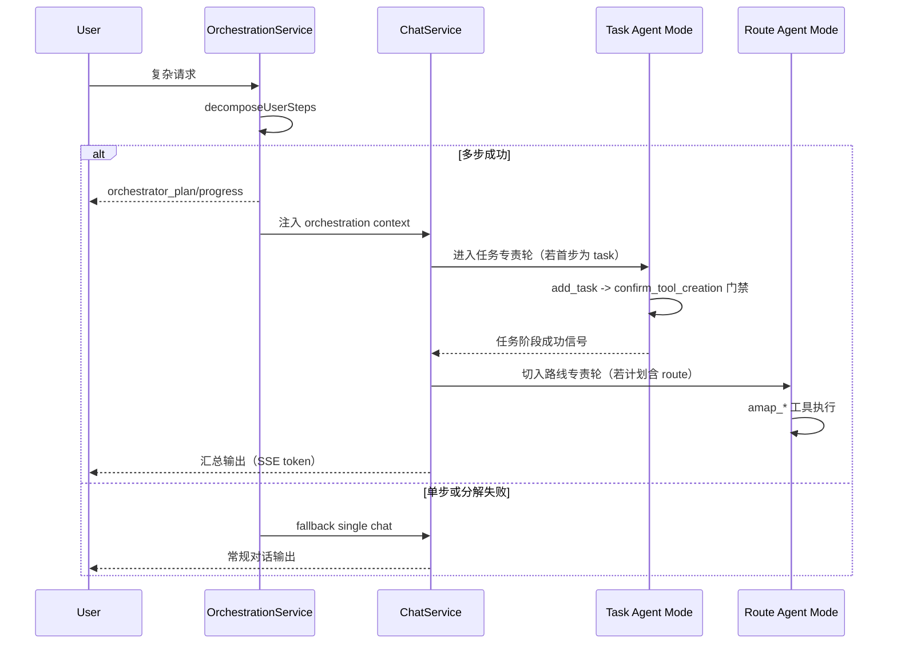

# 多 Agent 架构主题（Multi-Agent）

本文作为“多 Agent”独立主题，聚焦系统中的角色分工、协作机制、实现路径与演进方向。

> 说明：当前项目属于“轻量多 Agent 架构”，不是完整通用工作流引擎。

## 目录

- [1. 为什么要多 Agent](#1-为什么要多-agent)
- [2. 当前系统中的多 Agent 形态](#2-当前系统中的多-agent-形态)
- [3. 协作流程图](#3-协作流程图)
- [4. 关键实现细节](#4-关键实现细节)
- [5. 当前架构的边界（实事求是）](#5-当前架构的边界实事求是)
- [6. 演进路线建议](#6-演进路线建议)
- [7. 10 分钟讲稿](#7-10-分钟讲稿)
- [8. 5 分钟讲稿](#8-5-分钟讲稿)
- [9. 2 分钟讲稿](#9-2-分钟讲稿)
- [10. 快速 Q&A](#10-快速-qa)

---

## 1. 为什么要多 Agent

单 Agent 在复杂请求中常见问题：

- 同时处理“任务写入 + 路线规划 + 解释输出”时，工具选择容易混乱
- 步骤顺序难保证，可能跳过关键确认环节
- 失败恢复和进度可视化能力弱

多 Agent 的核心价值是：**分工、顺序、可控**。

---

## 2. 当前系统中的多 Agent 形态

当前系统采用“编排层 + 专责子模式”：

- **Orchestrator（编排器）**：`OrchestrationService`
  - 负责分解用户请求、生成计划、输出编排进度、决定是否降级
- **Task Agent（任务专责）**：由 `ChatService` 在编排参数驱动下进入任务模式
  - 工具面收窄到任务域，强调 add->confirm 门禁
- **Route Agent（路线专责）**：由 `ChatService` 在编排参数驱动下进入路线模式
  - 工具面收窄到 `amap_*`，完成路线相关子步骤

本质上是“一套执行引擎 + 多个 agent 角色模式”，而不是多个完全独立进程。

---

## 3. 协作流程图

---

## 4. 关键实现细节

### 4.1 分解与降级

`OrchestrationService.handleStream(...)` 先调用 `decomposeUserSteps(...)`：

- 多步可信：发 `orchestrator_plan`，注入编排上下文给 `ChatService`
- 单步或失败：走 `fallback_single_chat`

这保证“多 Agent 是增强能力”，不是系统单点。

### 4.2 角色注入而非硬分叉

编排层通过参数注入：

- `orchestrationTaskAgent`（stepId/summary）
- `orchestrationRouteAgent`（stepId/summary/planStepIndex）

`ChatService` 根据这些参数动态切换工具面和策略，不需要复制两套主循环代码。

### 4.3 阶段门控

任务阶段通过门禁控制“是否允许进入后续步骤”：

- add_task 成功后需 confirm
- confirm not_found 时可重试
- 超上限触发终止话术，不再推进后续步骤

路线阶段可延后切入，只有在前序条件满足时才独占 `amap_*` 工具。

### 4.4 观测与可解释

多 Agent 过程通过 SSE 对外暴露：

- `orchestrator_plan`
- `orchestrator_progress`

并通过 metrics 暴露内部质量：

- `orchestrator_decompose`
- `task_agent_round`
- `confirm_task_retry`
- `route_agent_start/complete`

---

## 5. 当前架构的边界（实事求是）

当前是轻量多 Agent，仍有边界：

- 主要是“线性多步 + 阶段门控”，不是通用 DAG
- 并行子任务能力有限（缺 fan-out/fan-in barrier 原语）
- 步骤状态持久化仍可加强（跨请求 resume 能力有限）
- 策略仍偏代码配置，非完全声明式编排

---

## 6. 演进路线建议

- 引入步骤状态存储（pending/running/succeeded/failed）
- 支持并行子任务与汇聚节点
- 编排策略配置化（规则/重试/超时/预算）
- 统一 trace/correlation 在多 agent 全链路贯通

---

## 7. 10 分钟讲稿

我们系统的多 Agent 不是“起很多模型实例”，而是“把一个复杂请求拆成可控角色阶段”。  
核心是 `OrchestrationService`：先分解，再决定走多步还是降级单步。

当分解成功时，它会先把计划通过 SSE 发给前端，再把编排上下文注入 `ChatService`。  
`ChatService` 本身不变，还是同一个 ReAct 循环；变化的是它进入了不同 agent 模式。  
如果首步是任务，就进入 Task Agent 模式：工具面收窄，先写库再 confirm。  
如果计划中有路线步骤，会在前序条件满足后切换 Route Agent 模式，独占 `amap_*` 工具。

这里最关键的是门控。  
我们不是让模型“尽量按顺序”，而是让系统控制“能不能进入下一阶段”。  
任务没确认成功，路线阶段就不会开启。  
这样多 Agent 才有工程可靠性，而不是 prompt 幻觉。

同时，这个过程是可观测的：  
前端能看到 orchestrator_plan/progress，后端有分解、轮次、重试、完成指标。  
所以它不是黑盒多轮，而是可解释执行过程。

当前边界也要讲清楚：  
我们现在是轻量多 Agent，还不是通用 workflow 引擎。  
下一步会补步骤持久化、并行原语和配置化策略。  
但在现阶段，这套架构已经把复杂请求从单轮问答升级成了多阶段可控执行。

---

## 8. 5 分钟讲稿

当前多 Agent 架构由 `OrchestrationService + ChatService` 组成。  
编排层先分解请求：多步就进入编排，单步就降级普通对话。  
编排时会把任务和路线拆成不同专责阶段，并通过门禁控制顺序：任务先写入确认，再进入路线。  
整个过程有计划与进度事件，也有重试与完成指标。  
所以这是一套轻量但可控、可解释的多 Agent 执行体系。

---

## 9. 2 分钟讲稿

我们有多 Agent，但不是重型工作流平台。  
做法是：编排层先分解请求，再把执行切成 task/route 专责阶段，由同一个 `ChatService` 主循环执行。  
关键是阶段门控：任务不确认成功就不进入后续路线。  
再配合计划/进度事件和指标，这套多 Agent 既可控又可观测。

---

## 10. 快速 Q&A

- **问：这算真正多 Agent 吗？**  
  答：是轻量多 Agent，强调角色模式与阶段门控；不是多进程工作流平台。

- **问：为什么不直接一个 Agent 全做？**  
  答：复杂请求会出现工具混用和顺序错乱，多 Agent 分工能显著提升可靠性。

- **问：下一步最值得补什么？**  
  答：步骤状态持久化 + 并行原语 + 配置化编排策略。
