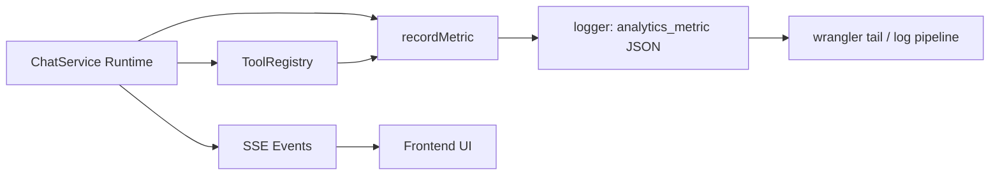

# 可观测性设计（Metrics + SSE Events）

本文对应主题：

- 可观测性意识
- 有 metric/event（工具执行、搜索、流式阶段等），不是黑盒聊天机器人

## 目录

- [1. 目标与原则](#1-目标与原则)
- [2. 可观测性架构图](#2-可观测性架构图)
- [3. 相关实现](#3-相关实现)
- [4. 设计权衡](#4-设计权衡)
- [5. 建议增强](#5-建议增强)
- [6. 10 分钟讲稿](#6-10-分钟讲稿)
- [7. 5 分钟讲稿](#7-5-分钟讲稿)
- [8. 2 分钟讲稿](#8-2-分钟讲稿)

---

## 1. 目标与原则

可观测性的目标不是“多打日志”，而是让系统在运行中可回答三类问题：

- **系统正在做什么**（阶段状态）
- **系统做了什么**（工具调用与结果）
- **系统做得怎么样**（时延、成功率、失败原因）

当前项目采用两条观测通道：

- **SSE 事件面向前端与用户可见态**
- **Metrics 面向运维与回放分析**

---

## 2. 可观测性架构图

---

## 3. 相关实现

### 3.1 指标实现

- `recordMetric(name, fields)` 在 `observability/metrics.ts`
- 以单行 JSON 打到日志（`analytics_metric`）
- 便于 `wrangler tail` 或后续日志管道过滤

### 3.2 关键指标来源

- `ChatService`
  - `chat_stream_started/finished`
  - `llm_chat_stream`
  - 编排相关指标（task/route/got）
- `ToolRegistry`
  - `tool_execute`（含 unknown tool、异常、业务失败）
- `SearchTool`
  - `search_executed`（quota/serper_error/success）

### 3.3 SSE 事件契约

`sse-contract` 已定义常用事件：

- `status`（connected/memory_retrieving/model_generating/tools_running）
- `intention`
- `citation`
- `tool_call`
- `tool_result_meta`
- `token`
- `done`
- 编排扩展：`orchestrator_plan` / `orchestrator_progress`

这使 UI 不再只是“显示文字”，而是“显示系统状态机进度”。

---

## 4. 设计权衡

- **优点**
  - 用户侧透明：知道系统在检索、在调工具、还是在生成
  - 工程侧可诊断：失败原因与耗时可追踪
  - 可用于后续 SLO 建立（成功率、P95）
- **代价**
  - 事件与指标维度管理复杂度上升
  - 需要避免过度埋点导致噪音
  - 需要约束日志中敏感字段

---

## 5. 建议增强

- 建立统一指标字典（命名、字段、采样策略）
- 增加会话级 trace id 贯穿所有日志
- 设定最小 SLO：tool success rate、chat P95、search degrade ratio

---

## 6. 10 分钟讲稿

我们把可观测性分成两层：用户可见事件和工程可见指标。  
用户可见层走 SSE，工程可见层走 metrics 日志。  
这样既能提升体验透明度，也能支持定位和优化。

先看 SSE。`ChatService` 在不同阶段发 `status`，比如 connected、memory_retrieving、tools_running。  
模型调用工具时发 `tool_call`，工具返回结构化摘要时发 `tool_result_meta`，RAG 命中发 `citation`。  
这让前端不是被动收 token，而是能展示“系统当前在做什么”。

再看 metrics。  
我们通过 `recordMetric` 输出单行 JSON，核心指标来自三个模块：  
`ChatService` 关注流式生命周期与模型耗时，`ToolRegistry` 关注工具执行结果，`SearchTool` 关注搜索成功与降级路径。  
例如 `tool_execute` 会区分 unknown tool、异常、业务失败；`search_executed` 会标记 quota 拒绝与 Serper 错误。

编排层也做了观测补充，比如 task/route agent 的起止、重试、GOT 开销。  
这意味着多 Agent 不是黑箱，我们能看到它在哪一步、为什么重试、何时完成。

设计上这套方案的价值在于：把“体验问题”和“系统问题”连接起来。  
用户看到卡在 tools_running，工程侧能对齐到 tool_execute 的失败原因。  
用户觉得检索慢，工程侧可看 llm/chat/search 的时延分布。

当然代价是指标治理复杂度上升，所以后续我们会建立指标字典、trace id 和 SLO。  
结论是：可观测性不是附加项，而是把 agent 系统做成可运营产品的前提。

---

## 7. 5 分钟讲稿

我们的可观测性有两条主线：SSE 事件和 metrics。  
SSE 负责把运行阶段透明给前端，metrics 负责给工程侧做诊断和优化。  
在实现上，`ChatService`、`ToolRegistry`、`SearchTool` 都打关键埋点。  
例如工具执行成功率、搜索降级原因、流式阶段耗时都可观测。  
这让系统不是黑盒聊天，而是可解释、可追踪、可优化的运行时。

---

## 8. 2 分钟讲稿

我们把可观测性做成双通道：  
前端看 SSE 事件，知道系统在连、在检索、在调工具还是在生成；  
后端看 metrics 日志，知道每次工具和模型调用是否成功、耗时多少、失败原因是什么。  
这样用户体验和工程诊断能对齐，系统就不是黑盒。
