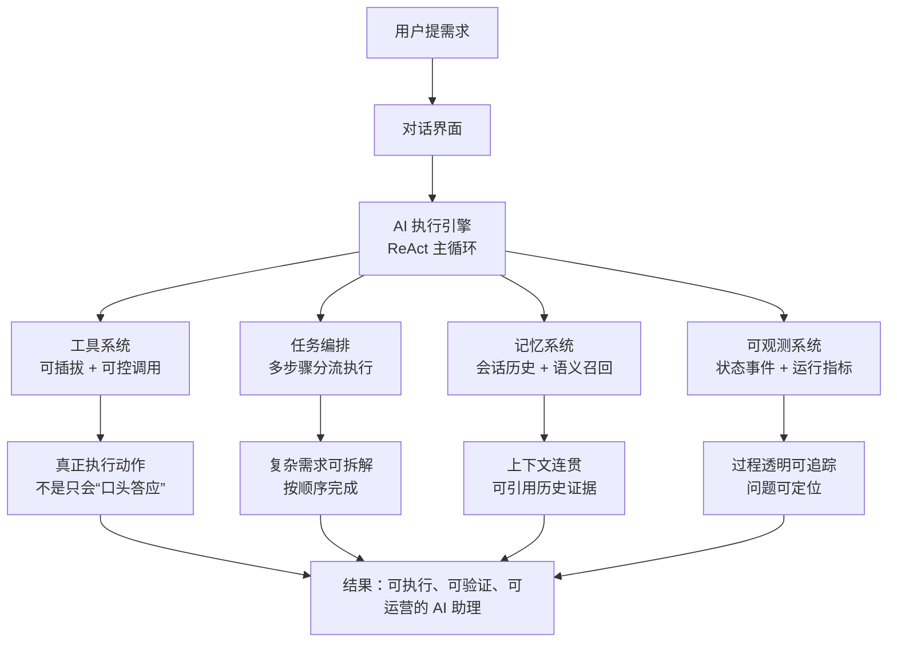

# 一页总览图版（老板/非技术）

目标：用一页讲清楚“这个 AI 助手为什么可靠、能落地、可运营”。

## 目录

- [1. 一页总览图](#1-一页总览图)
- [2. 一页讲解词（90 秒）](#2-一页讲解词90-秒)
- [3. 业务价值版（30 秒）](#3-业务价值版30-秒)
- [4. 常见一句话问答](#4-常见一句话问答)

---

## 1. 一页总览图

---

## 2. 一页讲解词（90 秒）

我们这个系统的价值，不是“更会聊天”，而是“更会完成事情”。  
中间的核心是 AI 执行引擎，它不是一次性生成答案，而是边判断、边调用工具、边根据结果继续执行。  
为了让它能在真实业务里稳定运行，我们做了四个支撑层：

- 工具系统：可插拔、可控调用，保证动作真执行。  
- 编排系统：把复杂需求拆成步骤，按顺序完成。  
- 记忆系统：既记当前会话，也能语义召回历史信息。  
- 可观测系统：前端看得到状态，后端查得到指标。  

所以最终结果是：这个 AI 不只是“会说”，而是“能做、可验证、可追踪”，可以长期运营。

---

## 3. 业务价值版（30 秒）

- **对用户**：响应更可靠，不会“答应了却没做”。  
- **对团队**：问题可定位，可持续优化，不靠猜。  
- **对产品**：从聊天功能升级为可执行能力平台。  

---

## 4. 常见一句话问答

- **这和普通聊天机器人有什么不同？**  
  我们强调“执行结果一致性”，不是只输出好看的文字。

- **为什么值得投入这套架构？**  
  因为它把 AI 从演示能力变成生产能力。

- **最大优势是什么？**  
  过程可控、结果可验、系统可运营。
