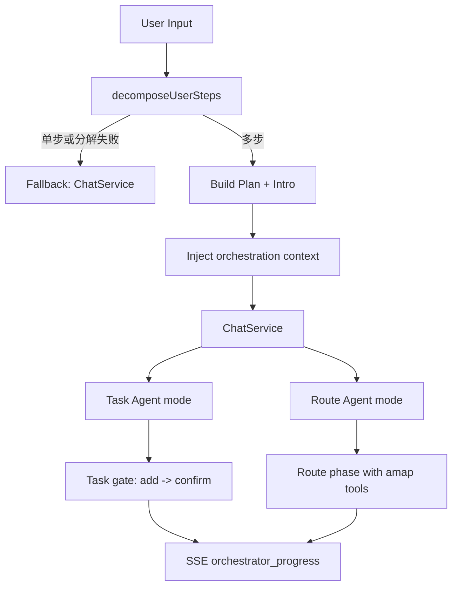

# 轻量多 Agent 编排层（OrchestrationService）

本文对应主题：

- 有编排层而非纯单 Agent
- 已有 `OrchestrationService`、task/route agent 分流与阶段门控

## 目录

- [1. 原理与定位](#1-原理与定位)
- [2. 架构流程](#2-架构流程)
- [3. 关键实现点](#3-关键实现点)
- [4. 权衡分析](#4-权衡分析)
- [5. 后续演进建议](#5-后续演进建议)
- [6. 10 分钟讲稿](#6-10-分钟讲稿)
- [7. 5 分钟讲稿](#7-5-分钟讲稿)
- [8. 2 分钟讲稿](#8-2-分钟讲稿)

---

## 1. 原理与定位

`OrchestrationService` 是“ChatService 之上的轻量编排层”：

- 先把用户请求分解为步骤（task/route 等）
- 在 SSE 中对外输出编排计划与进度
- 将编排约束注入 `ChatService`，由后者执行 ReAct 主循环

它不是独立工作流引擎（还没有完整 DAG/retry policy），但已经具备多 Agent 分工雏形。

---

## 2. 架构流程

---

## 3. 关键实现点

### 3.1 分解与降级

`OrchestrationService.handleStream(...)` 调用 `decomposeUserSteps(...)`：

- 若不是可靠多步：降级到普通 `ChatService`
- 若是多步：发送 `orchestrator_plan` + `orchestrator_progress`，并注入编排上下文

这保证了编排能力是“可选增强”，不会破坏主链路可用性。

### 3.2 Task/Route 分流

注入参数：

- `orchestrationTaskAgent`: 任务子步信息
- `orchestrationRouteAgent`: 路线子步信息 + 计划索引

`ChatService` 内部据此切换首轮工具策略与阶段门控：

- task 优先：先写入并确认任务
- route 后置：满足前置条件后再进入 `amap_*` 专责轮

### 3.3 阶段门控与可观测

在 `ChatService` 内部：

- `reduceTaskAgentGateAfterTool(...)` 管理 add->confirm 门禁
- 失败重试与终止条件有明确上限
- 关键节点发 `orchestrator_progress` + 编排 metrics

这使多 Agent 行为可解释，不是“模型自己想怎么跳就怎么跳”。

---

## 4. 权衡分析

- **优点**
  - 在不重写主链路的前提下增加多步骤执行能力
  - 可对外展示计划与进度（SSE）
  - 任务与路线两类高风险步骤得到策略化控制
- **限制**
  - 当前更像“线性多步 + 条件分流”，不是通用 DAG 引擎
  - 重试策略与并发策略还偏代码逻辑，配置化不足
  - 子代理能力主要通过 prompt + 工具策略实现，隔离性有限

---

## 5. 后续演进建议

- 增加步骤状态持久化（pending/running/done/failed）
- 引入 barrier/fan-out/fan-in 原语支持并行子任务
- 将门控策略抽象为可配置规则（而非散落代码）

---

## 6. 10 分钟讲稿

我们目前不是单 Agent 架构，而是“轻量多 Agent 编排”。  
核心是 `OrchestrationService` 放在 `ChatService` 之上：先判断用户请求是否需要多步执行，再把编排信息注入主对话循环。

第一步是分解。系统会尝试把用户请求拆成 `task`、`route` 等步骤。  
如果分解失败或只有单步，会自动降级到普通聊天流程，这一点很关键：编排是增强，不是单点依赖。  
如果分解成功，会先向前端发送 `orchestrator_plan` 和 `orchestrator_progress`，让用户看到系统准备如何执行。

第二步是分流执行。我们并没有另起一套执行器，而是把“编排上下文”注入到 `ChatService`，由它继续跑 ReAct。  
当首步是任务时，进入 Task Agent 模式：收窄工具、强制调用、add 后必须 confirm。  
当计划里有路线步骤时，会在满足前置条件后切换到 Route Agent 专责轮，收窄到 `amap_*` 工具。

第三步是门控与可观测。  
编排不是“建议模型按顺序做”，而是通过状态变量和规则强约束执行顺序。  
例如任务写入若未 confirm 成功，不允许继续后续路线步骤；重试次数到上限会终止并给固定话术。  
同时关键节点都有 `orchestrator_progress` 事件和 metrics，上层可以看到“在哪一步、为什么重试、是否完成”。

这套设计的价值在于：不牺牲主链路稳定性的前提下，把复杂请求从“单轮回答”升级成“可解释的多步骤执行”。  
当然它还不是完整工作流引擎，后续要补状态持久化、并行原语和配置化策略。  
但就当前阶段，它已经形成了可用的轻量多 Agent 架构骨架。

---

## 7. 5 分钟讲稿

我们的编排层是 `OrchestrationService`，负责在进入 `ChatService` 前先做一步“是否多步任务”的判断。  
如果不是多步，直接回普通聊天；如果是多步，就先生成计划并通过 SSE 给前端，再把编排信息注入 `ChatService`。

执行时会出现 task/route 分流：任务先写入并确认成功，再进入路线步骤。  
这不是软提示，而是有门控规则和重试上限。  
好处是复杂请求可以按顺序、可解释地执行，且全程可观测。

---

## 8. 2 分钟讲稿

我们不是纯单 Agent。  
在 `ChatService` 之上有一个轻量编排层：先分解步骤，失败就降级，成功就按 task/route 分流执行。  
任务写入有确认门禁，路线步骤有工具收窄和阶段切换，整个过程通过 `orchestrator_*` 事件对外可见。  
所以这是“可解释的轻量多 Agent”，不是黑箱多轮对话。
