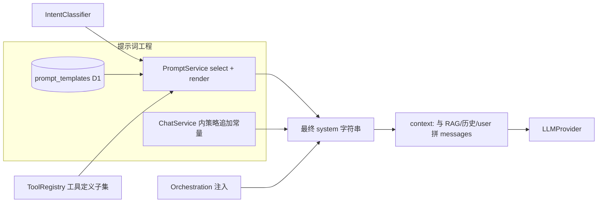

# 提示词工程（Prompt Engineering）

本文作为独立主题，描述系统中**提示词如何存储、如何被选型与渲染、哪些内容仍在代码中维护**，以及它与意图、工具、上下文拼装、编排、可观测性等模块的**关系与交互**。

> **与 `context_engineering.md` 的分工**：本文侧重 **「主系统提示模板」+ 槽位变量 + 运营侧 CRUD**；上下文工程文档侧重 **整条消息数组**（含 RAG、历史、按轮追加与工具面）。两者在 `ChatService` 中汇合为最终模型输入。

## 目录

- [1. 在本项目中的范围：两层提示词](#1-在本项目中的范围两层提示词)
- [2. 数据层：prompt_templates 与管理接口](#2-数据层prompt_templates-与管理接口)
- [3. 运行时：选型、渲染与拼接](#3-运行时选型渲染与拼接)
- [4. 模板槽位一览](#4-模板槽位一览)
- [5. 与各主题文档的交界（关系与交互）](#5-与各主题文档的交界关系与交互)
- [6. 设计思考与权衡](#6-设计思考与权衡)
- [7. 演进建议](#7-演进建议)
- [8. 提示词优化：现状与设计方向](#8-提示词优化现状与设计方向)
- [9. 10 分钟讲稿](#9-10-分钟讲稿)
- [10. 5 分钟讲稿](#10-5-分钟讲稿)
- [11. 2 分钟讲稿](#11-2-分钟讲稿)
- [12. 快速 Q&A](#12-快速-qa)

---

## 1. 在本项目中的范围：两层提示词

### 1.1 第一层：D1 中的「场景模板」（可运营）

- 表 **`prompt_templates`**（`backend/src/db/schema.ts`）：`id`、`name`、`template_text`、`scenario`、`created_at`。
- 模板正文支持 **`{{占位符}}`** 替换，由 `PromptService.render` 完成（见 §4）。
- **`scenario` 与意图字符串对齐**：`IntentClassifier` 产出 `intention` 后，`PromptService.selectTemplate(intention)` 按 `scenario` 取行；若无则 **`default`**，再否则取列表首条（保证有兜底）。

### 1.2 第二层：代码中的「策略追加段」（偏工程）

大量**强纪律、强场景**的说明不在 DB 模板里维护，而在 `ChatService` 内以常量字符串按条件拼接，例如：

- 系统时钟块（置前）
- Serper 未注册时的能力说明
- 联网找图 / 事实检索专段
- 任务突变首轮强制、`add_task` 纪律
- 编排 Task / Route 子步说明、编排通用 `orchestrationSystemAppend`
- 路线场景下的工具引用提示等

**设计含义**：DB 模板负责**人格、长期可改的产品文案与 TOOLS 结构展示**；代码追加负责**与安全、工具门禁、编排阶段强绑定的策略**，减少「改库误伤安全边界」的风险，但会带来**可读性分散**（见 §6）。

---

## 2. 数据层：prompt_templates 与管理接口

| 能力 | 说明 |
|------|------|
| 持久化 | D1（SQLite），经 Drizzle `PromptRepository` 访问 |
| 查询 | `findByScenario`、`findById`、`list` |
| 写入 | `insert` / `update` / `delete`（更新可改 `name`、`template_text`、`scenario`） |
| HTTP API | `backend/src/routes/prompts.ts`，**管理员门禁**（`requireAdminGate`）下的列表、单条、创建、更新、删除 |

**运营流**：管理员通过 API 维护模板 → 下一请求 `selectTemplate` 即生效（无单独发布流水线；依赖部署与 DB 迁移/种子数据初始化）。

---

## 3. 运行时：选型、渲染与拼接

典型顺序（均在 `ChatService.handleMessageStream` 中）：

1. **`intention = await intentClassifier.classify(userInput)`**  
2. **`template = await promptService.selectTemplate(intention)`**  
3. 根据本轮策略计算 **`toolsForPrompt`**（全量或收窄后的 `ToolDefinition[]`）。  
4. **`systemPrompt = promptService.render(template.template_text, { userName, userEmail, aiNickname, tools: toolsForPrompt, preferencesJson })`**  
5. 在 `systemPrompt` 上按条件 **concat** 各类代码内追加段（时钟、搜索、任务、编排等），得到最终 **主 system 字符串**。  
6. 与 **RAG 块、D1 历史、用户输入** 等一并组装为 `LLMMessage[]`（详见 `context_engineering.md`）。

**要点**：**同一套模板文本**在不同请求下会因 **`toolsForPrompt` 不同**而渲染出不同的 `TOOLS_DEFINITIONS` JSON，即「提示词」与「工具面」在渲染时刻绑定。

---

## 4. 模板槽位一览

`PromptService.render` 当前支持的占位符（未知键替换为空串）：

| 占位符 | 含义 |
|--------|------|
| `{{USER_NAME}}` | 用户显示名 |
| `{{USER_EMAIL}}` | 用户邮箱 |
| `{{AI_NICKNAME}}` | AI 昵称 |
| `{{TOOLS_DEFINITIONS}}` | 当前轮注入的工具列表 JSON（name / description / parameters） |
| `{{PREFERENCES_SUMMARY}}` | 用户 `preferences_json` 解析后的多行摘要；无效 JSON 时截断原始文本 |
| `{{PREFERENCES_BLOCK}}` | 非空时在摘要外包一层「【用户偏好】」标题块 |

辅助函数 `formatPreferencesSummary` 见 `backend/src/prompt/prompt-service.ts`。

---

## 5. 与各主题文档的交界（关系与交互）

| 主题 / 模块 | 与提示词工程的关系 | 交互方式（简述） |
|-------------|-------------------|------------------|
| **`intent.md`** | **模板路由的输入** | `intention` → `selectTemplate`；决定用哪条 `scenario` 的 `template_text` |
| **`tools_plugable.md`** | **模板内工具说明的数据源** | `render` 时注入的 `tools` 来自 `ToolRegistry.getDefinitions()` 的子集 `toolsForPrompt` |
| **`context_engineering.md`** | **提示词只是 system 的一部分** | 渲染 + 追加后的 system 再与 RAG、历史、多轮 tool 消息组合 |
| **`multi_agent.md` / `orchestration_light_multi_agent.md`** | **编排向 system 注入额外段落** | `orchestrationSystemAppend`、Task/Route 专责 `buildOrchestration*SystemAppend`；不改变 `prompt_templates` 表结构 |
| **`memory_architecture.md`** | **间接关系** | RAG 块通常不写在 DB 模板里，而作为独立 system 片注入；模板可引导模型如何使用引用 |
| **`observability.md`** | **调试与审计** | 可记录 `templateId`、system 长度等（如 `dbg('template_selected')`）；**assistant** 落库时写入 `prompt_id: template.id`，用户消息行为 `null` |
| **`chat_service.md`** | **汇合点** | 意图 → 模板 → 渲染 → 追加 → ReAct；状态机决定何时追加哪段策略文 |

### 5.1 关系总览图

---

## 6. 设计思考与权衡

**为何拆分「DB 模板」与「代码追加」？**

- **产品可调**：人设、说明文体、默认任务风格等可给运营/产品通过 API 改，无需发版。
- **安全与确定性**：强制工具调用、门禁话术、编排阶段说明与 **工具面收窄** 强耦合，放代码里更易 **Code Review** 与单测覆盖，避免误改库导致越权或跳过 confirm。
- **成本**：策略分散在两处，新人需同时读 **DB 种子/模板** 与 **`chat-service.ts` 长常量**，文档化（本文 + `context_engineering`）有助于对齐认知。

**TOOLS_DEFINITIONS 进模板的利弊**

- **利**：模型在同一视图中看到「当前可调用的工具契约」，与真实 API 一致。
- **弊**：模板过长、工具多时令牌膨胀；需依赖 `toolsForPrompt` 收窄策略配合。

---

## 7. 演进建议

- 为 **`scenario` 与 `intention` 枚举**维护单一事实来源（文档或常量生成），避免 DB 里出现孤儿 scenario。
- 对代码内追加段做 **分组与命名规范**（或逐步迁到「只读配置块」），便于检索。
- 可选：在管理后台展示 **「渲染预览」**（脱敏用户 + 模拟工具列表），降低改模板时的线上意外。
- 评估是否将部分稳定策略段 **迁回模板**（版本化迁移），在可观测性上加 **模板版本号** 维度。

---

## 8. 提示词优化：现状与设计方向

### 8.1 当前落地情况（客观）

- **已有**
  - **运营侧**：管理员 API 维护 `prompt_templates`；**assistant** 落库带 **`prompt_id`**，可回放「当时选用的模板行」。
  - **工程侧**：`ChatService` 内大量**按场景追加**的策略段与 **意图 → 模板选型** 固定链路；`recordMetric` / `logger` / `logLlmMessagesSnapshot` 等可辅助排查「system 过长、选了哪套模板」。
  - **压测脚本**：如 `backend/scripts/load/chat-stream-ttft.mjs` 面向 **端到端延迟与成功率**，**不是**提示词质量回归集。
- **未形成闭环的「提示词优化体系」**
  - 无 **A/B 分流**、无 **模板版本号与实验字段**、无 **按 scenario 的离线黄金集**、无 **自动对比两版模板的成功率/工具误召率**。
  - 技术方案 `docs/technical/tech_design_ai_bot_v1_2.md` **§8.3** 描述了响应校验、可选 LLM-as-Judge、离线评估与点赞踩等方向，并给出示例伪代码（如 `validateResponse`）；**当前 `ChatService` 未实现该套校验/重试主路径**，相关内容属于**架构设想**，不是已实现特性。

### 8.2 若建设「提示词优化」，建议从哪些方面入手

| 方向 | 希望解决的问题 | 预期效果 |
|------|----------------|----------|
| **版本与实验** | 模板热改后行为漂移难归因、难回滚 | 模板带 `version` 或变更历史；小流量对照组对比关键指标 |
| **离线评测集** | 改一句 system 牵全身，只能靠线上踩坑 | 按 `scenario` 维护固定用例集（输入 + 期望工具/禁调工具/关键短语）；CI 或定时跑「渲染后 messages 快照 + 可选一次模型调用」 |
| **在线指标与反馈** | 不知道「差」在哪里 | 已有 `tool_execute`、可扩展「本轮 `prompt_id` + intention + 是否用户编辑重试」；若有赞踩，关联到 `prompt_id` / 版本 |
| **代码段与模板协同** | 策略一半在 DB 一半在代码，优化时漏改一侧 | 文档化「某 scenario 依赖哪些追加常量」；大改时 checklist |
| **长度与结构** | system 过长淹没指令、费 token | 分层压缩（核心纪律 vs 可折叠说明）、或对非关键段做检索式注入 |
| **安全与合规段隔离** | 实验误伤强制工具/confirm 纪律 | **明确禁止对安全相关代码追加段做 A/B**；仅对 DB 模板或纯文案段实验 |

### 8.3 与相关文档/模块的衔接

- **`observability.md`**：优化依赖可度量；需在 metrics / 日志维度上能 **join `prompt_id`（及未来 version）**。
- **`intent.md`**：意图抖动会改变模板选型；优化提示词时要 **同步观察 intention 分布**。
- **`context_engineering.md`**：优化对象不仅是 `template_text`，还包括 **是否与 RAG/历史比例失调**。

---

## 9. 10 分钟讲稿

提示词在这套系统里分两层。第一层在 D1 的 `prompt_templates` 表里，每条模板有一个 `scenario`，和意图分类结果对齐。用户一句话进来，先分类出 intention，再 `selectTemplate`：对得上就用那条，对不上用 default，再没有就用第一条兜底。

渲染用的是简单的双花括号替换：用户名、邮箱、AI 昵称，以及一整块 **当前轮允许调用的工具 JSON**。这里很关键——**工具列表不是写死在模板里的**，而是 `ChatService` 先按路线、搜索、任务、编排等策略算出一个子集，再塞进模板。所以模板负责「怎么说」，运行时负责「这一轮给你哪些工具」。

第二层在代码里：`ChatService` 里一长串按条件拼接的 system 追加。包括时钟、搜索不可用说明、事实检索纪律、任务写入必须调工具、编排子步说明等等。为什么不一锅炖进数据库？主要是这些和**安全、门禁、阶段**绑得太紧，放代码里更好审、更好测，改库不容易误伤。

管理和意图、工具、上下文、编排、可观测性的关系：意图选模板；工具定义渲染进模板；上下文工程文档描述的是渲染之后怎么和 RAG、历史、tool 消息拼成完整输入；编排再往 system 上叠一段；可观测性帮我们确认选了哪个模板、system 有多长。

后续可以加强 scenario 治理、预览能力、提示词版本与离线评测，以及考虑把部分稳定文案迁回模板并做版本号。

---

## 10. 5 分钟讲稿

提示词两件事：数据库里的场景模板加双花括号变量，以及代码里按条件追加的策略段。意图决定用哪个 scenario；渲染时把当前工具列表 JSON 填进模板。然后 ChatService 再拼时钟、搜索、任务、编排等说明。管理员 API 可以改模板，但安全相关的话术主要在代码里。这和意图、工具、上下文拼装、编排都是连在一起的——模板是主 system 的骨架，上下文工程是整条消息怎么组。

---

## 11. 2 分钟讲稿

提示词 = D1 模板按意图选型 + `render` 填槽，其中工具列表是运行时收窄后注入的；再加代码里一大块策略追加。意图路由模板，工具定义进 `TOOLS_DEFINITIONS`，编排继续往 system 上叠。详情分工会话可看 `context_engineering.md`。

---

## 12. 快速 Q&A

- **问：改模板后一定要发版吗？**  
  **答**：一般**不用**发版；D1 更新后下一请求即读取。若 Worker 有缓存层需另论（当前实现为读库）。

- **问：为什么模板里要放 TOOLS_DEFINITIONS？**  
  **答**：让模型看到的工具说明与 **本轮 API 实际暴露的 tools** 一致，减少「描述有、调用无」的错位。

- **问：对话里存的 `prompt_id` 和本文关系？**  
  **答**：`ChatService` 持久化 **assistant** 消息时写入 **`prompt_id: template.id`**（用户消息为 `null`），便于回放「该轮回复基于哪条 `prompt_templates` 行选型」。

- **问：和 Prompt Engineering 业界用法一致吗？**  
  **答**：一致的部分是模板 + 变量 + 迭代；本项目额外强调 **与工具面、编排、代码策略** 的**强耦合拆分**（DB vs 代码）。

- **问：我们现在有自动化的提示词优化吗？**  
  **答**：**没有完整闭环**；有模板 CRUD、`prompt_id` 与可观测埋点。技术方案里有评估与 Judge 的**设想**，主链路尚未按该节实现；规划方向见 **§8**。
