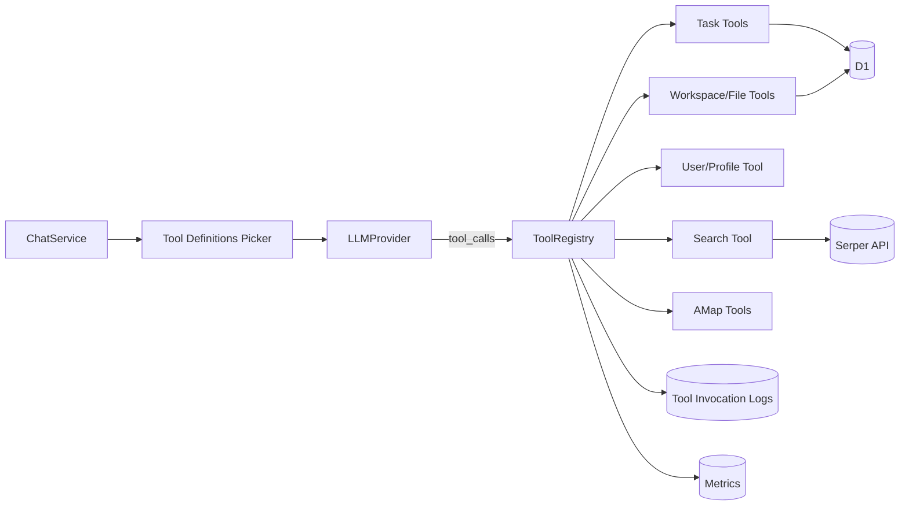

# 工具系统可插拔与 ToolRegistry 设计

本文聚焦两件事：

- 工具系统可插拔
- `ToolRegistry` 统一注册/执行（任务、搜索、用户资料、文件、地图工具注入）

## 目录

- [1. 原理与目标](#1-原理与目标)
- [2. 架构设计](#2-架构设计)
- [3. 关键实现](#3-关键实现)
- [4. 当前工具目录（名称/参数/用途）](#4-当前工具目录名称参数用途)
- [5. 设计权衡](#5-设计权衡)
- [6. 工程建议（后续）](#6-工程建议后续)
- [7. 写操作验证机制：从特例到通用框架](#7-写操作验证机制从特例到通用框架)
- [8. 实现路径：写后确认循环与 Provider 工具封装](#8-实现路径写后确认循环与-provider-工具封装)
- [9. 工具重路由：是否需要与设计权衡](#9-工具重路由是否需要与设计权衡)
- [10. 10 分钟讲稿](#10-10-分钟讲稿)
- [11. 5 分钟讲稿](#11-5-分钟讲稿)
- [12. 2 分钟讲稿](#12-2-分钟讲稿)

---

## 1. 原理与目标

### 1.1 问题

如果把工具调用写成 `if/else` 分散在对话主链路，会出现：

- 扩展新工具要改核心链路，耦合高
- 工具失败、埋点、审计逻辑不一致
- 难以按场景做“工具面收窄”和策略控制

### 1.2 目标

把工具系统做成“运行时可组合”能力：

- **统一协议**：所有工具实现同一接口（名称、参数 Schema、执行）
- **统一执行入口**：由 `ToolRegistry` 处理调度、错误、埋点、持久化
- **按场景注入**：每轮对话给模型的工具集合可动态变化

---

## 2. 架构设计

---

## 3. 关键实现

### 3.1 统一工具协议

`ToolRegistry` 约束了工具最小契约：`name/description/parametersSchema/execute`。  
这样每个工具可以独立演进，但在运行时表现一致。

### 3.2 统一注册与执行

- 注册：`register(tool)`
- 对模型暴露定义：`getDefinitions()`
- 执行：`executeCall` / `executeAll`

执行时统一处理：

- unknown tool 保护
- 异常兜底
- 结果判定（`ok` 推断）
- `recordMetric('tool_execute')`
- 可选写 `tool_invocations`（用于审计）

### 3.3 工具注入点

在应用组装层（`backend/src/index.ts`）统一注册：

- `registerTaskTools(...)`
- `registerShanghaiCalendarTool(...)`
- `createWorkspaceFilesTool(...)`
- `createUpdateUserProfileTool(...)`
- `createSearchTool(...)` / `createPlanResearchTool(...)`（受 `SERPER_API_KEY` 控制）
- `createAmapTools(...)`（受 `AMAP_WEB_KEY` 控制）

这说明“可插拔”不仅是接口，还包含**按环境动态启用/禁用**。

### 3.4 动态工具面收窄

`ChatService` 不总是把全量工具给模型，而是按场景选择：

- 全量
- 仅 `search`
- 仅 `amap_*`
- 仅任务域工具
- 编排 task agent 专用工具集

这使“工具系统可插拔”进一步变成“**策略可插拔**”。

---

## 4. 当前工具目录（名称/参数/用途）

> 说明：以下为当前代码中已实现的工具集合。部分工具按环境变量条件注册（见“注册条件”列）。

| 工具名 | 主要参数（简化） | 用途 | 注册条件 |
|---|---|---|---|
| `resolve_shanghai_calendar` | `items[]`（`kind=offset/next_weekday`、`days_from_today`、`weekday`、`ref`） | 把“明天/下周一”解析为东八区公历与默认起止时间戳 | 默认注册 |
| `add_task` | `title`（必填）、`description`、`detail`、`status`、`project_id`、`starts_at`、`ends_at` | 新增任务（任务写库核心） | 默认注册 |
| `list_tasks` | `status`、`project_id` | 列出任务并支持过滤 | 默认注册 |
| `update_task` | `task_id`（必填）、`title`、`description`、`detail`、`status`、`project_id`、`starts_at`、`ends_at` | 更新任务字段与时间信息 | 默认注册 |
| `confirm_tool_creation` | `task_id`（必填）、`title_hint` | 校验 `add_task` 是否真实落库（门禁工具） | 默认注册 |
| `delete_task` | `task_id`（必填） | 删除任务 | 默认注册 |
| `update_user_profile` | `name`、`email`、`ai_nickname`、`preferences` | 对话内更新用户资料与 AI 昵称 | 默认注册 |
| `manage_workspace_files` | `action`（`list/delete/rename/set_semantic_type/set_tags`）、`file_id`、`new_name`、`semantic_type`、`tags`、`folder_path`、`semantic_type_filter` | 文件工作空间管理（列出/删除/重命名/标签等） | 默认注册 |
| `search` | `query`（必填）、`type`（`organic/news/images/...`）、`num` | 联网搜索（Serper）并返回结构化结果 | 需 `SERPER_API_KEY` |
| `plan_research` | `goal`（必填） | 深度研究：拆子任务 + 子代理搜索 + 汇总 | 需 `SERPER_API_KEY`（依赖 `search`） |
| `amap_geocode` | `address`（必填）、`city` | 地址转经纬度 | 需 `AMAP_WEB_KEY` |
| `amap_route_plan` | `origin`、`destination`、`mode`（必填）、`transit_city`、`geocode_city` | 路径规划（驾车/步行/公交/骑行） | 需 `AMAP_WEB_KEY` |
| `amap_navigation_uri` | `origin`、`destination`、`mode`（必填）、`geocode_city` | 生成可打开的高德导航链接 | 需 `AMAP_WEB_KEY` |
| `amap_route_static_map` | `origin`、`destination`（必填）、`polyline`、`geocode_city` | 生成路线静态图 URL（可嵌入 Markdown） | 需 `AMAP_WEB_KEY` |
| `tree_of_thoughts` | `problem`（必填）、`depth`、`branchFactor` | 可选高级推理工具（树状探索） | 需 `ENABLE_TOT_GOT_TOOLS=true` |
| `graph_of_thoughts` | `problem`（必填）、`iterations` | 可选高级推理工具（图状迭代） | 需 `ENABLE_TOT_GOT_TOOLS=true` |

### 4.1 工具分组视图（便于讲解）

- **任务域**：`resolve_shanghai_calendar`、`add_task`、`list_tasks`、`update_task`、`confirm_tool_creation`、`delete_task`
- **用户域**：`update_user_profile`
- **文件域**：`manage_workspace_files`
- **搜索研究域**：`search`、`plan_research`
- **地图路线域**：`amap_*` 系列 4 个工具
- **高级推理域（可选）**：`tree_of_thoughts`、`graph_of_thoughts`

### 4.2 参数设计共性（你可以讲的设计点）

- 参数都走 JSON Schema，模型侧可读、可校验。
- 多数工具以“最小必填 + 可选扩展”为原则，兼顾易调用与可扩展。
- 写操作工具普遍有显式主键参数（如 `task_id`、`file_id`），便于门禁与审计。
- 返回值统一 JSON 字符串，便于回填到 ReAct 上下文并做 `ok/error` 判定。

---

## 5. 设计权衡

- **优点**
  - 解耦：新增工具不侵入主链路
  - 一致性：错误、埋点、审计路径统一
  - 可控：按场景收窄工具面，降低误调用
- **代价**
  - 需要维护工具协议与 JSON 输出规范
  - 工具越多，策略编排复杂度越高
  - 需要持续治理“工具描述质量”（影响模型调用效果）

---

## 6. 工程建议（后续）

- 工具清单与策略从代码迁到配置层（YAML/DB）
- 为每个工具增加“调用预算”与“场景白名单”
- 在 `tool_invocations` 基础上加工具级 SLO（成功率、P95）

---

## 7. 写操作验证机制：从特例到通用框架

### 7.1 当前现状（已落地）

当前系统在任务写入链路中使用了“写后确认”模式：

- 写工具：`add_task`
- 验证工具：`confirm_tool_creation`
- 运行时门禁：在 `ChatService` 中控制 add->confirm 的顺序、重试与终止

这条链路可靠性高，但属于**任务域特例 + 代码硬编码**。

### 7.2 当前方案的局限

- 扩展新写工具时，容易复制“`xxx` + `confirm_xxx`”成对模式
- 验证协议分散在不同工具/领域，难统一治理
- 运行时策略与工具契约耦合，维护成本上升

### 7.3 可扩展模式对比

| 模式 | 核心思想 | 优点 | 缺点 | 适用阶段 |
|---|---|---|---|---|
| **模式 A：通用 `verify_operation` 工具** | 所有写工具统一返回 `operation_id/resource_ref`，再由一个通用验证工具做确认 | 改造成本低、复用快、能快速摆脱“每域一个 confirm 工具” | 仍需模型配合调用验证；策略仍偏流程层 | 近期（快速统一） |
| **模式 B：工具声明后置条件（Postcondition）** | 在工具元数据声明“是否需验证/如何验证”，运行时自动触发验证 | 验证逻辑下沉到运行时，稳定性高；模型负担低 | 需要改造工具注册元数据与执行框架 | 中期（平台化） |
| **模式 C：命令-查询分离（Command/Query）** | 写操作先提交命令，再由状态机异步确认最终态 | 最稳健，适合复杂流程/高并发；天然幂等与可恢复 | 体系改造最大，引入异步状态管理复杂度 | 中长期（重业务） |

### 7.4 三种模式的关键权衡（简述）

- **落地速度**：A > B > C
- **长期可维护性**：C > B > A
- **对现有代码侵入**：A 最小，C 最大
- **运行时自治程度**：C 最高，A 最低

### 7.5 推荐演进路线

1. **先 A（1-2 个迭代）**：统一写工具返回协议，引入通用验证入口  
2. **再 B（平台化）**：把“需验证/验证策略”做成工具元数据，由运行时自动执行  
3. **最后按需 C（高复杂业务）**：对关键领域引入命令状态机与异步确认

> 结论：`add_task + confirm_tool_creation` 是正确方向，但应逐步抽象为平台能力，避免未来每个写工具都手工配一套“confirm 配套工具”。

---

## 8. 实现路径：写后确认循环与 Provider 工具封装

本节对应代码中的**实际调用链**，便于评审/答辩时从「设计」落到「类与文件」。

### 8.1 `add_task` 与 `confirm_tool_creation` 在工具循环里如何配合

**工具本体（写库 / 读库校验）**

| 环节 | 位置 | 行为 |
|------|------|------|
| 写库 | `backend/src/tools/task-tools.ts` → `createAddTaskTool` | 解析 JSON 参数、`tasks.insert`、再 `findByIdForUser`，返回 `{ ok: true, task: { id, ... } }` 等 |
| 校验 | 同文件 → `createConfirmToolCreationTool` | 用 `task_id`（可选 `title_hint`）查库；成功 `{ ok: true, task: ... }`，失败带 `reason`（如 `not_found`、`title_mismatch`） |

**编排 Task Agent 模式**（`ChatService` 中 `orchestrationTaskAgentMode` 为真时）

- **状态**：`chat-service.ts` 内维护 `taskAgentGate`：`unconfirmedAddTaskId`、`confirmRetryCount`。
- **执行方式**：该模式下对本轮 `response.tool_calls` **顺序 for 循环**逐个处理，而不是 `executeAll` 并行一把执行。
- **硬门禁**：若模型在本轮又调 `add_task`，但 **`unconfirmedAddTaskId` 仍非空**（上一轮 add 尚未被 confirm 消化），则**不执行真实 `add_task`**，直接注入伪造 tool 结果：`confirm_pending_before_new_add`，提示须先对上一轮 `task.id` 调用 `confirm_tool_creation`。
- **状态迁移**：每步执行后调用 `backend/src/orchestration/task-agent-state.ts` 的 `reduceTaskAgentGateAfterTool`：
  - `add_task`：若输出 `ok === true` 且能解析 `task.id`，则置 `unconfirmedAddTaskId`。
  - `confirm_tool_creation`：若对上 pending 的 `task_id` 且 `ok: true`，清空 pending；若 `not_found` 等与重试策略匹配，则增加计数（有上限 `TASK_AGENT_MAX_CONFIRM_RETRIES`，过重试则终止任务子步并固定话术）。
- **与路线子步衔接**：`backend/src/chat/orchestration-route-phase.ts` 的 `scanOrchestrationTaskPhaseGateSuccess` 把「任务子步算成功」定义为：`confirm_tool_creation` / `update_task` / `delete_task` 中**至少一次**返回 `ok: true`——**仅有 `add_task` 不算**，从而与「先 confirm 再进入后续路线专责轮」的调度一致。
- **提示词约束**：`backend/src/chat/orchestration-task-agent.ts` 的 `buildOrchestrationTaskAgentSystemAppend` 等要求模型：add 成功后必须再 confirm，且 **confirm `ok:true` 前不要对用户断言已落库**。

**非编排的普通对话**

- 工具通常走 `ToolRegistry.executeAll`；**不跑**上述门禁状态机。
- `add_task` / `confirm_tool_creation` 仍可能被调用，主要靠系统追加说明（如 `TASK_MUTATION_SYSTEM_APPEND`）与任务域 `tool_choice: required` 等约束模型行为。

### 8.2 Gemini / Qwen 等返回的 tool 调用：谁解析、谁封装

**主链路统一抽象**（`ChatService` / `ToolRegistry` **不区分**供应商）

- `backend/src/llm/types.ts`：`ToolCall { id, name, arguments }`（`arguments` 一律为 **JSON 字符串**）；`LLMResponse` 含 `content` 与可选 `tool_calls`；`LLMMessage` 中 assistant 可带 `tool_calls`，tool 角色带 `content` + `tool_call_id`。

**各 Provider 把响应压成 `ToolCall[]`**

| 供应商 | 类 / 文件 | 说明 |
|--------|-----------|------|
| Gemini | `GeminiProvider`，`gemini-provider.ts` 内 `parseCandidateContent` | 遍历 `candidates[0].content.parts`：文本拼 `content`，每个 `functionCall` → 一个 `ToolCall`（`arguments` = `JSON.stringify(args)`）；**`id` 本地 `randomUUID()`**（API 侧无 OpenAI 式 call id 时） |
| Qwen（OpenAI 兼容） | `QwenProvider`，`qwen-provider.ts` 内 `parseAssistantMessage` 及流式聚合 | 读 `choices[0].message.tool_calls[]`，取 `function.name`、`function.arguments`；`id` 用返回的 `id` 或 **`randomUUID()`** |

**工具定义与请求组装（出站）**

- `ToolRegistry.getDefinitions()` → `ToolDefinition[]`。
- Gemini：`gemini-messages.ts` 的 `toGeminiToolDeclarations`、`toGeminiContents`（assistant → `functionCall`，tool → `functionResponse`）。
- Qwen：`toOpenAITools`、`toOpenAIMessages`（OpenAI 兼容 `tools` + `messages`）。

**执行结果写回对话（入站下一轮）**

- `ToolRegistry.executeCall`（`tool-registry.ts`）返回 `ExecutedToolCall`：`output` 字符串 + `geminiToolCallId`（历史命名）= **`toolCallKey(name, id)`** → 形如 **`函数名::调用id`**。
- `ChatService` push assistant（带原始 `tool_calls`）+ 多条 `{ role: 'tool', content, tool_call_id: geminiToolCallId }`。
- 再调 Provider 时：Gemini 侧用 `parseFunctionNameForToolMessage` 从 `name::id` 取出函数名写 `functionResponse`；Qwen 侧把 `tool_call_id` 放进 OpenAI 兼容 tool 消息。

**一句话**：模型差异止步于 **`GeminiProvider` / `QwenProvider`（及 message 转换）**；**`ChatService` + `ToolRegistry` + `task-tools.ts`** 始终只认统一的 `ToolCall` / `LLMMessage`。

---

## 9. 工具重路由：是否需要与设计权衡

### 9.1 术语：什么是「工具重路由」

本文将 **工具重路由** 定义为：在模型已经产生（或即将产生）**具体 `tool_call`** 之后，由系统在 **ToolRegistry 执行前或执行后**，**改写目标工具名/参数**、或 **强制改换本轮可用工具面** 的**二次决策层**——与仅在选择「本轮暴露哪些工具定义」的 **工具面预收窄** 不是同一概念。

### 9.2 当前系统中是否存在该设计

**不存在**独立的「工具重路由」服务或统一中间件。

当前与「路由」相关的机制主要是：

| 机制 | 性质 | 作用 |
|------|------|------|
| **意图 + 关键词 + 编排模式** | **调用模型前**决定 `toolsForPrompt` / `roundDefs` | 减少误选域（任务 / 搜索 / 高德 / 编排专责） |
| **`tool_choice: required` 等** | API 层约束 | 强制首轮先出工具调用 |
| **编排 Task Agent 顺序执行 + 门禁** | 执行顺序与伪造 tool 结果 | 如未 confirm 则拦截重复 `add_task` |
| **unknown_tool / JSON 错误** | 执行期拒绝 | 结果回填给模型，由 **ReAct 下一轮自纠** |

即：**路由发生在「给模型的工具列表」与「门禁规则」层**，而不是在「已解析的 `ToolCall` 上再映射一层别名」。

### 9.3 是否需要单独做「工具重路由」——结论与权衡

**当前阶段：非必须。**

- **理由**：工具数量与域划分仍可通过 **意图 + 编排 + 收窄 + 门禁** 管理；误召可在多轮对话中由模型根据 tool 错误 JSON **自我修正**，成本可控。
- **何时值得引入**：工具矩阵持续增长、多域语义高度重叠、或 **单次误调成本极高**（如错误写库且难以回滚）时，再考虑在 Registry 前增加显式改派层。

**若不做独立重路由（维持现状）**

| 优点 | 缺点 |
|------|------|
| 架构简单、延迟低、行为可预测 | 强依赖提示词与工具描述质量；跨域误召要靠多轮纠正 |
| 与「单一执行入口」叙事一致 | 规则散落在 `ChatService`，复杂后难全局一览 |

**若做独立重路由**

| 优点 | 缺点 |
|------|------|
| 可将「易错映射」集中治理（如别名 → 规范工具名） | 额外 **时延**（规则或二次小模型） |
| 可在执行前统一审计「改派原因」 | **误判**会导致更难调试（用户看到的结果与模型原始意图不一致） |
| 适合高风控写操作前的最后一道闸 | 与 **ToolRegistry 单一可信执行口** 的边界要文档化，避免双层逻辑打架 |

### 9.4 若未来需要：可参考的设计要点（非当前实现）

1. **触发点**：仅在 **白名单场景** 启用（如「写库类工具」「高成本搜索」），避免所有调用都过路由。
2. **输入**：用户话轮、`intention`、候选 `ToolCall`、当前 `toolsForPrompt` 列表、编排阶段标识。
3. **策略优先级**：**硬规则**（禁止映射）优于 **学习式路由**；学习式仅在高置信度时改派。
4. **输出**：`allow` / `rewrite(name, args)` / `reject_with_hint`；所有改写 **写 metric + 结构化日志**（可观测性文档中的事件应可关联）。
5. **预期解决的问题**：降低 **跨域误召率**、统一 **工具别名/历史名称** 的兼容。
6. **预期达到的效果**：在 **不显著增加 P95 延迟** 的前提下，减少特定高危工具的误执行次数。
7. **主要代价**：系统行为 **可解释性** 与 **排障成本** 上升，需配套 dashboard 或采样回放。

> **与 `intent.md` 的分工**：意图解决「选哪套模板与粗粒度域」；工具重路由（若引入）解决「在细粒度 tool 调用上的纠偏」，二者不应重复实现同一套 if-else。

---

## 10. 10 分钟讲稿

我们这套工具体系的核心思路，是把工具调用从“散落在业务代码里的函数调用”升级成“统一运行时能力”。  
先看动机：如果每个工具都直接在 `ChatService` 里写判断，新增工具会不断侵入主链路，失败处理和埋点也会越来越不一致。  
所以我们先定义统一工具协议：每个工具都有 name、描述、参数 schema 和 execute。  
然后由 `ToolRegistry` 做统一注册与执行。模型只看到标准化工具定义，执行时也都经过同一个入口。

这带来三个直接收益。第一是可扩展：任务、搜索、用户资料、文件、地图工具都能按同一模式接入。  
第二是可治理：unknown tool、异常、结果判定、埋点、审计都走统一路径。  
第三是可控：`ChatService` 能按场景动态收窄工具面，而不是始终暴露全量工具。

在实现上，注册发生在 `index.ts` 的组装阶段。是否启用某些工具由环境控制，例如没有 `SERPER_API_KEY` 就不注册搜索工具。  
这意味着系统天然支持能力降级，而不是运行时报错。

再看执行路径：模型返回 `tool_calls` 后，`ToolRegistry` 执行每个调用，返回标准 output 和可选元信息。  
元信息会经 SSE 发给前端，前端能看到“调用了哪个工具、结果摘要是什么”。  
与此同时我们记录 `tool_execute` 埋点，也可写入 `tool_invocations`，形成可审计链路。

最后说权衡。这个架构的代价是要维护工具协议和策略复杂度，但收益是长期可演进。  
当工具数量增大时，统一注册和执行是必须的基础设施。  
所以“可插拔”并不只是方便扩展，更是为了把可靠性和可观测性做成系统能力。

---

## 11. 5 分钟讲稿

我们把工具系统做成可插拔，核心是 `ToolRegistry`。  
所有工具统一实现一套协议，注册后由 Registry 统一暴露给模型、统一执行、统一处理错误和埋点。  
这样任务、搜索、用户资料、文件、地图工具都能用同一方式接入，不需要改核心对话循环。

同时 `ChatService` 会按场景动态收窄工具面，比如某些轮次只给任务工具或只给搜索工具。  
这比“全量工具常驻”更安全，也更利于模型正确调用。  
再加上统一审计和 metrics，我们得到的是一个可扩展、可治理、可观测的工具运行时，而不只是 function calling demo。

---

## 12. 2 分钟讲稿

我们的工具系统不是写死在聊天逻辑里的，而是插件化。  
每个工具实现统一协议，由 `ToolRegistry` 统一注册和执行。  
好处是三点：新增工具不侵入主链路、失败与埋点路径一致、可按场景动态收窄工具集合。  
所以任务、搜索、用户资料、文件、地图都能注入，而且系统仍可控、可审计。
