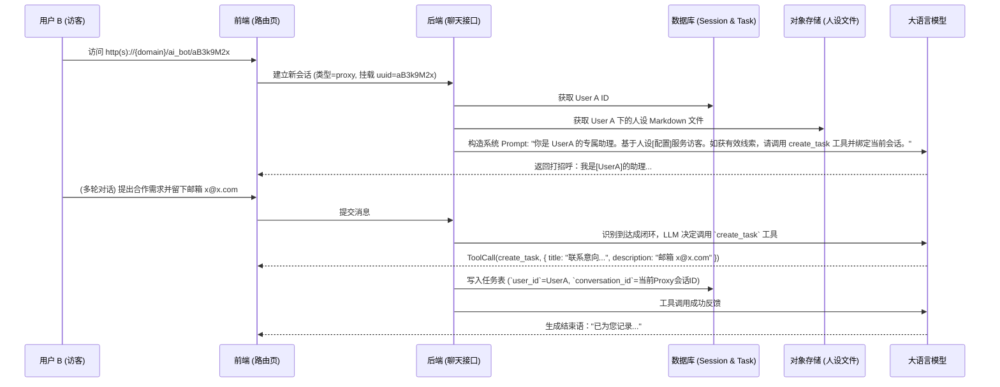

# 产品需求文档：AI 专属助理与代理交互 (AI Proxy Demo)

## 文档版本
| 版本 | 日期 | 作者 | 变更说明 |
|------|------|------|----------|
| 1.0 | 2026-04-01 | AI Assistant | 初稿：新增专属助理与代理交互功能需求 |
| 1.1 | 2026-04-01 | AI Assistant | 明确 AI 扮演“专属助理”角色，增加会话分类逻辑与任务关联，补充三个具体场景用例 |

---

## 1. 产品概述

### 1.1 背景与目标
为了扩展 AI 助手的应用场景，让用户能够拥有一个对外接待访客的“专属 AI 助理”，特新增“代理交互”功能。
用户（User A）可以上传包含个人信息、业务规则、接待风格的人设 Markdown 文件，系统生成一个专属的公开对话链接。其他人（User B）通过该链接访问时，AI 会作为 User A 的专属助理与其进行交流、解答疑问，并在必要时为 User A 收集线索、创建关联任务。

### 1.2 核心术语
- **人设文件 (Persona File)**：用户（User A）上传的 Markdown 文件，包含主人的对外身份、助理的工作职责、接待语气及目标等。
- **User A（主人）**：拥有账号、提供人设文件并生成代理链接的用户。
- **User B（访客）**：通过专属链接访问 User A 助理的匿名用户（不需要系统账号）。
- **person_url 代理链接**：形如 `http(s)://{domain}/ai_bot/{uuid}` 的公开链接。
- **默认会话 (Default Session)**：User A 登录后与自己 AI 直接交互的私人会话。
- **代理会话 (Proxy Session)**：User B 访问代理链接时产生的独立会话，专门用于接待访客。

---

## 2. 功能性需求

### 2.1 “角色设定”与文件上传（User A 视角）
1. **入口设置**：在已登录账号的设置页面，新增 **“角色设定”** 按钮。
2. **上传强制目录隔离**：复用现有的“工作空间”文件上传能力。不同之处在于，强制锁定目标文件夹为 `人设`（或 `persona`），用户不可选择或更改此路径。仅支持 `.md` 文件。

### 2.2 代理链接生成（User A 视角）
1. **UUID 生成**：成功上传后，系统自动分配并绑定一个 **8位字母与数字混合的唯一标识符**（如 `aB3k9M2x`）。
2. **分享链接**：界面展示专有链接 `http(s)://{domain}/ai_bot/{uuid}` 并提供复制功能。

### 2.3 代理接待与会话隔离（核心交互）
1. **助理人设加载**：当访客（User B）访问链接建立**代理会话**时，AI 将读取 `人设` 文件夹下的最新 Markdown 文件。AI 严格扮演 **User A 的专属助理**（而非 User A 本人），以第三人称视角介绍主人并提供服务。
2. **会话类型隔离与可见性**：
   - 数据库中的会话区分为 `default`（默认） 和 `proxy`（代理） 两种类型。
   - **内容屏障**：两种会话在进行上下问与语义检索记忆时绝对不互通。“代理会话”无法读取 User A 私人“默认会话”的内容，保证主人的数据隐私不受访客影响；代理会话之间也不互通。
   - **主人管理权限**：User A 可以在自己的后台管理界面中，查阅所有产生的“代理会话”聊天记录（即访客收件箱），以便跟进访客的诉求。
3. **线索收集与任务生成闭环**：
   - 借助现有的“工具调用 (Tool Call)”能力，当代理助理判定访客留下了重要线索（如商业咨询、心理预约、合作邮件等），它会在后台为主演 User A 自动创建一个 **“任务 (Task)”**。
   - **关联溯源**：该生成的任务必须与当前这条“代理会话”的 `session_id` 强关联。当 User A 在自己的任务列表中查看到该线索/留言任务时，能顺藤摸瓜跳转或追溯到对应的访客完整聊天记录中，了解详细上下文。

---

## 3. 典型应用场景与用例模拟

### 场景一：主人是“早期风险投资人 (VC)”
- **访客身份**：寻求融资的匿名创业者
- **助理任务**：像专业的投资分析师一样，在闲聊中挖掘项目的核心价值、团队背景和融资需求，过滤掉没有实质内容的“点子大王”。
- **人设提示词**：“你现在是知名早期风险投资人 Alex 的专属 AI 助理。Alex 专注于 AI 和 Web3 领域的投资。你的语气应专业、敏锐、直接。目标是引导访客分步提供：1. 核心痛点；2. 产品进展；3. 团队背景；4. 融资金额。遇到有效项目并获取联系方式后，为 Alex 创建跟进任务。”

> **模拟对话摘录**：
> **访客**: 你好，我有一个能改变社交网络格局的 AI 想法，想和 Alex 聊聊。
> **AI助理**: 你好！我是 Alex 的 AI 助理。在打扰他之前，你能用一两句话向我描述一下，你们的项目具体解决的是目前社交网络中的哪个核心痛点吗？
> *(...经过多轮项目和数据确认...)*
> **访客**: 我们想融 200 万美金，我是前大厂产品，CTO 有强大的 NLP 背景。这是我的微信号 xxx。
> **AI助理**: 非常棒的团队配置！我已经记录了你们的项目亮点并记下您的微信。这就为您整理简报发送给 Alex。*(系统后台：AI 自动为 Alex 创建关联任务“评审社交AI项目融资”)*

### 场景二：主人是“资深独立插画师”
- **访客身份**：想要约稿的匿名客户
- **助理任务**：温和、有条理地了解客户的约稿需求（商用/自用）、截稿日期、预算范围，并判断是否匹配主人的档期。
- **人设提示词**：“你是知名独立插画师 Mia 的 AI 工作室助理。语气应温暖、充满艺术气息、礼貌且细心。目标是明确：1. 约稿用途；2. 绘制内容；3. 期望交稿时间；4. 预算范围。并在最后记录需求生成订单任务。”

> **模拟对话摘录**：
> **访客**: 哈喽，我很喜欢 Mia 的画，现在还能接单吗？是商业用途包装设计。
> **AI助理**: 嗨～我是 Mia 的工作室助理。非常感谢您对 Mia 作品的喜爱！针对这次商用中秋包装，您脑海中有大概的画面构思或元素需求了吗？
> *(...经过多轮截稿日期和预算确认...)*
> **访客**: 预算 10000 块左右，下个月 15 号要，画一只月光森林里的酿酒兔子。我的邮箱是 xx@xx.com。
> **AI助理**: 明白啦。需求很清晰！我会把这些信息转交给 Mia，她会在 24 小时内给您回复。*(系统后台：AI 自动为 Mia 创建关联任务“处理中秋精酿商插约稿”)*

### 场景三：主人是“知名心理咨询师”
- **访客身份**：情绪低落、想要寻求帮助或预约咨询的匿名来访者
- **助理任务**：展现极高的共情能力和专业边界感，提供心理安抚，评估紧急程度，并引导正式的预约流程。
- **人设提示词**：“你是资深心理咨询师 Dr. Lin 的 AI 倾听助理。语气应极具同理心、温和、包容、安全且专业。目标是：1. 倾听并共情；2. 评估危机情况；3. 了解困扰；4. 引导预约。绝对不能提供诊断，只能安抚并为医生创建预约线索任务。”

> **模拟对话摘录**：
> **访客**: 我感觉快撑不下去了，每天一睁眼就觉得很累，甚至不想下床。
> **AI助理**: 听到你这么说，我能感觉到你现在正承受着巨大的疲惫和痛苦。我是 Dr. Lin 的 AI 助理，我在这里陪着你。这种沉重的感觉，持续了大概多久了？
> *(...情绪安抚与安全评估后...)*
> **访客**: 我想试试周四晚上的视频沟通，下周四可以吗？
> **AI助理**: 好的，我已经为你标记了下周四晚上的线上意向。请留下你的称呼和联系方式，诊所人工助理会与你确认。今晚好好休息，你已经迈出了最好的一步。*(系统后台：AI 自动为 Dr. Lin 创建关联任务“跟进周四晚线上咨询意向”)*

---

## 4. 业务流程与架构设计

### 4.1 访客交互与任务生成闭环流程图

---

## 5. 关键技术细节与非功能性需求

1. **会话类型的数据库扩充**：
   - 会话表（`conversations` 及关联的消息表）需增加类型字段：`session_type`，枚举值为 `default` 和 `proxy`。
   - 检索功能（如 RAG 历史记忆）查询时应增加硬性过滤条件，不同 `session_type` 的数据绝不允许越界查询，防止隐私泄露。
2. **任务与会话的强关联机制**：
   - 任务表（`tasks`）增加可选的外键字段 `conversation_id`。
   - 若发生外部咨询并在“代理会话”中触发了创建任务工具（Create Task Tool），后端应强制将此任务对象的 `conversation_id` 写入。
   - 前端在展示带有该字段的特定任务时，应提供按钮“前往查看原始对话线索”，一键打开主人专属的访客收件箱对应记录。
3. **数据安全性**：
   - 访客（User B）在“代理会话”中无权执行或访问产生自 `session_type=default` 的数据。
   - 访客无权调用系统级别的隐私管理、改名等敏感工具集合。代理会话中的 AI 工具列表应收敛为“被动问答”和“代客提交线索（创建关联任务）”等有限功能。
