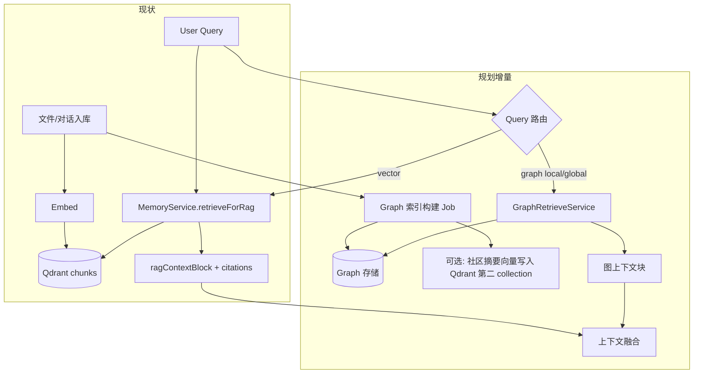

# GraphRAG 与现有记忆体系结合规划

## 文档说明

| 属性 | 说明 |
|------|------|
| 状态 | **规划稿**（非当前实现） |
| 范围 | 与 `MemoryService` / Qdrant / 文件入库链路相关的 **长期记忆与 RAG 演进** |
| 读者 | 后端与算法工程、架构评审 |
| 关联实现 | 现状见 `backend/src/memory/memory-service.ts`、`backend/src/vector/*`、演讲向说明见 [`docs/presentation/memory_architecture.md`](../presentation/memory_architecture.md)（含 §3.7「昨天聊了什么」案例） |

> 说明：业界常称 **GraphRAG**（图增强检索增强生成）。本文统一使用 **GraphRAG**。

## 版本

| 版本 | 日期 | 变更说明 |
|------|------|----------|
| 0.1 | 2026-03-23 | 初稿：技术特点、与现状差异、目标架构、数据与阶段规划 |
| 0.2 | 2026-03-23 | 新增 **§9 会话级轻量图**：每轮更新、「内存图」在 Workers 上的可行性、DO/D1/异步方案、与文档级 GraphRAG 边界；原「参考/小结」顺延为 **§10 / §11** |

---

## 1. 背景与动机

### 1.1 当前系统（基线）

- **索引**：对话与文件内容经切分/摘要后写入 **Qdrant**，以 **chunk 向量** 为主键检索单元，`payload` 携带 `user_id`、`type`、`source`、`file_id` 等（见 `MemoryVectorPayload`）。
- **检索**：单次 query embedding + 单次向量 `search` + `minScore` + `limit`（见 `MemoryService.retrieveWithScores`）。
- **注入**：`retrieveForRag` → `ragContextBlock` + SSE `citation`。

该路径在 **「找与用户话语义相近的片段」** 上简单有效，但在下列问题上存在结构性短板：

| 问题类型 | 纯向量 chunk RAG 的典型局限 |
|----------|------------------------------|
| **全局/主题级问题** | 用户问「这些文档整体上讨论什么组织/项目？」——片段 top-K 难以覆盖**全局结构** |
| **多跳关系推理** | 「与 A 合作且位于 B 城市的实体有哪些？」——需要 **实体—关系—实体** 遍历，仅靠相似片段堆叠成本高且不稳 |
| **指代消解与聚合** | 同一实体多种别名、跨 chunk 重复叙述，向量检索易 **重复命中局部** 而缺少 **合并后的摘要视图** |
| **可解释溯源** | citation 到 chunk 清晰，但难以回答「该结论来自哪类**关系路径**」 |

### 1.2 引入 GraphRAG 的目标（定性）

在 **不推翻** 现有 Qdrant 向量通路的前提下，增量构建 **「文本单元 — 实体 — 关系 —（可选）社区」** 结构，使系统能够：

1. 对适合的问题启用 **基于图结构与社区摘要** 的上下文，而不仅依赖片段相似度；
2. 在 **用户隔离**（`user_id`）下维护**私有知识图**，与现有多租户模型一致；
3. 通过 **分阶段交付** 控制 Cloudflare Workers 的 **CPU 时间、子请求次数与 LLM 成本**。

---

## 2. GraphRAG 技术特点（与纯向量 RAG 对照）

以下归纳以 Microsoft GraphRAG 等开源范式为参考（**实体抽取 → 图构建 → 社区检测 → 社区摘要 → 分层检索**），与本项目具体实现可裁剪。

### 2.1 核心构件

| 构件 | 作用 |
|------|------|
| **TextUnit** | 与现有 chunk 对应的**最小文本单元**（可复用当前入库切片策略或略调粒度） |
| **Entity** | 从 TextUnit 中抽取的**命名实体**（人、组织、地点、产品、概念等），带类型与描述 |
| **Relationship** | 实体之间的有向/无向**语义关系**（如 WORKS_FOR、LOCATED_IN、MENTIONS），带来源 TextUnit 引用 |
| **Community** | 在实体—关系图上做 **社区发现** 得到的簇；每个社区生成 **高层摘要**（Global 视角） |
| **Community Report** | 对社区的可读摘要 + 可选关键实体列表，用于 **Global Search** |

### 2.2 典型检索模式（概念层）

| 模式 | 输入假设 | 上下文来源 | 适用问题示例 |
|------|----------|------------|----------------|
| **Local（局部）** | 能定位到具体实体或少量种子实体 | 实体邻域子图 + 相关 TextUnit | 「张三在本资料中负责什么？」 |
| **Global（全局）** | 问题偏宏观或跨文档 | 社区摘要（Community Reports）的多路检索/筛选 | 「上传的几份合同整体风险点有哪些？」 |
| **Hybrid（混合）** | 同时需要细节与全貌 | 向量 top-K **并** 图检索结果，经 **融合与 rerank**（与 `memory_architecture.md` §3.5 衔接） | 「总结 A 项目进度并引用具体日期出处」 |

### 2.3 与纯向量 RAG 的能力对比（摘要）

| 维度 | 纯向量 chunk RAG | GraphRAG |
|------|------------------|----------|
| 索引成本 | 低（embed + upsert） | 高（多轮 LLM 抽取/摘要 + 图计算） |
| 在线延迟 | 低（单次 search） | 中高（可能多步：选社区/扩图/取原文） |
| 全局问题 | 弱 | 强（依赖社区摘要质量） |
| 关系型多跳 | 弱 | 强（显式边） |
| 工程复杂度 | 低 | 高 |

---

## 3. 与现有架构的对齐关系

### 3.1 组件映射

### 3.2 与模块的交互

| 现有模块 | 与 GraphRAG 的关系 |
|----------|-------------------|
| **`MemoryService`** | 可演进为 **编排层**：内部组合 `vectorRetrieve` + `graphRetrieve`，对外仍可提供 `retrieveForRag` 或新 API（如 `retrieveForRagV2`） |
| **Qdrant** | 保留 chunk 向量；**可选** 增加「社区摘要」「实体描述」等 **第二套 points** 或 **独立 collection**，供 Global 路径量检索 |
| **D1** | 适合存 **图元数据与版本**：`graph_build_jobs`、`entity`、`relationship`、`community` 表（或 JSON blob + 索引策略），便于按 `user_id` / `file_id` 做增量与回放 |
| **`ChatService`** | 在 RAG 超时预算内调用增强检索；**失败降级** 为纯向量路径（与现有一致） |
| **文件处理流水线** | 入库后 **异步触发** Graph 构建（避免阻塞用户上传完成态） |

### 3.3 运行环境约束（Cloudflare Workers）

- **CPU 时间**：全图社区检测 + 大规模 LLM 批处理不适合在 **单次 HTTP 请求**内完成，应 **队列/异步 Job**（如 Cloudflare Queues + 独立 consumer，或外部 worker）。
- **子请求与成本**：实体抽取、关系抽取、社区摘要多次 LLM 调用，需 **批处理、缓存、增量**（仅对变更 TextUnit 重算）。
- **隐私**：图与向量相同，必须 **`user_id`（及可选 `file_id`）强隔离**，禁止跨用户边。

---

## 4. 数据模型草案（逻辑层）

以下为 **逻辑模型**，物理表结构可在实施阶段用 Drizzle 迁移细化。

### 4.1 实体与关系

- **`memory_text_unit`**：`id`, `user_id`, `content_hash`, `qdrant_point_id`, `file_id?`, `created_at`
- **`memory_entity`**：`id`, `user_id`, `canonical_name`, `entity_type`, `description`, `embedding_id?`（可选）
- **`memory_relationship`**：`id`, `user_id`, `src_entity_id`, `dst_entity_id`, `predicate`, `confidence`, `source_text_unit_ids`（JSON 数组）
- **`memory_community`**：`id`, `user_id`, `level`（层次社区可多级）, `member_entity_ids`, `report_text`, `report_embedding_id?`, `updated_at`

### 4.2 构建与版本（建议）

- **`graph_index_version`**：按 `user_id` 或按 `file_id` 记录 **最后成功构建版本**，支持 **部分重算**（单文件更新只影响子图）。
- **幂等**：TextUnit 以 `content_hash` 或稳定 chunk id 去重，避免重复抽取风暴。

---

## 5. 在线检索设计（规划）

### 5.1 Query 路由（轻量）

在调用昂贵图检索前，增加 **低成本路由**（规则 + 小分类器或单次 LLM 结构化输出，需严格超时）：

| 路由结果 | 行为 |
|----------|------|
| `vector_only` | 走现有 `retrieveWithScores` |
| `graph_local` | 从 query 抽实体种子 → 子图 N 跳 → 取关联 TextUnit → 截断 token |
| `graph_global` | 社区摘要检索（向量或关键词）→ 选 Top 社区报告 → 注入上下文 |
| `hybrid` | 向量 top-K 与图路径结果 **合并**，可选 **rerank**（见 presentation `memory_architecture` §3.5） |

### 5.2 上下文拼装协议

- **与现有一致**：最终仍产出 **可引用块**（便于 SSE `citation` 扩展：`kind: 'graph_community' | 'graph_entity'` 等）。
- **顺序建议**：**系统时钟 / 安全策略** → **主 system 模板** → **RAG 向量块** → **GraphRAG 块** → **D1 历史** → **user**（具体顺序可与 `context_engineering.md` 对齐迭代）。

### 5.3 降级策略

- Graph 索引 **未就绪** / **超时** / **部分文件未建图**：自动 **vector_only**。
- 对 **P95 延迟** 设硬阈值；图路径仅在 **显式场景**（如工作空间「分析/总结」类意图）默认开启，可降低误触发成本。

---

## 6. 分阶段落地路线（建议）

| 阶段 | 目标 | 主要交付 | 风险可控点 |
|------|------|----------|------------|
| **Phase 0** | 可观测与基线 | 记录「适合图检索」的 query 类型分布；离线评测集（不含图） | 无新存储 |
| **Phase 1** | 实体增强 | 入库异步抽实体，**不入边** 或仅入高置信边；UI/日志展示实体标签 | 控制抽取批次与费用 |
| **Phase 2** | 关系图 + Local | 用户维度子图；Local 检索 MVP；仍保留向量为主 | 限制子图深度与边数上限 |
| **Phase 3** | 社区 + Global | 社区检测与 Community Report；Global 检索；可选第二 Qdrant collection | 异步构建 + 版本号 |
| **Phase 4** | Hybrid + rerank | 多路融合与精排；与 `MemoryRetrieveOptions` 扩展对齐 | 统一超时与回退 |

阶段可 **裁剪**：若产品以「个人知识库问答」为主，**Phase 2 Local** 往往已能带来可感知增益；**Phase 3** 对「多文档综述」更有价值。

---

## 7. 非功能需求与指标

- **隔离**：所有图数据查询必须带 `user_id`（及业务需要的 `file_id` / `session` 范围）。
- **延迟**：与 `MEMORY_RAG_TIMEOUT_MS` 协调；图检索独立子超时，**默认不拖垮主对话**。
- **成本**：LLM token 用于抽取/摘要为主；需 **批处理、缓存、增量索引**。
- **指标建议**：`graph_index_build_duration`、`graph_retrieve_mode`（vector/local/global/hybrid）、`graph_retrieve_latency_ms`、`fallback_to_vector_count`。

---

## 8. 风险与开放问题

1. **抽取质量**：小模型抽实体关系错误会导致 **错误边** 污染图；需人工校验工具或置信度阈值 + 用户反馈闭环。
2. **社区检测稳定性**：文档更新导致社区划分漂移，摘要需 **版本化** 或 **温和更新策略**。
3. **与 PRD 边界**：GraphRAG 偏 **高级知识库能力**，需产品定义是否默认开启或仅工作空间「深度分析」模式开启。
4. **存储上限**：D1 + Qdrant 体量增长需 **保留策略**（按文件/按时间归档图快照）。

---

## 9. 会话级轻量图（Session Dialogue Graph）：按轮构建/更新与「内存图」可行性

本章回答一类**与文档级 GraphRAG 并列**的产品/架构问题：能否在 **每一轮对话之后**，针对 **当前 `session_id`** 建立或更新一个 **规模受控的图结构**（可视为 **GraphRAG 思想在会话内的裁剪实现**），从而 **更精准地检索「前面聊过的内容」**？下文**不压缩**，分动机、命题、运行时陷阱、宿主方案、与主链路集成、成本与分阶段衔接展开。

### 9.1 问题与动机：文档级 GraphRAG 未单独覆盖的缺口

- **文档级路径**（上文 §2–§6）主要服务 **上传文件 / 知识库 chunk** 的实体—关系—社区结构，解决 **跨文档综述、多跳关系、全局摘要** 等。
- **会话回忆**类需求（参见 `memory_architecture.md` **§3.7**）当前主要依赖：
  - D1 **`listRecentForSession(session_id, 20)`**；
  - **`conversationRowsToLlmMessages`** 的时间软截断/硬折叠；
  - Qdrant RAG **以文件向量为主**，**未**系统性地把每轮对话写入向量索引。
- **缺口**：当用户指代 **多轮之前的主题、实体、约定** 时，仅靠 **扁平历史文本 + 截断** 容易丢结构；**向量检索**若不对 **对话内容** 建索引，也无法稳定召回「聊过但不在最近 20 条内」的片段。
- **会话级轻量图**的定位：在 **单个 `session_id` 边界** 内，用 **实体 / 主题 / 轮次引用** 等显式结构，支持 **Local 式扩展**（从当前 query 或种子实体出发，在 **会话子图** 上取相关轮次摘要或原文 id），**补充**而非替代 D1 原文与文档级 GraphRAG。

### 9.2 设计命题：「每轮之后更新一个小 GraphRAG」指什么

**目标形态（逻辑）**：

1. **节点类型（示例，可裁剪）**
   - **`Turn`**：对应一轮 user+assistant（或仅 user），带 `conversation_id` / 时间戳 / 可选短摘要；
   - **`Entity`**：从当轮文本抽取的专名、项目名、日期约定等（**会话内 canonical**，可与文档级实体表 **延迟对齐**）；
   - **`Topic`**（可选）：聚类或关键词簇，用于「上一段在聊什么主题」；
   - **`Fact`**（可选）：结构化短句（「用户偏好：…」「已确认：…」），带来源 `turn_id`。
2. **边类型（示例）**
   - `Turn --mentions--> Entity`；
   - `Entity --related_to--> Entity`（当轮或跨轮）；
   - `Turn --continues--> Turn`（时序链）；
   - `Topic --covers--> Turn`。
3. **每轮增量**：在用户消息处理完成（及 assistant 持久化后）追加节点与边，并对 **度数/时间窗** 做裁剪，保证 **有界**。

该结构与 Microsoft GraphRAG 的 **TextUnit—Entity—Relationship** 同族，但 **不做**全量社区检测与 Global Community Report（除非会话极长且产品明确要求），以降低 **CPU 与 LLM 成本**。

### 9.3 「在内存里维护」在 Cloudflare Workers 上的真实含义与陷阱

**常见误解**：在 Worker 里放一个 `Map<sessionId, Graph>`，每轮 `set`，下一轮请求就能读到。

**实际情况**：

| 事实 | 含义 |
|------|------|
| **请求之间无共享堆** | 不同请求可能落在 **不同 isolate**；全局变量 **不**构成可靠的跨请求会话存储。 |
| **冷启动** | 实例回收后内存清空；**纯内存图**若无持久化，**下一轮必丢**。 |
| **并发** | 同会话两条消息并发到达时，若对同一图 **无串行化**，会出现 **丢更新或脏写**。 |

**结论**：若产品要求「**任意后续轮次**都能用到累计图」，则 **不能**仅依赖「单次请求内的进程内对象」；必须引入 **粘性会话状态 + 持久化或至少 DO 持久内存语义**。

**唯一例外**：若「图」仅用于 **同一次 HTTP 长连接内的多轮工具循环**（同一 `handleMessageStream` 调用内），则可在 **该次调用的局部变量** 中维护；但这 **无法**覆盖「用户关闭页面后下一条消息」的场景，与「每轮对话之后」的通常产品语义 **不一致**。

### 9.4 可行宿主方案对比

#### 9.4.1 Durable Objects（按 `session_id` 路由）

- **模型**：每个会话对应一个 DO（或哈希分片减少对象数），DO 内 **单线程** 处理该会话的图更新与读，**天然避免**并发写冲突。
- **内存**：DO 内可长期保留图结构；可选 **持久化 API** 将状态写入存储，DO 休眠后再唤醒 **恢复**。
- **优点**：与「每轮追加」模型契合；延迟路径短（同区域 DO stub）。
- **缺点**：DO **计费与配额**需评估；热点会话 **单点**；需设计 **图大小上限** 防止单 DO 状态爆炸。

#### 9.4.2 D1 / KV：图序列化为 JSON Blob + 版本号

- **模型**：`session_graph` 表：`session_id`, `version`, `graph_json`, `updated_at`；每轮 **读-改-写** 或 **追加事件日志** 再物化。
- **优点**：不引入 DO；与现有 D1 运维一致；易备份与审计。
- **缺点**：高并发下需 **乐观锁**（`version`）或 **串行化写入**；大图 JSON **解析/序列化** CPU 与行大小限制需注意；**读改写**延迟高于 DO 纯内存。

#### 9.4.3 异步队列 + 消费者

- **模型**：每轮结束后往 Queue 丢 **「会话增量事件」**（`session_id`, `user_snippet`, `assistant_snippet`, `turn_id`）；消费者批量调用 LLM 抽实体/边，再写入 D1/DO。
- **优点**：**不阻塞** SSE 主路径；可 **批处理** 降 token。
- **缺点**：**最终一致**；用户紧接下一轮问「你刚才记住了吗？」可能 **尚未入库**，需产品话术或 **同步轻量摘要** 兜底。

#### 9.4.4 混合（推荐工程路径）

- **同步路径**：只更新 **极轻量** 结构（如 `rolling_summary` 一行 + `last_entities`），写入 D1，保证 **下一轮立即可见**。
- **异步路径**：完整 **边抽取、消歧、合并** 在队列里做，结果合并进 **DO 或 D1**。
- **读路径**：`ChatService` 组装上下文时 **先读轻量摘要**，可选再读 **图检索服务** 返回的 `turn_id` 列表，回 D1 **拉原文** 拼进 prompt（**可追溯**）。

### 9.5 与文档级 GraphRAG（本文 §2–§6）的边界

| 维度 | 文档级 GraphRAG | 会话级轻量图 |
|------|-----------------|--------------|
| **主数据** | 文件 chunk、工作空间资料 | **当前 session 内对话轮次** |
| **生命周期** | 随文件/用户知识库 | 随会话；可配置 **归档到用户级** |
| **构建节奏** | 异步 Job、批处理 | **每轮或节流每 N 轮** |
| **检索问题** | 多文档全局/多跳 | 「前面聊过什么」「指代哪次约定」 |
| **社区检测** | 通常需要（Global） | **一般省略**或仅在会话超长时触发弱聚类 |

二者 **可共存**：检索路由可先判 **意图**（回忆/续聊 vs 查资料），再并行或串行拉 **会话子图上下文** 与 **文档向量/文档图**。

### 9.6 如何进入 `ChatService` 上下文（与 `context_engineering` 对齐）

建议 **独立一块** 注入（与 `ragContextBlock` 并列），例如：

- **`sessionGraphContextBlock`**：包含 **相关轮次摘要 + 引用 id**（或 **子图 Mermaid 文本**仅供调试，生产可换自然语言描述）；
- **顺序**：在 **主 system** 与 **文档 RAG** 之后、**D1 原始历史** 之前或之后需 A/B——**之前**可强调结构记忆，**之后**可强调原文顺序；需用 **离线评测** 定夺。

**SSE**：可扩展 `citation` 的 `kind`（如 `session_turn`），`excerpt` 为摘要，**`conversation_id` 指向 D1**，便于前端「跳转该轮」。

**降级**：图 **未就绪**、超时、或会话 **新开** → **整段省略**，不影响主对话。

### 9.7 更新频率、LLM 调用与成本控制

- **每轮全量重抽实体/关系**：成本高，易触发 **Workers CPU/子请求** 限制；**不推荐**作为默认。
- **推荐**：
  - **规则/轻量模型** 先做 **候选实体**（用户名、引号内专名、正则日期）；
  - **LLM 抽取** **节流**：每 **N 轮**、或当 **用户话轮命中「回忆/之前/上次」**、或 **Turn 文本超阈值** 时触发；
  - **异步** 补全边与 **实体对齐**（canonical）。
- **预算**：单次会话图 **节点数/边数** 硬顶；超过则 **按时间淘汰** 低频实体或 **合并 Topic**。

### 9.8 图规模、跨会话与隐私

- **规模**：默认 **仅当前 `session_id`**；避免把 **会话图** 与 **其他会话** 自动连边（除非用户显式「合并上下文」）。
- **用户隔离**：所有读写带 **`user_id`** 校验，与 `session` 归属一致。
- **跨会话回忆**（产品需求）：需 **显式** 设计「加载历史会话图」或 **用户级轻量摘要表**，**禁止**隐式跨 session 泄露。

### 9.9 轻量替代路线（若暂不建图）

在工程资源不足时，可先落地 **不依赖完整图** 的增强：

1. **会话滚动摘要**：每轮或每 K 轮用 LLM 更新 `session_summary`（存 D1 `chat_sessions` 或侧表），下轮注入 system 前部；
2. **关键实体列表**：`session_entities_json` 与摘要同步维护；
3. **对话向量**：将 **摘要或每轮短句** embed 写入 Qdrant，`payload.session_id` 过滤，专用于 **会话语义召回**（与文件 RAG **分 collection 或 payload 区分**）。

这些可与 **会话图** **渐进合并**：摘要负责 **粗召回**，图负责 **精确定位轮次与关系**。

### 9.10 风险与测试要点

- **抽取错误边** → 错误「回忆」：需 **置信度阈值**、**用户纠正**入口、**日志采样审计**。
- **最终一致延迟**（队列方案）→ 用户感知 **不一致**：需 **产品文案** 或 **同步最小摘要**。
- **DO 热点** → 延迟尖刺：需 **分片** 或 **降级到 D1 只读副本**。
- **测试**：构造 **多轮指代**、**换题再回来**、**新会话**、**20 条历史之外** 的用例，对比 **有/无会话图** 的 **引用正确率** 与 **P95 延迟**。

### 9.11 与本文 §6 分阶段路线的衔接

建议在 **文档级 Phase 0（指标）** 同时加 **「会话回忆」类 query 占比**。

**独立阶段建议（会话级）**：

| 子阶段 | 内容 |
|--------|------|
| **S0** | 仅 **滚动摘要** + D1，无图 |
| **S1** | **Turn 链 + 实体节点**，规则边为主，LLM 节流 |
| **S2** | **DO 或 D1 乐观锁** 承载图；读路径进 `ChatService` |
| **S3** | 与 **文档级 Phase 2 Local** 做 **统一检索编排**（`MemoryService` 扩展） |

文档级 **Phase 1–4** 与 **S0–S3** 可 **并行规划**，由产品决定优先级（知识库优先 vs 会话体验优先）。

---

## 10. 参考与延伸阅读

- Microsoft Research 公开材料：**GraphRAG**（基于图的 RAG：实体、关系、社区摘要与分层检索）。实施时请对照最新开源实现与论文中的 **Local/Global Search** 定义。
- 本项目相关：`docs/presentation/memory_architecture.md`（§3.4 多路召回、§3.5 rerank、§3.7 会话回忆案例）、`docs/presentation/context_engineering.md`（上下文拼装）。
- **会话级增量图（按轮更新、Workers 宿主）**：见本文 **§9**。
- 阶段与总路线对齐：**[`tech_design_ai_bot_v1_3.md`](./tech_design_ai_bot_v1_3.md)**（§6、§10）。

---

## 11. 小结

GraphRAG **不是**对现有 Qdrant 向量 RAG 的简单替换，而是在 **异步构建知识图 + 在线可路由检索** 的前提下，与向量检索 **互补**。结合 Cloudflare Workers 约束，推荐 **异步建图、分阶段交付、严格降级与超时**，并与现有 `MemoryService` / `ChatService` 注入点保持 **接口稳定、实现可插拔**。

**会话级轻量图（§9）** 解决的是 **同一会话内「前文结构」** 的可检索性，与 **文档级** GraphRAG **正交**；其实现必须正视 **Workers 无跨请求共享堆** 的事实，采用 **DO / D1+版本 / 异步队列** 等宿主，并配合 **节流与有界图**，才能在 **精准回忆** 与 **成本延迟** 之间取得平衡。
