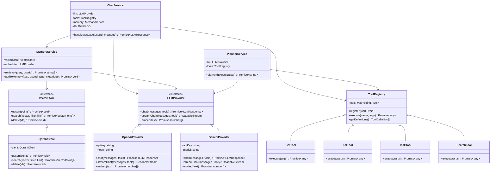
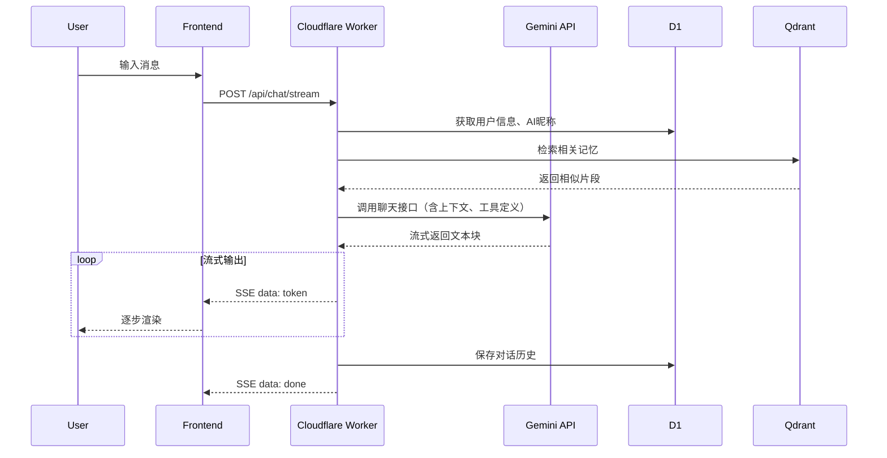
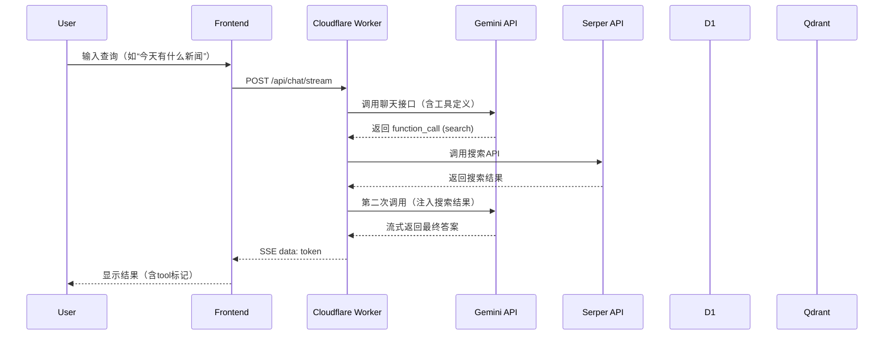
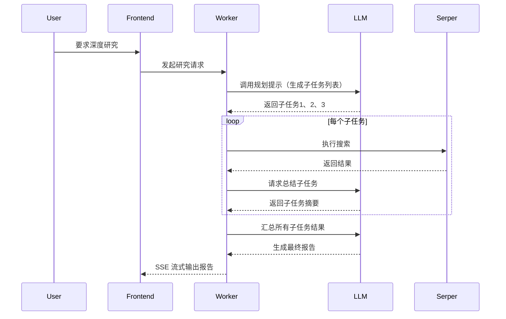
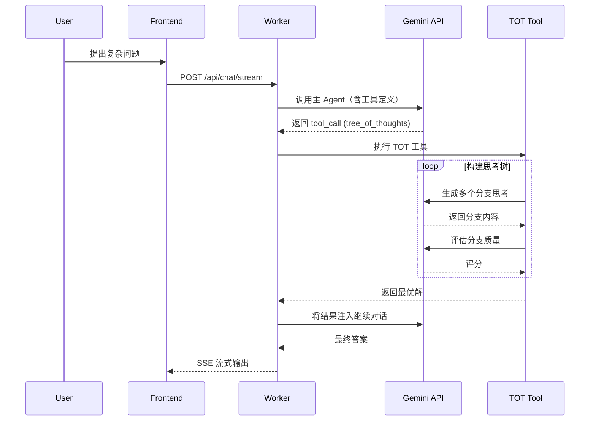
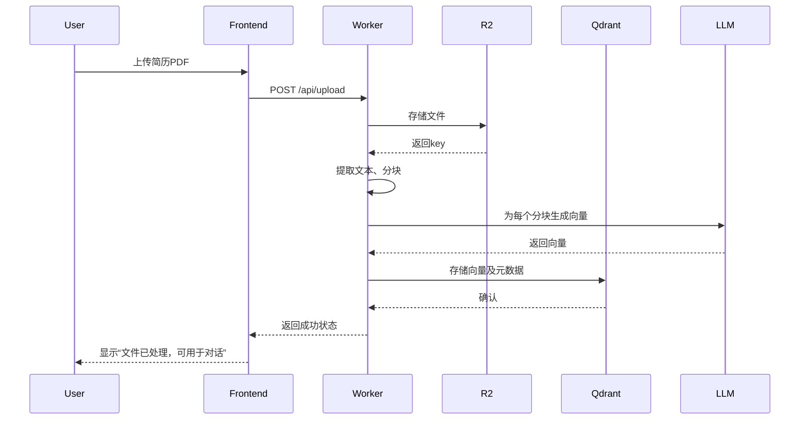

# 后端技术设计方案（1.0版本）——最终版

## 文档版本
| 版本 | 日期 | 作者 | 变更说明 |
|------|------|------|----------|
| 1.0 | 2026-03-21 | AI Assistant | 初稿完成（包含完整技术选型、架构、实现细节、LLM调用设计） |

---

## 1. 技术选型与理由

| 组件 | 技术选型 | 理由 |
|------|----------|------|
| **运行环境** | Cloudflare Workers | 全球边缘部署，低延迟；无服务器架构，自动扩缩容；免费额度充足，符合项目成本要求；原生支持 D1、R2 等存储。 |
| **编程语言** | **TypeScript (Node.js 兼容)** | 与 Cloudflare Workers 生态完美集成；类型安全减少运行时错误；V8 引擎冷启动 < 50ms；生态丰富（Hono、Drizzle ORM 等）。 |
| **Web 框架** | **Hono (TypeScript)** | 轻量级（13KB），专为 Workers 优化；原生 TypeScript 支持；内置中间件（JWT、CORS、日志）；原生支持 Server-Sent Events。 |
| **AI 模型** | Gemini 2.0 Flash Lite (Google AI Studio) | 免费额度，响应速度快；支持函数调用（工具调用），便于实现工具注入和子代理规划。 |
| **LLM 抽象层** | 自定义 `LLMProvider` 接口 | 抽象具体模型调用，便于后续切换 OpenAI、Claude 等，保持业务逻辑稳定。 |
| **向量数据库** | Qdrant Cloud (免费层) | 存储对话片段、简历/文档的向量表示，支持语义检索和记忆召回；免费层 1GB 存储足够原型使用。 |
| **向量数据库抽象** | 自定义 `VectorStore` 接口 | 抽象向量存储操作，便于替换为 Pinecone、Weaviate 或本地 Milvus。 |
| **关系型数据库** | Cloudflare D1 (SQLite) | 存储用户信息、任务列表、AI昵称等结构化数据；与 Workers 同环境，零延迟；SQL 易于管理。 |
| **关系数据库抽象** | **Drizzle ORM** | 类型安全的 SQL 构建器，自动推导数据库 schema；支持 D1、PostgreSQL、MySQL 等，便于未来迁移。 |
| **搜索 API** | Serper.dev (免费额度) | 1-2 秒内返回 Google 搜索结果，结构化 JSON；支持网页、图片、新闻等类型，满足深度研究需求。 |
| **文件存储** | Cloudflare R2 | 存储用户上传的简历、导出的报告等文件；S3 兼容 API，成本低廉。 |
| **前端框架** | Vercel AI SDK + Tailwind CSS | Vercel AI SDK 提供 React hooks 和流式对话支持，简化前端集成；Tailwind CSS 快速构建 UI。 |

---

### 1.1 关于 Python 的劣势分析

尽管 Python 在 AI 生态中拥有丰富的库（如 LangChain、Transformers），但在 **Cloudflare Workers** 环境中，选择 Python 会面临以下劣势：

| 维度 | 劣势说明 |
|------|----------|
| **原生支持** | Workers 运行时原生支持 JavaScript/TypeScript，Python 需通过 `python_workers`（beta）或 WASM 运行，存在性能损耗和功能限制。 |
| **冷启动** | Python 解释器启动时间明显长于 V8 引擎，冷延迟可能达到数百毫秒甚至秒级，影响对话首字时间。 |
| **生态适配** | 主流 AI/数据库 SDK（如 Gemini、Serper、Qdrant）均为 Python 提供了完整客户端，但 Workers 环境要求异步、无状态，多数 Python SDK 为同步设计，需额外封装。 |
| **依赖管理** | Python 依赖包体积大，且 Workers 对 `site-packages` 有大小限制（1MB），部署复杂。 |
| **工具链** | TypeScript 有 Hono、Drizzle、Vercel AI SDK 等专为边缘环境优化的库，Python 生态更偏向传统服务器。 |
| **类型安全** | Python 虽支持类型注解，但运行时无强制检查，工具定义等易出错。 |

因此，在 Cloudflare Workers 上构建本项目，**TypeScript/Node.js 是最优选择**。

---

### 1.2 Agent 框架选型决策

在 Agent 实现方式上，我们决定 **不引入 LangChain/LangGraph 等现成框架**，而是采用轻量自研方案。理由如下：

1. **架构哲学**：将智能交给模型，将确定性交给基础设施。当模型足够强大时，硬编码的 chain 或 graph 反而成为障碍。决策权在 LLM 而非代码，新模型发布时能力自动增强。
2. **Cloudflare Workers 环境约束**：包体积限制（免费 3 MB，付费 10 MB）和冷启动要求极低的框架开销。LangChain.js 等框架即使压缩后也可能占 2 MB 以上，而自研核心代码不足 500 KB，留足扩展空间。
3. **框架实际价值有限**：框架主要提供 LLM 接口统一、工具预置和 ReAct 循环脚手架，但这些都可以用少量代码自行实现。框架解决不了规划、错误恢复、上下文管理等核心难题。
4. **MCP 标准正削弱框架价值**：工具方直接提供 MCP Server，模型直接返回结构化 `tool_call`，框架的集成价值下降。
5. **可控性与可观测性**：自研实现使每一步逻辑透明，便于调试和定制化。

因此，我们选择在 `ChatService` + `ToolRegistry` + `PlannerService` 中自行实现 ReAct 循环、工具调用和规划能力，确保轻量、高效、完全可控。

#### 1.2.1 关于 Cloudflare 体积限制的补充说明

根据 Cloudflare 官方文档（2026 年 3 月），Workers 的包体积限制已提升至：
- **免费计划**：压缩后 3 MB
- **付费计划**：压缩后 10 MB

这一变化进一步减轻了包体积压力，但并未改变我们选择轻量自研 Agent 的核心决策。理由如下：

- **自研方案体积优势依然显著**：即使 3 MB 的免费额度，LangChain.js 及其依赖（约 2 MB）仍会占用大量配额，而我们的自研核心代码压缩后不足 500 KB，为未来功能扩展留足空间。
- **边缘环境冷启动要求未变**：框架层仍会增加解析和初始化时间，自研方案更利于保持冷启动 < 50ms。
- **可充分利用新特性**：
  - 在 `wrangler.toml` 中开启 `nodejs_compat` 标志，可使用内置 Node.js API（不计入包体积），进一步优化依赖。
  - 静态资源（如 PDF 模板）可存储于 R2，避免打包到 Worker 脚本中。

因此，尽管限制放宽，自研方案在可维护性、可控性和边缘适配性上仍是本项目的最佳选择。

---

## 2. 整体架构设计

```
┌─────────────────────────────────────────────────────────────────┐
│                        前端 (Vercel AI SDK + ChatUI)           │
│                     - 对话界面                                   │
│                     - 富文本渲染（工具调用标记、RAG 浮窗）         │
└───────────────────────────────┬─────────────────────────────────┘
                                │ HTTPS / SSE
                                ▼
┌─────────────────────────────────────────────────────────────────┐
│                     Cloudflare Worker (Hono)                    │
│  ┌───────────────────────────────────────────────────────────┐  │
│  │                      API Gateway                          │  │
│  │   - 路由分发 / 认证 / 限流 / 日志                          │  │
│  └───────────────────────────────────────────────────────────┘  │
│  ┌───────────────────────────────────────────────────────────┐  │
│  │                      核心服务层                           │  │
│  │  ┌─────────────┐ ┌─────────────┐ ┌──────────────────┐   │  │
│  │  │ 用户管理模块 │ │ 对话管理模块 │ │  任务管理模块    │   │  │
│  │  └─────────────┘ └─────────────┘ └──────────────────┘   │  │
│  │  ┌─────────────┐ ┌─────────────┐ ┌──────────────────┐   │  │
│  │  │ 记忆召回模块 │ │ 工具调用模块 │ │ 子代理规划模块   │   │  │
│  │  └─────────────┘ └─────────────┘ └──────────────────┘   │  │
│  │  ┌─────────────┐ ┌─────────────────────────────────┐   │  │
│  │  │ TOT/GOT模块 │ │         高级推理模块            │   │  │
│  │  └─────────────┘ └─────────────────────────────────┘   │  │
│  └───────────────────────────────────────────────────────────┘  │
│  ┌───────────────────────────────────────────────────────────┐  │
│  │                      外部集成层                           │  │
│  │   Gemini API │ Serper API │ Qdrant │ D1 │ R2            │  │
│  └───────────────────────────────────────────────────────────┘  │
└─────────────────────────────────────────────────────────────────┘
```

**架构特点**：
- **无服务器**：Worker 按请求计费，自动扩缩。
- **分层清晰**：网关、服务层、数据层分离，便于维护和扩展。
- **工具注入与子代理规划**：通过 Gemini 的函数调用能力实现，核心逻辑封装在工具调用模块。
- **抽象解耦**：LLM、向量数据库、关系数据库均通过接口抽象，便于替换实现。
- **高级推理支持**：内置 TOT/GOT 模块，用于复杂思考链。

---

## 3. 模块划分

| 模块 | 职责 | 关键类/文件 |
|------|------|-------------|
| **用户管理模块** | 用户信息、AI昵称的存储与获取 | `UserRepository`, `api/user.ts` |
| **对话管理模块** | 接收用户消息，调用 LLM，处理工具调用，返回回复 | `ChatService`, `api/chat.ts` |
| **任务管理模块** | 任务 CRUD，项目关联 | `TaskRepository`, `ProjectRepository`, `api/tasks.ts` |
| **记忆召回模块** | 向量检索历史对话、上传文档，注入上下文 | `MemoryService`, `VectorStore` |
| **工具调用模块** | 注册与执行所有可用工具 | `ToolRegistry`, `tools/*.ts` |
| **子代理规划模块** | 深度研究等复杂任务的分解与协调 | `PlannerService` |
| **TOT/GOT 模块** | 树/图思考模式，用于高级推理 | `TotService`, `GotService` |
| **文件处理模块** | 文件上传、文本提取、向量化存储 | `api/upload.ts`, `FileProcessor` |
| **LLM 抽象层** | 封装不同 AI 模型调用 | `LLMProvider`, `GeminiProvider` |
| **向量存储抽象层** | 封装向量数据库操作 | `VectorStore`, `QdrantStore` |
| **关系数据库抽象层** | 使用 Drizzle ORM 操作 D1 | `db/schema.ts`, `db/repositories/*` |

---

## 4. 数据存储设计

### 4.1 关系型数据库（Cloudflare D1）

#### ER 图（简化）
```
┌─────────────┐       ┌─────────────┐       ┌─────────────┐
│   users     │       │   tasks     │       │  projects   │
├─────────────┤       ├─────────────┤       ├─────────────┤
│ id (PK)     │◄──────│ user_id (FK)│       │ id (PK)     │
│ name        │       │ project_id  │───────│ user_id (FK)│
│ email       │       │ title       │       │ name        │
│ ai_nickname │       │ description │       │ created_at  │
│ created_at  │       │ status      │       └─────────────┘
└─────────────┘       │ created_at  │
                      │ updated_at  │
                      └─────────────┘

┌─────────────────┐       ┌─────────────────┐
│  conversations  │       │   file_uploads  │
├─────────────────┤       ├─────────────────┤
│ id (PK)         │       │ id (PK)         │
│ user_id (FK)    │       │ user_id (FK)    │
│ role            │       │ filename        │
│ content         │       │ original_name   │
│ created_at      │       │ mime_type       │
└─────────────────┘       │ size            │
                          │ r2_key          │
                          │ processed       │
                          │ created_at      │
                          └─────────────────┘
```

#### 表结构详细定义

**users**
| 字段 | 类型 | 约束 | 说明 |
|------|------|------|------|
| id | TEXT | PRIMARY KEY | UUID |
| name | TEXT | NOT NULL | 用户姓名 |
| email | TEXT | UNIQUE NOT NULL | 邮箱 |
| ai_nickname | TEXT | DEFAULT '助手' | AI 昵称 |
| created_at | INTEGER | NOT NULL | Unix 时间戳 |

**projects**
| 字段 | 类型 | 约束 | 说明 |
|------|------|------|------|
| id | TEXT | PRIMARY KEY | UUID |
| user_id | TEXT | NOT NULL, FK | 所属用户 |
| name | TEXT | NOT NULL | 项目名称 |
| created_at | INTEGER | NOT NULL | 创建时间 |

**tasks**
| 字段 | 类型 | 约束 | 说明 |
|------|------|------|------|
| id | TEXT | PRIMARY KEY | UUID |
| user_id | TEXT | NOT NULL, FK | 所属用户 |
| project_id | TEXT | NULL, FK | 所属项目 |
| title | TEXT | NOT NULL | 任务标题 |
| description | TEXT | NULL | 详细描述/备注 |
| status | TEXT | NOT NULL DEFAULT 'pending' | pending, in_progress, completed |
| created_at | INTEGER | NOT NULL | |
| updated_at | INTEGER | NOT NULL | |

**conversations**（可选）
| 字段 | 类型 | 约束 | 说明 |
|------|------|------|------|
| id | TEXT | PRIMARY KEY | UUID |
| user_id | TEXT | NOT NULL, FK | |
| role | TEXT | NOT NULL | 'user' 或 'assistant' |
| content | TEXT | NOT NULL | |
| created_at | INTEGER | NOT NULL | |

**file_uploads**
| 字段 | 类型 | 约束 | 说明 |
|------|------|------|------|
| id | TEXT | PRIMARY KEY | UUID |
| user_id | TEXT | NOT NULL, FK | |
| filename | TEXT | NOT NULL | 存储文件名 |
| original_name | TEXT | NOT NULL | |
| mime_type | TEXT | NOT NULL | |
| size | INTEGER | NOT NULL | |
| r2_key | TEXT | NOT NULL | R2 路径 |
| processed | INTEGER | DEFAULT 0 | 是否已向量化 |
| created_at | INTEGER | NOT NULL | |

### 4.2 向量数据库（Qdrant）

**Collection**: `memory`  
**向量维度**: 768（Gemini embedding）  
**距离度量**: Cosine  

**Payload 结构**:
| 字段 | 类型 | 说明 |
|------|------|------|
| user_id | string | 用户标识 |
| type | string | 'conversation' 或 'document' |
| source | string | 原始文本片段 |
| timestamp | integer | 时间戳 |
| file_id | string | 关联 file_uploads.id（若为文档） |

### 4.3 时间字段设计说明

所有时间字段（`created_at`、`updated_at`）均使用 **INTEGER** 类型存储 **Unix 时间戳（秒级）**。选择理由：
- **业务精度足够**：任务创建、更新等场景对时间精度要求到秒即可满足需求。
- **存储与索引效率**：秒级时间戳占用 4 字节，比毫秒级节省空间，索引性能更优。
- **API 兼容性**：Gemini、Serper 等外部 API 返回的时间字段通常为秒级 Unix 时间戳，便于直接存储和比较。
- **跨语言一致性**：JavaScript 中 `Math.floor(Date.now() / 1000)` 可轻松获得秒级时间戳。

若未来需要毫秒级精度，可采用以下扩展方案：
- **方案一**：将字段类型改为 `BIGINT` 直接存储毫秒时间戳（`Date.now()`）。
- **方案二**：保留秒级字段，增加一个 `ms_offset` 字段（SMALLINT，0~999）存储毫秒偏移，实现毫秒精度且保持索引高效。

当前版本按秒级设计，后续可根据实际需求灵活升级。

### 4.4 数据库迁移脚本（D1）

使用 `wrangler d1 migrations` 管理。示例迁移文件略。

---

## 5. API 接口设计

所有接口返回 JSON，需携带 `Authorization: Bearer <token>`（简化实现可使用 session）。

### 5.1 对话接口（SSE 流式）

**POST /api/chat/stream**

请求体：
```json
{
  "message": "用户输入",
  "conversation_id": "可选"
}
```

响应：`Content-Type: text/event-stream`

事件格式：
```
event: token
data: {"content":"正在思考"}

event: tool_call
data: {"name":"search","args":{...}}

event: done
data: {}
```

### 5.2 用户信息接口

**GET /api/user** → 返回当前用户
```json
{ "id": "xxx", "name": "李明", "email": "li@example.com", "ai_nickname": "小研" }
```

**PUT /api/user** → 更新
```json
{ "name": "李小明", "email": "new@example.com" }
```

**PUT /api/user/ai-name** → 设置 AI 昵称
```json
{ "nickname": "星尘" }
```

### 5.3 任务接口

**GET /api/tasks?status=pending** → 任务列表
**POST /api/tasks** → 创建
```json
{ "title": "完成报告", "description": "详细内容", "status": "pending" }
```
**PUT /api/tasks/:id** → 更新
**DELETE /api/tasks/:id** → 删除

### 5.4 文件上传接口

**POST /api/upload** (multipart/form-data)

返回：
```json
{ "file_id": "xxx", "message": "文件已上传，正在处理中" }
```

实际处理异步进行，处理完成后可通过对话消息通知用户。

### 5.5 导出接口

**POST /api/export** → 生成 PDF 报告
```json
{ "content": "报告内容", "filename": "report.pdf" }
```
返回文件 URL。

---

## 6. 核心抽象设计

### 6.1 LLM 提供者抽象

**接口定义**（`src/llm/llm-provider.ts`）：
```typescript
export interface LLMMessage {
  role: 'system' | 'user' | 'assistant' | 'tool';
  content: string;
  tool_calls?: ToolCall[];
  tool_call_id?: string;
}

export interface LLMResponse {
  content: string;
  tool_calls?: ToolCall[];
}

export interface LLMProvider {
  chat(messages: LLMMessage[], tools?: ToolDefinition[]): Promise<LLMResponse & { usage: TokenUsage }>;
  streamChat(messages: LLMMessage[], tools?: ToolDefinition[]): ReadableStream;
  embed(text: string): Promise<number[]>;
}
```

**实现示例**（`src/llm/gemini-provider.ts`）：
```typescript
export class GeminiProvider implements LLMProvider {
  constructor(private apiKey: string, private model: string = 'gemini-2.0-flash-lite') {}
  async chat(messages: LLMMessage[], tools?: ToolDefinition[]) {
    // 转换消息格式，调用 Gemini API，解析 usageMetadata 并返回
  }
  // ...
}
```

**模型切换**：通过环境变量 `LLM_MODEL` 传入不同模型标识（如 `gemini-2.0-flash-lite`、`gpt-4o-mini`）。

### 6.2 向量数据库抽象

**接口定义**（`src/vector/vector-store.ts`）：
```typescript
export interface VectorPoint {
  id: string;
  vector: number[];
  payload: Record<string, any>;
}

export interface VectorStore {
  upsert(points: VectorPoint[]): Promise<void>;
  search(vector: number[], filter?: Record<string, any>, limit?: number): Promise<VectorPoint[]>;
  delete(ids: string[]): Promise<void>;
}
```

**实现示例**（`src/vector/qdrant-store.ts`）：
```typescript
export class QdrantStore implements VectorStore {
  constructor(private client: QdrantClient, private collection: string) {}
  // ...
}
```

### 6.3 关系数据库抽象（Drizzle ORM）

**Schema 定义**（`src/db/schema.ts`）：
```typescript
import { sqliteTable, text, integer } from 'drizzle-orm/sqlite-core';

export const users = sqliteTable('users', {
  id: text('id').primaryKey(),
  name: text('name').notNull(),
  email: text('email').unique().notNull(),
  aiNickname: text('ai_nickname').default('助手'),
  createdAt: integer('created_at').notNull(),
});
// ...
```

**使用**：
```typescript
import { drizzle } from 'drizzle-orm/d1';
const db = drizzle(env.DB);
const user = await db.select().from(users).where(eq(users.email, email));
```

---

## 7. LLM 调用核心设计

### 7.1 Prompt 设计

Prompt 是控制 LLM 行为的关键。本项目采用 **动态构建 + 模板管理** 的方式，确保提示词清晰、可控且易于调整。

#### 7.1.1 系统提示词（System Prompt）

系统提示词定义了 AI 助手的角色、能力边界、行为规范以及可用工具。我们将其设计为可配置的模板，支持根据用户偏好（如 AI 昵称）动态替换。

**模板示例**（存储在 D1 或环境变量中）：
```markdown
你是一个智能任务管理助手，昵称为“{{AI_NICKNAME}}”。你的职责是：
1. 记住用户信息（姓名、邮箱），并在对话中自然称呼用户。
2. 帮助用户管理任务列表（增删改查），支持通过自然语言对话完成操作。
3. 当用户询问实时信息或需要外部知识时，调用 search 工具获取结果。
4. 对于复杂研究任务，使用 plan_research 工具进行深度研究。
5. 始终以友好、专业的语气回复。

当前用户信息：
- 姓名：{{USER_NAME}}
- 邮箱：{{USER_EMAIL}}

可用工具列表（以 JSON Schema 形式提供）：
{{TOOLS_DEFINITIONS}}
```

**构建时机**：每次对话前，`ChatService` 从数据库读取用户信息和 AI 昵称，替换模板变量，并通过 `LLMProvider` 的 `chat` 或 `streamChat` 方法传递系统提示。

#### 7.1.2 用户消息与工具调用消息的格式

为保持与 OpenAI 函数调用格式兼容，我们统一使用以下消息结构：

- **用户消息**：`{ role: "user", content: userInput }`
- **助手消息（含工具调用）**：
  ```json
  {
    "role": "assistant",
    "content": null,
    "tool_calls": [
      { "id": "call_123", "type": "function", "function": { "name": "search", "arguments": "{\"query\":\"...\"}" } }
    ]
  }
  ```
- **工具响应消息**：
  ```json
  {
    "role": "tool",
    "tool_call_id": "call_123",
    "content": "工具返回的 JSON 字符串"
  }
  ```

#### 7.1.3 提示词模板管理

使用轻量级模板引擎（如 `mustache` 或手写替换）实现模板渲染。模板存储在 D1 的 `prompt_templates` 表中，支持热更新。

```typescript
// src/utils/prompt.ts
export function renderSystemPrompt(template: string, vars: Record<string, string>): string {
  return template.replace(/\{\{(\w+)\}\}/g, (_, key) => vars[key] || '');
}
```

### 7.2 Context 设计

上下文由三部分构成：**系统提示**、**短期记忆（对话历史）**、**长期记忆（RAG 检索片段）**。

#### 7.2.1 短期上下文（会话消息历史）

- 存储：使用 `conversations` 表（可选）或内存数组（当前会话）。
- 策略：保留最近 N 轮对话（默认 10 轮），避免超出模型上下文窗口。当历史超过限制时，可进行 **摘要压缩**（调用 LLM 生成摘要后替换早期消息）。

#### 7.2.2 长期记忆（RAG 检索）

在用户消息发送后，`MemoryService` 执行以下步骤：

1. 将用户输入向量化（调用 `LLMProvider.embed`）。
2. 在 Qdrant 中检索与 `user_id` 匹配且相似度 > 0.75 的 Top K（默认 3）个片段。
3. 将检索到的片段格式化为上下文消息：
   ```json
   {
     "role": "system",
     "content": "相关历史记忆：\n- 片段1\n- 片段2"
   }
   ```
4. 将该消息插入到系统提示与用户消息之间。

#### 7.2.3 上下文窗口管理

为防止超限，需计算当前构建的消息总 tokens 数（可使用 `tiktoken` 或模型 API 的 `countTokens` 方法）。若超出模型限制（如 Gemini 2.0 Flash Lite 上下文窗口为 1M tokens，基本不用担心，但仍可做防御），采取以下策略：
- 优先保留系统提示和最新消息。
- 丢弃最早的对话轮次。
- 对检索到的记忆片段进行截断（每个片段限制 500 字符）。

### 7.3 LLM 生成的评估

为了确保回复质量，我们引入多层评估机制，既包括实时验证，也包括离线分析。

#### 7.3.1 评估策略

| 评估层级 | 触发时机 | 方法 | 示例 |
|----------|----------|------|------|
| **语法/格式校验** | 收到 LLM 响应后 | 正则匹配、JSON 解析 | 检查 tool_calls 的 `arguments` 是否为合法 JSON |
| **工具调用有效性** | 执行工具前 | 校验参数是否完整、工具是否存在 | 若缺少必填参数，要求 LLM 重新生成 |
| **答案相关性** | 最终回复返回前 | 规则 + 可选 LLM-as-Judge | 检测是否包含“我不知道”等低质量信号，可触发重试 |
| **幻觉检测** | 离线（异步） | 事实校验、引用追溯 | 对于涉及外部事实的回复，可搜索验证 |

#### 7.3.2 评估实现（代码片段）

在 `ChatService` 中集成校验逻辑：

```typescript
private async validateResponse(response: LLMResponse, messages: LLMMessage[]): Promise<boolean> {
  // 1. 工具调用参数校验
  if (response.tool_calls) {
    for (const call of response.tool_calls) {
      try {
        JSON.parse(call.arguments);
      } catch {
        console.warn(`Invalid JSON in tool call: ${call.arguments}`);
        return false;
      }
    }
  }
  
  // 2. 空回复检测
  if (!response.content && (!response.tool_calls || response.tool_calls.length === 0)) {
    return false;
  }
  
  // 3. 可选：使用 LLM 评估相关性（仅当开启高可靠性模式）
  if (this.shouldEvaluateQuality(response)) {
    const quality = await this.evaluateWithLLM(messages, response);
    if (quality.score < 0.7) {
      return false;
    }
  }
  
  return true;
}
```

#### 7.3.3 离线评估与监控

将用户反馈（如“点赞/点踩”）和对话日志存储到 D1，定期运行评估任务：
- 使用 LLM-as-Judge 对历史对话进行质量评分。
- 检测高频问题（如工具调用失败、重复回答）。
- 生成报告供开发人员优化提示词或工具。

### 7.4 Tokens 消耗与成本跟踪框架

虽然当前使用免费 API，但框架需预留计费能力，并实时跟踪 tokens 消耗，以便未来切换付费模型或优化成本。

#### 7.4.1 获取 Tokens 数据

在 `LLMProvider` 实现中，从 API 响应头或响应体中提取 tokens 信息：

**Gemini API** 返回结构包含 `usageMetadata`：
```json
{
  "usageMetadata": {
    "promptTokenCount": 123,
    "candidatesTokenCount": 456,
    "totalTokenCount": 579
  }
}
```

**OpenAI API** 类似，在 `response.usage` 中。

我们在 `GeminiProvider.chat` 方法中解析并返回：

```typescript
async chat(messages: LLMMessage[], tools?: ToolDefinition[]): Promise<LLMResponse & { usage: TokenUsage }> {
  const response = await fetch(...);
  const data = await response.json();
  return {
    content: data.candidates[0].content.parts[0].text,
    tool_calls: this.parseToolCalls(data),
    usage: {
      promptTokens: data.usageMetadata.promptTokenCount,
      completionTokens: data.usageMetadata.candidatesTokenCount,
      totalTokens: data.usageMetadata.totalTokenCount,
    }
  };
}
```

#### 7.4.2 成本计算模型

定义价格配置（支持多种模型）：

```typescript
// src/llm/pricing.ts
export const MODEL_PRICING = {
  'gemini-2.0-flash-lite': { input: 0, output: 0 },      // 免费
  'gemini-2.0-flash': { input: 0.000000125, output: 0.000000375 }, // 示例：每 1k tokens 美元
  'gpt-4o-mini': { input: 0.00000015, output: 0.0000006 },
};

export function calculateCost(model: string, usage: TokenUsage): number {
  const pricing = MODEL_PRICING[model];
  if (!pricing) return 0;
  return (usage.promptTokens / 1000) * pricing.input + (usage.completionTokens / 1000) * pricing.output;
}
```

#### 7.4.3 跟踪与上报

在 `ChatService` 每次 LLM 调用后，将 usage 信息异步上报到埋点服务：

```typescript
private async trackTokenUsage(userId: string, model: string, usage: TokenUsage, cost: number) {
  this.analytics.trackEvent('llm_usage', {
    userId,
    model,
    promptTokens: usage.promptTokens,
    completionTokens: usage.completionTokens,
    totalTokens: usage.totalTokens,
    estimatedCost: cost,
    timestamp: Date.now(),
  });
}
```

#### 7.4.4 聚合统计与告警

可定期（如每小时）从埋点数据中聚合各用户/总体的 tokens 消耗和成本，在控制台展示。若成本超过预设阈值（即使免费也需留意免费额度），可触发告警。

### 7.5 总结

本部分详细设计了 LLM 调用的核心环节：

- **Prompt 设计**：采用模板化系统提示，动态注入用户信息和工具定义。
- **Context 设计**：组合短期历史、长期记忆（RAG）和系统提示，并管理上下文窗口。
- **评估机制**：多层校验确保回复质量，包括格式、工具、相关性，以及离线评估。
- **成本跟踪**：完整记录 tokens 消耗，预留价格模型，支持未来切换付费模型。

这些设计确保了 LLM 调用的可维护性、可观测性和成本可控性，为产品长期迭代打下基础。

---

## 8. Agent 实现原理与无框架方案设计

本项目采用 **模型即编排** 的轻量自研 Agent 方案，核心逻辑位于 `ChatService`、`ToolRegistry`、`PlannerService` 和高级推理模块中。

### 8.1 ReAct 循环实现

`ChatService.handleMessage()` 的核心是一个 while 循环，模拟 ReAct 模式：

```typescript
async handleMessage(userId: string, userInput: string): Promise<LLMResponse> {
  // 1. 构建消息历史，包含系统提示、短期对话、RAG 记忆
  const messages = await this.buildMessages(userId, userInput);
  
  let maxIterations = 10;
  let finalResponse: LLMResponse | null = null;
  
  while (maxIterations-- > 0) {
    // 2. 调用 LLM
    const response = await this.llm.chat(messages, this.tools.getDefinitions());
    
    // 3. 如果没有工具调用，返回最终答案
    if (!response.tool_calls || response.tool_calls.length === 0) {
      finalResponse = response;
      break;
    }
    
    // 4. 执行工具调用
    const toolResults = await this.tools.executeAll(response.tool_calls);
    
    // 5. 将工具结果作为新消息添加到对话中，继续循环
    messages.push({
      role: 'assistant',
      content: response.content,
      tool_calls: response.tool_calls,
    });
    messages.push(...toolResults.map(tr => ({
      role: 'tool',
      content: tr.output,
      tool_call_id: tr.id,
    })));
  }
  
  // 6. 保存对话历史
  await this.saveConversation(userId, userInput, finalResponse.content);
  return finalResponse;
}
```

### 8.2 工具注册与调用

`ToolRegistry` 管理所有工具的定义和执行：

```typescript
export class ToolRegistry {
  private tools = new Map<string, Tool>();
  
  register(tool: Tool): void {
    this.tools.set(tool.name, tool);
  }
  
  getDefinitions(): ToolDefinition[] {
    return Array.from(this.tools.values()).map(tool => ({
      name: tool.name,
      description: tool.description,
      parameters: tool.parametersSchema,
    }));
  }
  
  async executeAll(toolCalls: ToolCall[]): Promise<ToolResult[]> {
    return Promise.all(toolCalls.map(async call => {
      const tool = this.tools.get(call.name);
      if (!tool) throw new Error(`Tool ${call.name} not found`);
      const output = await tool.execute(call.arguments);
      return { id: call.id, output };
    }));
  }
}
```

每个工具实现 `Tool` 接口，例如搜索工具：

```typescript
export class SearchTool implements Tool {
  name = 'search';
  description = '搜索实时信息';
  parametersSchema = {
    type: 'object',
    properties: {
      query: { type: 'string', description: '搜索关键词' },
      type: { type: 'string', enum: ['organic', 'news', 'images'], default: 'organic' },
    },
    required: ['query'],
  };
  
  async execute(args: { query: string; type?: string }): Promise<string> {
    const results = await serperApi.search(args.query, args.type);
    return JSON.stringify(results);
  }
}
```

### 8.3 规划与子代理（深度研究）

`PlannerService` 负责将复杂任务分解为子任务，并协调执行：

```typescript
export class PlannerService {
  async planAndExecute(goal: string): Promise<string> {
    // 1. 生成子任务列表
    const subTasks = await this.generateSubTasks(goal);
    const results = [];
    
    for (const task of subTasks) {
      // 2. 为每个子任务创建临时 Agent
      const subAgent = new SubAgent(this.llm, this.tools, this.memory);
      const result = await subAgent.execute(task);
      results.push(result);
    }
    
    // 3. 汇总生成最终报告
    return await this.summarize(goal, results);
  }
  
  private async generateSubTasks(goal: string): Promise<string[]> {
    const prompt = `请将以下研究目标分解为3-5个具体的子任务，每个子任务是一个独立的搜索或分析步骤，用列表形式输出：\n${goal}`;
    const response = await this.llm.chat([{ role: 'user', content: prompt }]);
    // 解析返回的子任务列表（简化实现）
    return response.content.split('\n').filter(l => l.trim().startsWith('-'));
  }
  
  private async summarize(goal: string, results: string[]): Promise<string> {
    const prompt = `基于以下研究结果，生成一份结构化的最终报告，包含主要观点、数据支持和结论：\n目标：${goal}\n子任务结果：\n${results.join('\n---\n')}`;
    const response = await this.llm.chat([{ role: 'user', content: prompt }]);
    return response.content;
  }
}
```

### 8.4 高级推理模式：TOT / GOT 实现

为了支持更复杂的思考链（如多路径探索、回溯），我们设计了独立的 TOT/GOT 模块，并封装为特殊工具，供主 Agent 调用。

#### 8.4.1 TOT（Tree of Thoughts）工具

`TotTool` 实现树状思考，允许模型生成多个思考分支，评估后选择最优路径：

```typescript
export class TotTool implements Tool {
  name = 'tree_of_thoughts';
  description = '使用树状思考模式解决复杂问题，会生成多个思考分支并选择最优路径';
  parametersSchema = {
    type: 'object',
    properties: {
      problem: { type: 'string', description: '需要解决的问题' },
      depth: { type: 'number', description: '思考深度（默认3）' },
      branchFactor: { type: 'number', description: '分支因子（默认3）' },
    },
    required: ['problem'],
  };
  
  async execute(args: { problem: string; depth?: number; branchFactor?: number }): Promise<string> {
    const depth = args.depth || 3;
    const branchFactor = args.branchFactor || 3;
    
    // 使用递归生成思考树
    const thoughts = await this.buildThoughtTree(args.problem, depth, branchFactor);
    // 评估每个叶子节点的结果
    const bestLeaf = await this.evaluateAndSelect(thoughts);
    // 返回最终答案
    return bestLeaf.solution;
  }
  
  private async buildThoughtTree(problem: string, depth: number, branchFactor: number): Promise<ThoughtNode> {
    // 实现树的构建逻辑：每层调用 LLM 生成多个思考方向，递归到指定深度
  }
  
  private async evaluateAndSelect(root: ThoughtNode): Promise<ThoughtNode> {
    // 使用 LLM 评估每个叶子节点的质量，选择最优路径
  }
}
```

#### 8.4.2 GOT（Graph of Thoughts）工具

`GotTool` 实现图状思考，支持节点之间相互引用和组合：

```typescript
export class GotTool implements Tool {
  name = 'graph_of_thoughts';
  description = '使用图状思考模式解决复杂问题，支持多思路组合和交叉验证';
  parametersSchema = {
    type: 'object',
    properties: {
      problem: { type: 'string', description: '需要解决的问题' },
      iterations: { type: 'number', description: '迭代次数（默认5）' },
    },
    required: ['problem'],
  };
  
  async execute(args: { problem: string; iterations?: number }): Promise<string> {
    const iterations = args.iterations || 5;
    // 实现图的生成与推理
    const graph = await this.buildThoughtGraph(args.problem);
    for (let i = 0; i < iterations; i++) {
      await this.refineGraph(graph);
    }
    return await this.extractSolution(graph);
  }
}
```

#### 8.4.3 与主 Agent 集成

将 TOT/GOT 作为普通工具注册到 `ToolRegistry`，LLM 在需要时自行决定调用。例如，用户问“如何解决某个复杂技术难题”，LLM 可能选择调用 `tree_of_thoughts` 进行深度推理。

```typescript
// 在 ToolRegistry 中注册
toolRegistry.register(new TotTool());
toolRegistry.register(new GotTool());
```

#### 8.4.4 性能与成本考虑

- 由于 TOT/GOT 会多次调用 LLM，可能显著增加 token 消耗和延迟。我们在工具内部设置 `maxDepth`、`maxBranches` 等限制，并在调用前通过系统提示告知 LLM 谨慎使用。
- 对于深度思考场景，可考虑使用更轻量的模型（如 Gemini Flash）生成中间步骤，最终由主模型汇总。

### 8.5 记忆与上下文管理

`MemoryService` 结合短期缓存和向量检索，为对话提供上下文：

```typescript
export class MemoryService {
  constructor(private vectorStore: VectorStore, private embedder: LLMProvider) {}
  
  async retrieve(query: string, userId: string, limit = 5): Promise<string[]> {
    const vector = await this.embedder.embed(query);
    const results = await this.vectorStore.search(vector, { user_id: userId }, limit);
    return results.map(r => r.payload.source);
  }
  
  async addToMemory(text: string, userId: string, type: 'conversation' | 'document', metadata?: any): Promise<void> {
    const vector = await this.embedder.embed(text);
    await this.vectorStore.upsert([{
      id: crypto.randomUUID(),
      vector,
      payload: { user_id: userId, type, source: text, timestamp: Date.now(), ...metadata },
    }]);
  }
}
```

短期记忆（当前会话）存储在 `ConversationService` 的数组中，随对话进行更新。

---

## 9. 类图（Mermaid）



---

## 10. 主要交互流程（Mermaid）

### 10.1 简单对话流程（无工具调用）



### 10.2 工具调用流程（以搜索为例）



### 10.3 深度研究流程（子代理规划）



### 10.4 TOT 高级推理流程



### 10.5 文件上传与 RAG 处理流程



---

## 11. 文件目录组织结构

```
backend/
├── .wrangler/                 # Cloudflare 配置
├── src/
│   ├── index.ts               # Worker 入口，注册路由
│   ├── core/                  # 核心业务逻辑
│   │   ├── ChatService.ts
│   │   ├── ToolRegistry.ts
│   │   ├── MemoryService.ts
│   │   ├── PlannerService.ts
│   │   ├── TotService.ts      # TOT 实现
│   │   └── GotService.ts      # GOT 实现
│   ├── llm/                   # LLM 抽象层
│   │   ├── LLMProvider.ts
│   │   ├── GeminiProvider.ts
│   │   ├── pricing.ts         # 价格配置与成本计算
│   │   └── (future: OpenAiProvider.ts)
│   ├── vector/                # 向量数据库抽象层
│   │   ├── VectorStore.ts
│   │   └── QdrantStore.ts
│   ├── db/                    # 关系数据库
│   │   ├── schema.ts          # Drizzle 表定义
│   │   ├── migrations/        # D1 迁移文件
│   │   └── repositories/      # 数据访问层
│   │       ├── UserRepository.ts
│   │       ├── TaskRepository.ts
│   │       └── ProjectRepository.ts
│   ├── tools/                 # 具体工具实现
│   │   ├── index.ts           # 导出所有工具
│   │   ├── SearchTool.ts
│   │   ├── TaskTool.ts
│   │   ├── UserTool.ts
│   │   ├── ExportTool.ts
│   │   ├── TotTool.ts         # TOT 工具封装
│   │   └── GotTool.ts         # GOT 工具封装
│   ├── api/                   # 路由处理（适配 Hono）
│   │   ├── chat.ts
│   │   ├── user.ts
│   │   ├── tasks.ts
│   │   └── upload.ts
│   ├── utils/                 # 通用工具
│   │   ├── logger.ts
│   │   ├── embeddings.ts      # 向量化辅助
│   │   ├── sse.ts             # SSE 流式辅助
│   │   ├── errors.ts          # 错误处理
│   │   └── prompt.ts          # 提示词渲染
│   └── types/                 # 全局类型定义
│       ├── index.ts
│       └── tool.ts
├── tests/                     # 单元测试
│   ├── core/
│   ├── llm/
│   └── tools/
├── wrangler.toml              # Cloudflare 配置
├── package.json
├── tsconfig.json
└── drizzle.config.ts          # Drizzle 配置
```

---

## 12. 异常处理策略

| 异常类型 | 处理方式 |
|----------|----------|
| **Gemini API 限流/超时** | 重试最多 2 次，若仍失败，返回友好提示：“AI 服务繁忙，请稍后再试。” |
| **Serper API 异常** | 捕获错误，告知用户“搜索服务暂时不可用”，降级为纯 AI 回答（基于知识库）。 |
| **Qdrant 连接失败** | 记录错误，跳过 RAG 检索，仅使用短期记忆。 |
| **D1 数据库错误** | 返回 500，记录日志，提示用户刷新重试。 |
| **用户输入过长** | 返回提示“消息过长，请精简后重试”。 |
| **未授权访问** | 返回 401，提示登录。 |

**统一错误处理中间件**（Hono）：
```typescript
app.onError((err, c) => {
  console.error(err);
  if (err instanceof ValidationError) return c.json({ error: err.message }, 400);
  if (err instanceof DatabaseError) return c.json({ error: '数据库错误，请稍后重试' }, 500);
  if (err instanceof LLMError) return c.json({ error: 'AI 服务繁忙，请稍后再试' }, 503);
  return c.json({ error: '内部服务器错误' }, 500);
});
```

---

## 13. 数据埋点设计

埋点用于追踪功能使用情况和性能，采用异步 HTTP 请求上报到第三方分析服务。

**关键事件**：
| 事件名 | 触发时机 | 附加字段 |
|--------|----------|----------|
| `user_register` | 首次收集姓名/邮箱 | user_id, name |
| `task_created` | 创建任务 | user_id, task_id |
| `task_updated` | 更新任务 | user_id, task_id, new_status |
| `search_executed` | 调用 Serper API | user_id, query, result_count |
| `rag_retrieved` | 从 Qdrant 检索成功 | user_id, query, top_score |
| `tool_call` | 任意工具调用 | user_id, tool_name, success |
| `chat_response_time` | AI 响应完成 | user_id, duration_ms, tool_calls_count |
| `export_generated` | 导出报告 | user_id, export_type, file_size |
| `tot_invoked` | TOT 工具被调用 | user_id, depth, branch_factor, duration_ms |
| `llm_usage` | LLM 调用后 | user_id, model, promptTokens, completionTokens, estimatedCost |

**实现**：
```typescript
// 在核心服务中调用
this.trackEvent('chat_response', { userId, duration, toolCalls: result.tool_calls?.length });
```

---

## 14. 性能描述与优化

- **冷启动**：Cloudflare Workers 冷启动时间 < 50ms，可忽略。
- **响应时间**：
  - 简单对话（无工具）：Gemini 平均 2-3 秒，SSE 流式逐步返回。
  - 搜索工具调用：Serper API 1-2 秒 + Gemini 再处理 2-3 秒，总计约 5 秒。
  - 深度研究（多步）：用户可见进度提示，每步交互时间累加。
  - TOT/GOT 推理：取决于分支数和深度，可能增加 5-10 秒，需向用户显示“正在深度思考”。
- **并发**：Workers 自动扩展，免费计划每日 10 万请求，足够原型使用。
- **数据库优化**：D1 使用索引（user_id），Qdrant 使用 `user_id` 过滤检索，确保查询效率。
- **Token 优化**：通过摘要压缩历史、截断 RAG 片段，控制输入 tokens 数量，降低成本和延迟。

---

## 15. 安全与隐私

- **API 密钥**：存储在 `wrangler.toml` 的 `vars` 或 `secrets` 中，不暴露给客户端。
- **CORS**：Hono 启用 `cors` 中间件，仅允许前端域名访问。
- **输入验证**：使用 Zod 验证所有请求体，防止恶意注入。
- **数据隔离**：所有数据库查询均带有 `user_id` 过滤，由 Repository 层自动注入。
- **文件存储**：R2 桶为私有，通过签名 URL 临时访问。
- **日志脱敏**：不记录用户邮箱、姓名等敏感信息。

---

## 16. 部署 Cloudflare Workers 流程

### 16.1 前置准备
- 注册 Cloudflare 账号
- 安装 Node.js 18+ 和 npm
- 安装 Wrangler CLI：`npm install -g wrangler`
- 登录 Cloudflare：`wrangler login`

### 16.2 配置 wrangler.toml
```toml
name = "ai-task-assistant"
main = "src/index.ts"
compatibility_date = "2024-01-01"
compatibility_flags = [ "nodejs_compat" ]   # 开启 Node.js 兼容，减少包体积

[[d1_databases]]
binding = "DB"
database_name = "task-assistant-db"
database_id = "your-database-id"

[[r2_buckets]]
binding = "FILES"
bucket_name = "task-assistant-files"

[vars]
GEMINI_API_KEY = "your-key"
SERPER_API_KEY = "your-key"
LLM_PROVIDER = "gemini"
LLM_MODEL = "gemini-2.0-flash-lite"

[env.production]
vars = { GEMINI_API_KEY = "prod-key", ... }
```

> 开启 `nodejs_compat` 后，可直接使用 Cloudflare 内置的 Node.js 核心 API（如 `Buffer`、`EventEmitter`），这些 API 不计入 Worker 体积，有助于进一步缩小最终 bundle。

### 16.3 初始化 D1 数据库
```bash
# 创建数据库
wrangler d1 create task-assistant-db

# 运行迁移
wrangler d1 migrations apply task-assistant-db
```

### 16.4 构建与部署
```bash
# 安装依赖
npm install

# 构建
npm run build

# 部署到 preview
wrangler deploy --env preview

# 部署到 production
wrangler deploy --env production
```

### 16.5 设置环境变量（Secret）
```bash
wrangler secret put GEMINI_API_KEY
wrangler secret put SERPER_API_KEY
```

### 16.6 绑定自定义域名（可选）
在 Cloudflare Dashboard 的 Workers 页面，添加路由或自定义域名。

### 16.7 监控与日志
- 实时日志：`wrangler tail`
- Dashboard 查看请求日志和错误报告。

---

## 17. 总结

本技术设计方案基于 Cloudflare Workers + TypeScript + Hono 构建，通过抽象层实现 LLM、向量数据库、关系数据库的灵活替换。采用 SSE 实现流式对话，类结构和目录清晰，易于维护和扩展。

在 Agent 实现上，我们选择了轻量自研方案，包含 ReAct 循环、工具调用、子代理规划和 TOT/GOT 高级推理，既保持了边缘环境的轻量高效，又提供了足够强大的智能能力。LLM 调用方面，设计了模板化 Prompt、多层次上下文管理、生成质量评估和完整的 token 成本跟踪框架，确保可观测性和成本可控。

部署流程完整，可快速上线验证。所有设计均围绕 PRD 需求，确保功能完整、性能良好、安全可靠。

**文档结束**