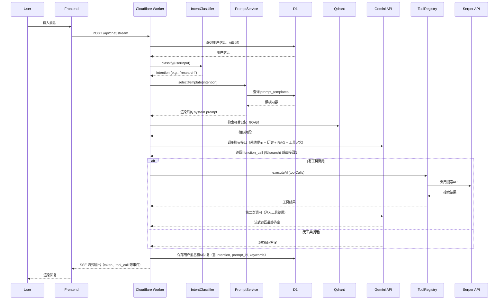
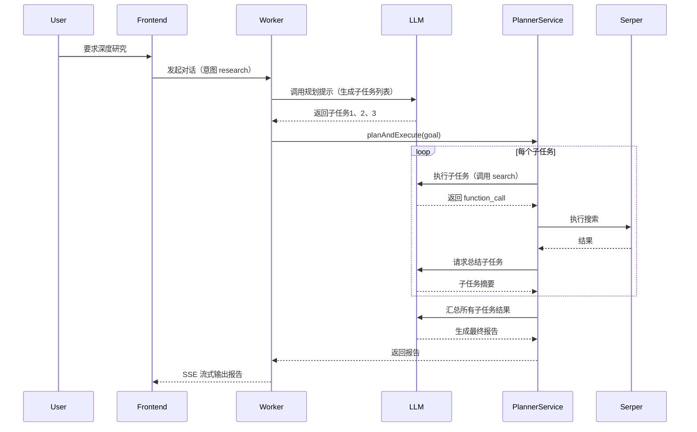
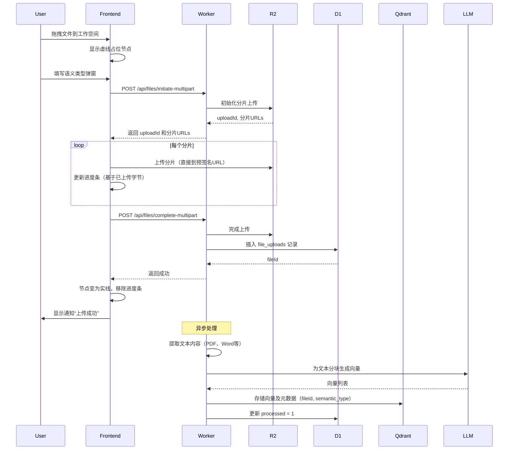
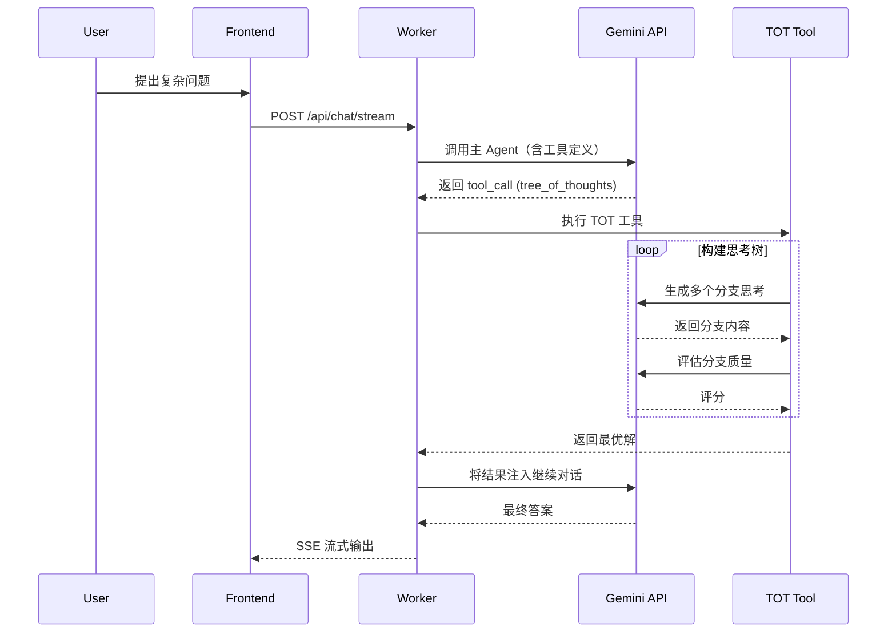
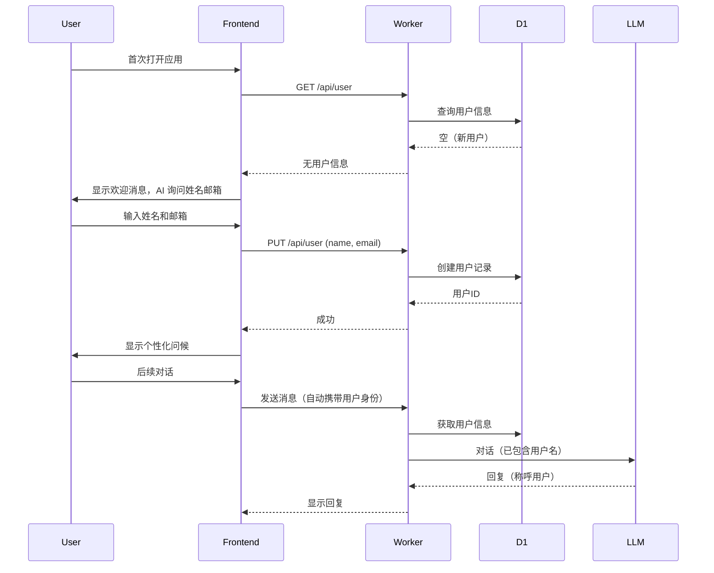

# 后端技术设计方案（v1.2，对齐 PRD v1.1）

## 文档版本
| 版本 | 日期 | 作者 | 变更说明 |
|------|------|------|----------|
| 1.0 | 2026-03-21 | AI Assistant | 初稿完成（包含完整技术选型、架构、实现细节、LLM调用设计） |
| 1.1 | 2026-03-21 | AI Assistant | 新增个人工作空间与文件管理模块（上传、RAG、前端交互） |
| 1.2 | 2026-03-21 | AI Assistant | 完善文件上传进度反馈；增加场景化 Prompt 模板与意图识别；扩展 conversations 表结构 |
| 1.3 | 2026-03-21 | AI Assistant | 对照 PRD v1.1 修订：去重章节、补齐 FileTool/SSE 引用块、文件夹与标签字段、任务 detail、用户偏好、Serper 配额、搜索类型与文件处理策略说明；标明 TOT/GOT 与 projects 为 PRD 外可选扩展 |

### 与 PRD v1.1 的范围说明

- **必选对齐**：对话式任务与文件管理、Serper 搜索与降级、RAG、工作空间上传与进度、64MB 限制、数据隔离等均按 PRD 设计。
- **PRD 未要求但本方案保留的扩展**：`projects` 任务分组、**TOT/GOT** 高级推理工具——实现阶段可作为**可选模块**开关，不纳入 PRD v1.1 验收范围。
- **向量维度**：下文示例维度与所用 **Gemini Embedding 模型官方文档**一致为准，集成前须在代码与环境变量中核对实际维度。

---

## 目录

- [1. 技术选型与理由](#1-技术选型与理由)
  - [1.1 关于 Python 的劣势分析](#11-关于-python-的劣势分析)
  - [1.2 Agent 框架选型决策](#12-agent-框架选型决策)
    - [1.2.1 关于 Cloudflare 体积限制的补充说明](#121-关于-cloudflare-体积限制的补充说明)
- [2. 整体架构设计](#2-整体架构设计)
- [3. 模块划分](#3-模块划分)
- [4. 数据存储设计](#4-数据存储设计)
  - [4.1 关系型数据库（Cloudflare D1）](#41-关系型数据库cloudflare-d1)
  - [4.2 向量数据库（Qdrant）](#42-向量数据库qdrant)
  - [4.3 时间字段设计说明](#43-时间字段设计说明)
  - [4.4 数据库迁移脚本（D1）](#44-数据库迁移脚本d1)
  - [4.5 上传文件类型与 RAG 处理策略](#45-上传文件类型与-rag-处理策略)
- [5. API 接口设计](#5-api-接口设计)
  - [5.1 对话接口（SSE 流式）](#51-对话接口sse-流式)
  - [5.2 用户信息接口](#52-用户信息接口)
  - [5.3 任务接口](#53-任务接口)
  - [5.4 文件管理接口](#54-文件管理接口)
  - [5.5 Prompt 模板管理接口（可选）](#55-prompt-模板管理接口可选)
- [6. 核心抽象设计](#6-核心抽象设计)
  - [6.1 LLM 提供者抽象](#61-llm-提供者抽象)
  - [6.2 向量数据库抽象](#62-向量数据库抽象)
  - [6.3 关系数据库抽象（Drizzle ORM）](#63-关系数据库抽象drizzle-orm)
  - [6.4 文件存储抽象](#64-文件存储抽象)
- [7. Prompt 模板与场景化设计](#7-prompt-模板与场景化设计)
  - [7.1 设计思路](#71-设计思路)
  - [7.2 模板存储](#72-模板存储)
  - [7.3 意图识别与模板选择](#73-意图识别与模板选择)
  - [7.4 模板示例](#74-模板示例)
  - [7.5 实现细节](#75-实现细节)
- [8. LLM 调用核心设计](#8-llm-调用核心设计)
  - [8.1 Prompt 设计（更新）](#81-prompt-设计更新)
  - [8.2 Context 设计](#82-context-设计)
  - [8.3 LLM 生成的评估](#83-llm-生成的评估)
  - [8.4 Tokens 消耗与成本跟踪框架](#84-tokens-消耗与成本跟踪框架)
- [9. Agent 实现原理与无框架方案设计](#9-agent-实现原理与无框架方案设计)
  - [9.1 ReAct 循环实现](#91-react-循环实现)
  - [9.2 工具注册与调用](#92-工具注册与调用)
  - [9.3 规划与子代理（深度研究）](#93-规划与子代理深度研究)
  - [9.4 高级推理模式：TOT / GOT 实现](#94-高级推理模式tot--got-实现)
  - [9.5 记忆与上下文管理](#95-记忆与上下文管理)
  - [9.6 意图识别与 Prompt 模板选择](#96-意图识别与-prompt-模板选择)
  - [9.7 对话记录持久化](#97-对话记录持久化)
  - [9.8 总结](#98-总结)
- [10. 类图（Mermaid）](#10-类图mermaid)
- [11. 主要交互流程（Mermaid）](#11-主要交互流程mermaid)
  - [11.1 完整对话流程（含意图识别与模板选择）](#111-完整对话流程含意图识别与模板选择)
  - [11.2 深度研究流程（子代理规划）](#112-深度研究流程子代理规划)
  - [11.3 文件上传与 RAG 处理流程（含进度反馈）](#113-文件上传与-rag-处理流程含进度反馈)
  - [11.4 TOT 高级推理流程](#114-tot-高级推理流程)
  - [11.5 用户首次访问与信息收集流程](#115-用户首次访问与信息收集流程)
- [12. 文件上传进度反馈详细设计](#12-文件上传进度反馈详细设计)
  - [12.1 前端实现](#121-前端实现)
  - [12.2 后端支持](#122-后端支持)
  - [12.3 失败处理](#123-失败处理)
  - [12.4 UI 表现](#124-ui-表现)
- [13. 文件目录组织结构](#13-文件目录组织结构)
- [14. 异常处理策略](#14-异常处理策略)
- [15. 数据埋点设计](#15-数据埋点设计)
- [16. 性能描述与优化](#16-性能描述与优化)
- [17. 安全与隐私](#17-安全与隐私)
- [18. 部署 Cloudflare Workers 流程](#18-部署-cloudflare-workers-流程)
  - [18.1 前置准备](#181-前置准备)
  - [18.2 配置 wrangler.toml](#182-配置-wranglertoml)
  - [18.3 初始化 D1 数据库](#183-初始化-d1-数据库)
  - [18.4 构建与部署](#184-构建与部署)
  - [18.5 设置环境变量（Secret）](#185-设置环境变量secret)
  - [18.6 绑定自定义域名（可选）](#186-绑定自定义域名可选)
  - [18.7 监控与日志](#187-监控与日志)
- [19. 总结](#19-总结)

---

## 1. 技术选型与理由

| 组件 | 技术选型 | 理由 |
|------|----------|------|
| **运行环境** | Cloudflare Workers | 全球边缘部署，低延迟；无服务器架构，自动扩缩容；免费额度充足，符合项目成本要求；原生支持 D1、R2 等存储。 |
| **编程语言** | **TypeScript (Node.js 兼容)** | 与 Cloudflare Workers 生态完美集成；类型安全减少运行时错误；V8 引擎冷启动 < 50ms；生态丰富（Hono、Drizzle ORM 等）。 |
| **Web 框架** | **Hono (TypeScript)** | 轻量级（13KB），专为 Workers 优化；原生 TypeScript 支持；内置中间件（JWT、CORS、日志）；原生支持 Server-Sent Events。 |
| **AI 模型** | Gemini 2.0 Flash Lite (Google AI Studio) | 免费额度，响应速度快；支持函数调用（工具调用），便于实现工具注入和子代理规划。 |
| **LLM 抽象层** | 自定义 `LLMProvider` 接口 | 抽象具体模型调用，便于后续切换 OpenAI、Claude 等，保持业务逻辑稳定。 |
| **向量数据库** | Qdrant Cloud (免费层) | 存储对话片段、简历/文档的向量表示，支持语义检索和记忆召回；免费层 1GB 存储足够原型使用。 |
| **向量数据库抽象** | 自定义 `VectorStore` 接口 | 抽象向量存储操作，便于替换为 Pinecone、Weaviate 或本地 Milvus。 |
| **关系型数据库** | Cloudflare D1 (SQLite) | 存储用户信息、任务列表、AI昵称等结构化数据；与 Workers 同环境，零延迟；SQL 易于管理。 |
| **关系数据库抽象** | **Drizzle ORM** | 类型安全的 SQL 构建器，自动推导数据库 schema；支持 D1、PostgreSQL、MySQL 等，便于未来迁移。 |
| **搜索 API** | Serper.dev (免费额度) | 1-2 秒内返回 Google 搜索结果，结构化 JSON；支持网页、图片、新闻等类型，满足深度研究需求。 |
| **文件存储** | Cloudflare R2 | 存储用户上传的简历、导出的报告等文件；S3 兼容 API，成本低廉，支持分片上传和进度监控。 |
| **前端框架** | Vercel AI SDK + Tailwind CSS | Vercel AI SDK 提供 React hooks 和流式对话支持，简化前端集成；Tailwind CSS 快速构建 UI。 |

---

### 1.1 关于 Python 的劣势分析

尽管 Python 在 AI 生态中拥有丰富的库（如 LangChain、Transformers），但在 **Cloudflare Workers** 环境中，选择 Python 会面临以下劣势：

| 维度 | 劣势说明 |
|------|----------|
| **原生支持** | Workers 运行时原生支持 JavaScript/TypeScript，Python 需通过 `python_workers`（beta）或 WASM 运行，存在性能损耗和功能限制。 |
| **冷启动** | Python 解释器启动时间明显长于 V8 引擎，冷延迟可能达到数百毫秒甚至秒级，影响对话首字时间。 |
| **生态适配** | 主流 AI/数据库 SDK（如 Gemini、Serper、Qdrant）均为 Python 提供了完整客户端，但 Workers 环境要求异步、无状态，多数 Python SDK 为同步设计，需额外封装。 |
| **依赖管理** | Python 依赖包体积大，且 Workers 对 `site-packages` 有大小限制（1MB），部署复杂。 |
| **工具链** | TypeScript 有 Hono、Drizzle、Vercel AI SDK 等专为边缘环境优化的库，Python 生态更偏向传统服务器。 |
| **类型安全** | Python 虽支持类型注解，但运行时无强制检查，工具定义等易出错。 |

因此，在 Cloudflare Workers 上构建本项目，**TypeScript/Node.js 是最优选择**。

---

### 1.2 Agent 框架选型决策

在 Agent 实现方式上，我们决定 **不引入 LangChain/LangGraph 等现成框架**，而是采用轻量自研方案。理由如下：

1. **架构哲学**：将智能交给模型，将确定性交给基础设施。当模型足够强大时，硬编码的 chain 或 graph 反而成为障碍。决策权在 LLM 而非代码，新模型发布时能力自动增强。
2. **Cloudflare Workers 环境约束**：包体积限制（免费 3 MB，付费 10 MB）和冷启动要求极低的框架开销。LangChain.js 等框架即使压缩后也可能占 2 MB 以上，而自研核心代码不足 500 KB，留足扩展空间。
3. **框架实际价值有限**：框架主要提供 LLM 接口统一、工具预置和 ReAct 循环脚手架，但这些都可以用少量代码自行实现。框架解决不了规划、错误恢复、上下文管理等核心难题。
4. **MCP 标准正削弱框架价值**：工具方直接提供 MCP Server，模型直接返回结构化 `tool_call`，框架的集成价值下降。
5. **可控性与可观测性**：自研实现使每一步逻辑透明，便于调试和定制化。

因此，我们选择在 `ChatService` + `ToolRegistry` + `PlannerService` 中自行实现 ReAct 循环、工具调用和规划能力，确保轻量、高效、完全可控。

#### 1.2.1 关于 Cloudflare 体积限制的补充说明

根据 Cloudflare 官方文档（2026 年 3 月），Workers 的包体积限制已提升至：
- **免费计划**：压缩后 3 MB
- **付费计划**：压缩后 10 MB

这一变化进一步减轻了包体积压力，但并未改变我们选择轻量自研 Agent 的核心决策。理由如下：

- **自研方案体积优势依然显著**：即使 3 MB 的免费额度，LangChain.js 及其依赖（约 2 MB）仍会占用大量配额，而我们的自研核心代码压缩后不足 500 KB，为未来功能扩展留足空间。
- **边缘环境冷启动要求未变**：框架层仍会增加解析和初始化时间，自研方案更利于保持冷启动 < 50ms。
- **可充分利用新特性**：
  - 在 `wrangler.toml` 中开启 `nodejs_compat` 标志，可使用内置 Node.js API（不计入包体积），进一步优化依赖。
  - 静态资源（如 PDF 模板）可存储于 R2，避免打包到 Worker 脚本中。

因此，尽管限制放宽，自研方案在可维护性、可控性和边缘适配性上仍是本项目的最佳选择。

---

## 2. 整体架构设计

```
┌─────────────────────────────────────────────────────────────────┐
│                        前端 (Vercel AI SDK + ChatUI)           │
│                     - 对话界面                                   │
│                     - 富文本渲染（工具调用标记、RAG 浮窗）         │
│                     - 工作空间（文件浏览器、拖拽上传、进度条）    │
└───────────────────────────────┬─────────────────────────────────┘
                                │ HTTPS / SSE / 文件上传
                                ▼
┌─────────────────────────────────────────────────────────────────┐
│                     Cloudflare Worker (Hono)                    │
│  ┌───────────────────────────────────────────────────────────┐  │
│  │                      API Gateway                          │  │
│  │   - 路由分发 / 认证 / 限流 / 日志                          │  │
│  └───────────────────────────────────────────────────────────┘  │
│  ┌───────────────────────────────────────────────────────────┐  │
│  │                      核心服务层                           │  │
│  │  ┌─────────────┐ ┌─────────────┐ ┌──────────────────┐   │  │
│  │  │ 用户管理模块 │ │ 对话管理模块 │ │  任务管理模块    │   │  │
│  │  └─────────────┘ └─────────────┘ └──────────────────┘   │  │
│  │  ┌─────────────┐ ┌─────────────┐ ┌──────────────────┐   │  │
│  │  │ 记忆召回模块 │ │ 工具调用模块 │ │ 子代理规划模块   │   │  │
│  │  └─────────────┘ └─────────────┘ └──────────────────┘   │  │
│  │  ┌─────────────┐ ┌─────────────────────────────────┐   │  │
│  │  │ TOT/GOT(可选)│ │        文件管理模块              │   │  │
│  │  └─────────────┘ └─────────────────────────────────┘   │  │
│  └───────────────────────────────────────────────────────────┘  │
│  ┌───────────────────────────────────────────────────────────┐  │
│  │                      外部集成层                           │  │
│  │   Gemini API │ Serper API │ Qdrant │ D1 │ R2            │  │
│  └───────────────────────────────────────────────────────────┘  │
└─────────────────────────────────────────────────────────────────┘
```

**架构特点**：
- **无服务器**：Worker 按请求计费，自动扩缩。
- **分层清晰**：网关、服务层、数据层分离，便于维护和扩展。
- **工具注入与子代理规划**：通过 Gemini 的函数调用能力实现，核心逻辑封装在工具调用模块。
- **抽象解耦**：LLM、向量数据库、关系数据库均通过接口抽象，便于替换实现。
- **高级推理支持（可选）**：TOT/GOT 供复杂推理场景使用，**非 PRD v1.1 必验收项**，建议 feature flag 控制。
- **文件管理**：集成 R2 存储、分片上传、进度反馈、RAG 处理。

---

## 3. 模块划分

| 模块 | 职责 | 关键类/文件 |
|------|------|-------------|
| **用户管理模块** | 用户信息、AI昵称的存储与获取 | `UserRepository`, `api/user.ts` |
| **对话管理模块** | 接收用户消息，调用 LLM，处理工具调用，返回回复；意图识别与 Prompt 选择 | `ChatService`, `api/chat.ts`, `IntentClassifier` |
| **任务管理模块** | 任务 CRUD；可选项目分组（**超出 PRD v1.1，可关闭**） | `TaskRepository`, `ProjectRepository`, `api/tasks.ts` |
| **记忆召回模块** | 向量检索历史对话、上传文档，注入上下文 | `MemoryService`, `VectorStore` |
| **工具调用模块** | 注册与执行所有可用工具（含 `manage_workspace_files`） | `ToolRegistry`, `tools/*.ts` |
| **子代理规划模块** | 深度研究等复杂任务的分解与协调 | `PlannerService` |
| **TOT/GOT 模块** | 树/图思考模式（**PRD 外可选**，默认可关闭以降低延迟与成本） | `TotService`, `GotService` |
| **文件管理模块** | 文件上传、存储、元数据管理、RAG 处理、进度反馈 | `FileService`, `api/files.ts`, `FileProcessor` |
| **Prompt 管理模块** | 管理场景化 Prompt 模板，支持按意图选择 | `PromptRepository`, `api/prompts.ts` |
| **LLM 抽象层** | 封装不同 AI 模型调用 | `LLMProvider`, `GeminiProvider` |
| **向量存储抽象层** | 封装向量数据库操作 | `VectorStore`, `QdrantStore` |
| **关系数据库抽象层** | 使用 Drizzle ORM 操作 D1 | `db/schema.ts`, `db/repositories/*` |

---

## 4. 数据存储设计

### 4.1 关系型数据库（Cloudflare D1）

#### ER 图（简化）
```
┌─────────────┐       ┌─────────────┐       ┌─────────────┐
│   users     │       │   tasks     │       │  projects   │
├─────────────┤       ├─────────────┤       ├─────────────┤
│ id (PK)     │◄──────│ user_id (FK)│       │ id (PK)     │
│ name        │       │ project_id  │───────│ user_id (FK)│
│ email       │       │ title       │       │ name        │
│ ai_nickname │       │ description │       │ created_at  │
│ prefs_json  │       │ detail_json │       └─────────────┘
│ created_at  │       │ status      │
└─────────────┘       │ created_at  │
                      │ updated_at  │
                      └─────────────┘

┌─────────────────┐       ┌─────────────────┐
│  conversations  │       │   file_uploads  │
├─────────────────┤       ├─────────────────┤
│ id (PK)         │       │ id (PK)         │
│ user_id (FK)    │       │ user_id (FK)    │
│ role            │       │ filename        │
│ content         │       │ original_name   │
│ created_at      │       │ mime_type       │
│ intention       │       │ size            │
│ prompt_id (FK)  │       │ r2_key          │
│ keywords        │       │ semantic_type   │
│ conversation_id │       │ folder_path     │
└─────────────────┘       │ tags            │
                          │ processed       │
                          │ created_at      │
                          └─────────────────┘

┌─────────────────┐
│ serper_usage    │
├─────────────────┤
│ user_id + day   │
│ call_count      │
└─────────────────┘

┌─────────────────┐
│   prompt_templates   │
├─────────────────┤
│ id (PK)         │
│ name            │
│ template_text   │
│ scenario        │
│ created_at      │
└─────────────────┘
```

#### 表结构详细定义

**users**
| 字段 | 类型 | 约束 | 说明 |
|------|------|------|------|
| id | TEXT | PRIMARY KEY | UUID |
| name | TEXT | NOT NULL | 用户姓名 |
| email | TEXT | UNIQUE NOT NULL | 邮箱 |
| ai_nickname | TEXT | DEFAULT '助手' | AI 昵称 |
| preferences_json | TEXT | NULL | 用户偏好（JSON），如回复风格、习惯等，供长期记忆与 Prompt 注入 |
| created_at | INTEGER | NOT NULL | Unix 时间戳 |

**projects**
| 字段 | 类型 | 约束 | 说明 |
|------|------|------|------|
| id | TEXT | PRIMARY KEY | UUID |
| user_id | TEXT | NOT NULL, FK | 所属用户 |
| name | TEXT | NOT NULL | 项目名称 |
| created_at | INTEGER | NOT NULL | 创建时间 |

**tasks**
| 字段 | 类型 | 约束 | 说明 |
|------|------|------|------|
| id | TEXT | PRIMARY KEY | UUID |
| user_id | TEXT | NOT NULL, FK | 所属用户 |
| project_id | TEXT | NULL, FK | 所属项目 |
| title | TEXT | NOT NULL | 任务标题 |
| description | TEXT | NULL | 详细描述/备注（纯文本） |
| detail_json | TEXT | NULL | 结构化详情（JSON）：子任务列表、分条备注等，对应 PRD「细化需求」 |
| status | TEXT | NOT NULL DEFAULT 'pending' | pending, in_progress, completed |
| created_at | INTEGER | NOT NULL | |
| updated_at | INTEGER | NOT NULL | |

**prompt_templates**
| 字段 | 类型 | 约束 | 说明 |
|------|------|------|------|
| id | TEXT | PRIMARY KEY | UUID |
| name | TEXT | NOT NULL | 模板名称（如 default, resume_interview, task_management） |
| template_text | TEXT | NOT NULL | 系统提示词模板，包含变量 {{USER_NAME}} 等 |
| scenario | TEXT | NOT NULL | 场景标识（default, interview, research, etc） |
| created_at | INTEGER | NOT NULL | |

**conversations**
| 字段 | 类型 | 约束 | 说明 |
|------|------|------|------|
| id | TEXT | PRIMARY KEY | UUID |
| user_id | TEXT | NOT NULL, FK | 所属用户 |
| role | TEXT | NOT NULL | 'user' 或 'assistant' |
| content | TEXT | NOT NULL | 消息内容 |
| intention | TEXT | NULL | AI 判断的用户意图（如 greeting, question, task_operation, etc） |
| prompt_id | TEXT | NULL, FK | 使用的 prompt 模板 ID（仅 assistant 消息） |
| keywords | TEXT | NULL | 用户语句中的命名实体识别结果（JSON 数组） |
| conversation_id | TEXT | NULL | 关联的用户消息 ID（用于将 AI 回复与用户消息配对） |
| created_at | INTEGER | NOT NULL | |

说明：
- `intention` 由 AI 在生成回答时判断并记录，用于后续分析和优化。
- `prompt_id` 记录本次回答使用了哪个 prompt 模板。
- `keywords` 存储从用户输入中提取的实体（如姓名、任务名称等），格式为 JSON 字符串。
- `conversation_id`：对于用户消息，该字段为 NULL；对于 AI 回复，该字段指向对应的用户消息 ID，方便追溯。

**file_uploads**
| 字段 | 类型 | 约束 | 说明 |
|------|------|------|------|
| id | TEXT | PRIMARY KEY | UUID |
| user_id | TEXT | NOT NULL, FK | 所属用户 |
| filename | TEXT | NOT NULL | 存储的文件名（如 UUID.pdf） |
| original_name | TEXT | NOT NULL | 用户原始文件名 |
| mime_type | TEXT | NOT NULL | MIME 类型（如 application/pdf） |
| size | INTEGER | NOT NULL | 文件大小（字节） |
| r2_key | TEXT | NOT NULL | 在 R2 中的存储路径 |
| semantic_type | TEXT | NULL | 用户标记的语义类型（简历、学习资料、小抄等） |
| folder_path | TEXT | NOT NULL DEFAULT '' | 工作空间内逻辑路径（如 `学习资料/2024`），根目录为空字符串；与 `GET /api/files?folder=` 前缀匹配 |
| tags | TEXT | NULL | 标签 JSON 数组字符串，如 `["important"]`，支持对话中「标记为重要」等指令 |
| processed | INTEGER | NOT NULL DEFAULT 0 | 异步处理状态：`0` 未处理或处理中，`1` 已向量化写入 Qdrant，`-1` 文本提取或向量化失败（仍可下载，可重试） |
| created_at | INTEGER | NOT NULL | 上传时间 |

**serper_usage**（Serper 调用计数，满足 PRD 成本与频率控制）

| 字段 | 类型 | 约束 | 说明 |
|------|------|------|------|
| user_id | TEXT | NOT NULL, PK(复合) | 用户 |
| day | TEXT | NOT NULL, PK(复合) | UTC 日期 `YYYY-MM-DD` |
| call_count | INTEGER | NOT NULL DEFAULT 0 | 当日已成功调用 Serper 的次数 |

主键：`(user_id, day)`。每次 `search` / 深度研究内实际命中 Serper 成功返回时递增；超过软阈值时由 `SearchTool` 或 `PlannerService` 返回友好提示，必要时在回复中询问用户是否继续（与 PRD 2.6.2-6 一致）。

### 4.2 向量数据库（Qdrant）

**Collection**: `memory`  
**向量维度**: 与所选 **Gemini（或替代）Embedding 模型**输出维度一致（文档示例沿用 768，**集成前务必按官方文档核对并配置**）  
**距离度量**: Cosine  

**Payload 结构**:
| 字段 | 类型 | 说明 |
|------|------|------|
| user_id | string | 用户标识 |
| type | string | 'conversation' 或 'document' |
| source | string | 原始文本片段 |
| timestamp | integer | 时间戳 |
| file_id | string | 关联 file_uploads.id（若为文档） |
| semantic_type | string | 用户标记的语义类型（便于过滤） |
| folder_path | string | 可选，与 D1 中文件记录一致，便于按目录过滤 |
| tags | string[] | 可选，从 `file_uploads.tags` 解析 |

### 4.3 时间字段设计说明

所有时间字段（`created_at`、`updated_at`）均使用 **INTEGER** 类型存储 **Unix 时间戳（秒级）**。选择理由：
- **业务精度足够**：任务创建、更新等场景对时间精度要求到秒即可满足需求。
- **存储与索引效率**：秒级时间戳占用 4 字节，比毫秒级节省空间，索引性能更优。
- **API 兼容性**：Gemini、Serper 等外部 API 返回的时间字段通常为秒级 Unix 时间戳，便于直接存储和比较。
- **跨语言一致性**：JavaScript 中 `Math.floor(Date.now() / 1000)` 可轻松获得秒级时间戳。

若未来需要毫秒级精度，可采用以下扩展方案：
- **方案一**：将字段类型改为 `BIGINT` 直接存储毫秒时间戳（`Date.now()`）。
- **方案二**：保留秒级字段，增加一个 `ms_offset` 字段（SMALLINT，0~999）存储毫秒偏移，实现毫秒精度且保持索引高效。

当前版本按秒级设计，后续可根据实际需求灵活升级。

### 4.4 数据库迁移脚本（D1）

数据库迁移使用 `wrangler d1 migrations` 管理。所有迁移文件存放在 `src/db/migrations/` 目录下，按时间顺序编号。以下是每个迁移文件的内容。

### 迁移 0001：创建 users 表

**文件**：`0001_create_users.sql`

```sql
-- 创建 users 表
CREATE TABLE IF NOT EXISTS users (
  id TEXT PRIMARY KEY,
  name TEXT NOT NULL,
  email TEXT UNIQUE NOT NULL,
  ai_nickname TEXT NOT NULL DEFAULT '助手',
  created_at INTEGER NOT NULL
);

-- 创建索引
CREATE INDEX IF NOT EXISTS idx_users_email ON users(email);
```

---

### 迁移 0002：创建 projects 表

**文件**：`0002_create_projects.sql`

```sql
-- 创建 projects 表
CREATE TABLE IF NOT EXISTS projects (
  id TEXT PRIMARY KEY,
  user_id TEXT NOT NULL,
  name TEXT NOT NULL,
  created_at INTEGER NOT NULL,
  FOREIGN KEY (user_id) REFERENCES users(id) ON DELETE CASCADE
);

-- 创建索引
CREATE INDEX IF NOT EXISTS idx_projects_user_id ON projects(user_id);
```

---

### 迁移 0003：创建 tasks 表

**文件**：`0003_create_tasks.sql`

```sql
-- 创建 tasks 表
CREATE TABLE IF NOT EXISTS tasks (
  id TEXT PRIMARY KEY,
  user_id TEXT NOT NULL,
  project_id TEXT,
  title TEXT NOT NULL,
  description TEXT,
  status TEXT NOT NULL DEFAULT 'pending',
  created_at INTEGER NOT NULL,
  updated_at INTEGER NOT NULL,
  FOREIGN KEY (user_id) REFERENCES users(id) ON DELETE CASCADE,
  FOREIGN KEY (project_id) REFERENCES projects(id) ON DELETE SET NULL
);

-- 创建索引
CREATE INDEX IF NOT EXISTS idx_tasks_user_id ON tasks(user_id);
CREATE INDEX IF NOT EXISTS idx_tasks_project_id ON tasks(project_id);
CREATE INDEX IF NOT EXISTS idx_tasks_status ON tasks(status);
```

---

### 迁移 0004：创建 prompt_templates 表

**文件**：`0004_create_prompt_templates.sql`

```sql
-- 创建 prompt_templates 表
CREATE TABLE IF NOT EXISTS prompt_templates (
  id TEXT PRIMARY KEY,
  name TEXT NOT NULL,
  template_text TEXT NOT NULL,
  scenario TEXT NOT NULL,
  created_at INTEGER NOT NULL
);

-- 创建索引
CREATE INDEX IF NOT EXISTS idx_prompt_templates_scenario ON prompt_templates(scenario);

-- 插入默认模板
INSERT INTO prompt_templates (id, name, template_text, scenario, created_at)
VALUES (
  'default_prompt',
  'default',
  '你是一个智能任务管理助手，昵称为“{{AI_NICKNAME}}”。你的职责是：\n1. 记住用户信息（姓名、邮箱），并在对话中自然称呼用户。\n2. 帮助用户管理任务列表（增删改查），支持通过自然语言对话完成操作。\n3. 当用户询问实时信息或需要外部知识时，调用 search 工具获取结果。\n4. 对于复杂研究任务，使用 plan_research 工具进行深度研究。\n5. 当用户要求通过对话管理工作空间文件（删除、重命名、改语义类型、打标签等）时，调用 manage_workspace_files 工具。\n6. 始终以友好、专业的语气回复。\n\n当前用户信息：\n- 姓名：{{USER_NAME}}\n- 邮箱：{{USER_EMAIL}}\n\n可用工具列表（以 JSON Schema 形式提供）：\n{{TOOLS_DEFINITIONS}}',
  'default',
  strftime('%s', 'now')
);
```

---

### 迁移 0005：创建 conversations 表

**文件**：`0005_create_conversations.sql`

```sql
-- 创建 conversations 表
CREATE TABLE IF NOT EXISTS conversations (
  id TEXT PRIMARY KEY,
  user_id TEXT NOT NULL,
  role TEXT NOT NULL,
  content TEXT NOT NULL,
  intention TEXT,
  prompt_id TEXT,
  keywords TEXT,
  conversation_id TEXT,
  created_at INTEGER NOT NULL,
  FOREIGN KEY (user_id) REFERENCES users(id) ON DELETE CASCADE,
  FOREIGN KEY (prompt_id) REFERENCES prompt_templates(id) ON DELETE SET NULL
);

-- 创建索引
CREATE INDEX IF NOT EXISTS idx_conversations_user_created ON conversations(user_id, created_at);
CREATE INDEX IF NOT EXISTS idx_conversations_intention ON conversations(intention);
```

---

### 迁移 0006：创建 file_uploads 表

**文件**：`0006_create_file_uploads.sql`

```sql
-- 创建 file_uploads 表
CREATE TABLE IF NOT EXISTS file_uploads (
  id TEXT PRIMARY KEY,
  user_id TEXT NOT NULL,
  filename TEXT NOT NULL,
  original_name TEXT NOT NULL,
  mime_type TEXT NOT NULL,
  size INTEGER NOT NULL,
  r2_key TEXT NOT NULL,
  semantic_type TEXT,
  processed INTEGER NOT NULL DEFAULT 0,
  created_at INTEGER NOT NULL,
  FOREIGN KEY (user_id) REFERENCES users(id) ON DELETE CASCADE
);

-- 创建索引
CREATE INDEX IF NOT EXISTS idx_files_user_created ON file_uploads(user_id, created_at);
CREATE INDEX IF NOT EXISTS idx_files_semantic_type ON file_uploads(semantic_type);
```

---

### 迁移 0007：PRD 对齐字段与 Serper 用量表

**文件**：`0007_prd_alignment.sql`

```sql
-- 用户偏好（长期记忆结构化落库，与 PRD 2.7 一致）
ALTER TABLE users ADD COLUMN preferences_json TEXT;

-- 任务子任务/结构化详情（与 PRD 2.3-5 一致）
ALTER TABLE tasks ADD COLUMN detail_json TEXT;

-- 工作空间路径与标签（与 PRD 2.5.1、对话「标记重要」等一致）
ALTER TABLE file_uploads ADD COLUMN folder_path TEXT NOT NULL DEFAULT '';
ALTER TABLE file_uploads ADD COLUMN tags TEXT;

CREATE INDEX IF NOT EXISTS idx_files_user_folder ON file_uploads(user_id, folder_path);

-- Serper 按用户按日计数（与 PRD 2.6.2-6 一致）
CREATE TABLE IF NOT EXISTS serper_usage (
  user_id TEXT NOT NULL,
  day TEXT NOT NULL,
  call_count INTEGER NOT NULL DEFAULT 0,
  PRIMARY KEY (user_id, day)
);
```

> 若生产环境已在 0001–0006 上跑过数据，**仅追加** `0007` 即可；新建库可后续将 0001–0007 合并为单次初始化脚本（按团队规范选择）。

---

### 执行迁移

在本地或 CI 中，使用以下命令应用迁移：

```bash
# 创建数据库（如果尚未创建）
wrangler d1 create task-assistant-db

# 应用迁移
wrangler d1 migrations apply task-assistant-db
```

迁移文件应按顺序执行，确保依赖关系正确。每次修改表结构时，需创建新的迁移文件（如 `0007_add_xxx.sql`），并保持编号递增。

---

以上迁移脚本完整定义了 D1 数据库的所有表结构，包括索引、外键约束和默认数据（如默认 Prompt 模板）。

### 4.5 上传文件类型与 RAG 处理策略

与 PRD 2.5.2、2.5.4 对齐，避免「凡上传必可向量化」的误解：

| 类型 | 处理策略 |
|------|----------|
| PDF、Word（doc/docx）、纯文本 / Markdown | 提取文本 → 分块 → Embedding → 写入 Qdrant；`processed` 最终为 `1` 或失败 `-1` |
| Excel（xlsx 等） | **v1.1**：优先提取单元格文本（只读、行数上限可配置）；若解析失败则仅存储文件供下载，`processed = -1` 并提示 |
| 图片 | **v1.1 可选**：OCR（如云端 API）后再向量化；未启用 OCR 时仅存储 + 元数据检索，不向量化 |
| 音频 / 视频 | **不向量化全文**：仅存 R2 + `file_uploads` 元数据；对话中可通过文件名、`semantic_type`、`folder_path` 被模型引用；若后续接入转写服务，再在异步流水线中追加向量 |
| 其他 MIME | 安全校验后存储；不向量化 unless 明确支持 |

系统在 `FileService` / `FileProcessor` 中按 `mime_type` 分支；**异步队列**完成提取与 `processed` 状态更新，与第 11.3 节流程一致。

---

## 5. API 接口设计

所有接口返回 JSON，需携带 `Authorization: Bearer <token>`（简化实现可使用 session）。

### 5.1 对话接口（SSE 流式）

**POST /api/chat/stream**

请求体：
```json
{
  "message": "用户输入",
  "conversation_id": "可选"
}
```

响应：`Content-Type: text/event-stream`

事件格式（**与 PRD 2.1-4「悬停查看原始数据」对齐**：除正文 token 外，下发结构化引用块供前端渲染 `<search>` / `<rag>` 及 Tooltip）：
```
event: token
data: {"content":"正在思考"}

event: tool_call
data: {"name":"search","args":{...}}

event: tool_result_meta
data: {"tool":"search","items":[{"title":"...","url":"...","snippet":"...","date":null}],"raw_ref":"可选，指向服务端缓存键或截断 JSON"}

event: citation
data: {"kind":"rag","file_id":"...","filename":"...","semantic_type":"简历","excerpt":"检索片段预览","score":0.82}

event: intention
data: {"intention":"greeting"}

event: done
data: {}
```

约定说明：

- **`tool_result_meta`**：在对应 `tool_call` 执行完成、且工具为 `search`（或同类）后发送，便于 UI 悬停展示来源与摘要，**不依赖用户从纯文本里猜 JSON**。
- **`citation`**：在 RAG 检索命中后发送（可一条或多条），与最终 assistant 正文中的 `<rag source="file" data='...'>` 对应；前端可用 `file_id` 拉取更多元数据或预览。
- 若需减少 SSE 条数，可将 `citation` 合并为单次 `event: citations` + JSON 数组，但需在前后端统一类型定义。

在流式响应中，可额外发送 `intention` 事件，告知前端 AI 判断的用户意图。

### 5.2 用户信息接口

**GET /api/user** → 返回当前用户
```json
{ "id": "xxx", "name": "李明", "email": "li@example.com", "ai_nickname": "小研", "preferences": { "reply_style": "简洁" } }
```
（`preferences` 来自 `users.preferences_json` 解析，无则省略或 `{}`。）

**PUT /api/user** → 更新
```json
{ "name": "李小明", "email": "new@example.com", "preferences": { "reply_style": "简洁" } }
```

**PUT /api/user/ai-name** → 设置 AI 昵称
```json
{ "nickname": "星尘" }
```

### 5.3 任务接口

**GET /api/tasks?status=pending** → 任务列表
**POST /api/tasks** → 创建
```json
{ "title": "完成报告", "description": "详细内容", "detail": { "subtasks": [{ "title": "提纲", "done": false }] }, "status": "pending" }
```
（`detail` 可选，对应表字段 `detail_json`。）
**PUT /api/tasks/:id** → 更新
**DELETE /api/tasks/:id** → 删除

### 5.4 文件管理接口

#### 5.4.1 获取文件列表

**GET /api/files**

查询参数：
- `folder`（可选）：逻辑路径前缀，与 `file_uploads.folder_path` 匹配（根目录传空或不传）；**v1.1 为扁平路径字符串**，非树形 inode，后续可演进为独立文件夹表。
- `type`（可选）：按语义类型过滤

响应：
```json
[
  {
    "id": "xxx",
    "filename": "resume.pdf",
    "original_name": "我的简历.pdf",
    "mime_type": "application/pdf",
    "size": 245760,
    "semantic_type": "简历",
    "folder_path": "简历",
    "tags": ["important"],
    "created_at": 1678896000,
    "processed": 1
  }
]
```
`processed` 数值语义同表定义：`0` / `1` / `-1`。

#### 5.4.2 上传文件（支持分片）

**POST /api/files/upload**

请求类型：`multipart/form-data`（小文件）或 `application/json`（大文件初始化）

- 小文件（≤5MB）：`multipart` 字段包含 `file`、`semantic_type`，可选 `folder_path`、`tags`（JSON 字符串）。
- 大文件：先调用初始化接口，获得 uploadId 和预签名分片 URL，再按分片上传。

初始化接口（大文件）：
**POST /api/files/initiate-multipart**
```json
{
  "filename": "resume.pdf",
  "original_name": "我的简历.pdf",
  "mime_type": "application/pdf",
  "size": 245760,
  "semantic_type": "简历",
  "folder_path": "简历",
  "tags": ["important"]
}
```
返回：
```json
{
  "upload_id": "xxx",
  "r2_key": "xxx",
  "part_urls": ["https://...?partNumber=1", "https://...?partNumber=2", ...]
}
```

前端按顺序上传每个分片到对应 URL，然后调用完成接口。

**POST /api/files/complete-multipart**
```json
{
  "upload_id": "xxx",
  "r2_key": "xxx",
  "parts": [{ "etag": "xxx", "partNumber": 1 }]
}
```
返回：`{ "id": "xxx", "message": "上传完成" }`

#### 5.4.3 上传进度反馈

前端可以通过以下方式获取上传进度：
- **XMLHttpRequest 的 `upload.onprogress`**：直接监听分片上传的进度事件，计算已上传字节数占总文件比例。
- **SSE 推送**：在后端处理分片上传时，可通过 WebSocket 或 SSE 推送每个分片完成的事件。但考虑到简化，推荐前端直接计算（因分片上传是前端直接发到 R2 预签名 URL，后端不参与数据流）。因此，前端在调用 `uploadPart` 时，可以通过 XMLHttpRequest 的 progress 事件获得每个分片的进度，累积得到总进度。
- 对于小文件上传（≤5MB），也可使用 `fetch` 的 `ReadableStream` 或 `XMLHttpRequest` 获取进度。

在 UI 上，前端展示进度条，并在所有分片完成后调用完成接口。

#### 5.4.4 删除文件

**DELETE /api/files/:id**

返回：`{ "message": "删除成功" }`

#### 5.4.5 重命名文件

**PUT /api/files/:id/rename**

请求体：`{ "new_name": "新名字.pdf" }`

返回：更新后的文件信息

#### 5.4.6 更新语义类型

**PUT /api/files/:id/semantic-type**

请求体：`{ "semantic_type": "学习资料" }`

返回：更新后的文件信息

#### 5.4.7 更新标签（重要标记等）

**PUT /api/files/:id/tags**

请求体：`{ "tags": ["important"] }`（覆盖式写入；对话侧由 `manage_workspace_files` 工具调用此逻辑。）

返回：更新后的文件信息

#### 5.4.8 获取下载链接

**GET /api/files/:id/download**

返回：`{ "url": "https://...?signature=xxx" }`（签名URL，有效期1小时）

---

### 5.5 Prompt 模板管理接口（可选，供管理员使用）

**GET /api/prompts** → 返回所有模板列表

**POST /api/prompts** → 创建新模板

**PUT /api/prompts/:id** → 更新模板

**DELETE /api/prompts/:id** → 删除模板

---

## 6. 核心抽象设计

### 6.1 LLM 提供者抽象

**接口定义**（`src/llm/llm-provider.ts`）：
```typescript
export interface LLMMessage {
  role: 'system' | 'user' | 'assistant' | 'tool';
  content: string;
  tool_calls?: ToolCall[];
  tool_call_id?: string;
}

export interface LLMResponse {
  content: string;
  tool_calls?: ToolCall[];
}

export interface LLMProvider {
  chat(messages: LLMMessage[], tools?: ToolDefinition[]): Promise<LLMResponse & { usage: TokenUsage }>;
  streamChat(messages: LLMMessage[], tools?: ToolDefinition[]): ReadableStream;
  embed(text: string): Promise<number[]>;
}
```

**实现示例**（`src/llm/gemini-provider.ts`）：
```typescript
export class GeminiProvider implements LLMProvider {
  constructor(private apiKey: string, private model: string = 'gemini-2.0-flash-lite') {}
  async chat(messages: LLMMessage[], tools?: ToolDefinition[]) {
    // 转换消息格式，调用 Gemini API，解析 usageMetadata 并返回
  }
  // ...
}
```

**模型切换**：通过环境变量 `LLM_MODEL` 传入不同模型标识（如 `gemini-2.0-flash-lite`、`gpt-4o-mini`）。

### 6.2 向量数据库抽象

**接口定义**（`src/vector/vector-store.ts`）：
```typescript
export interface VectorPoint {
  id: string;
  vector: number[];
  payload: Record<string, any>;
}

export interface VectorStore {
  upsert(points: VectorPoint[]): Promise<void>;
  search(vector: number[], filter?: Record<string, any>, limit?: number): Promise<VectorPoint[]>;
  delete(ids: string[]): Promise<void>;
}
```

**实现示例**（`src/vector/qdrant-store.ts`）：
```typescript
export class QdrantStore implements VectorStore {
  constructor(private client: QdrantClient, private collection: string) {}
  // ...
}
```

### 6.3 关系数据库抽象（Drizzle ORM）

**Schema 定义**（`src/db/schema.ts`）：
```typescript
import { sqliteTable, text, integer } from 'drizzle-orm/sqlite-core';

export const users = sqliteTable('users', {
  id: text('id').primaryKey(),
  name: text('name').notNull(),
  email: text('email').unique().notNull(),
  aiNickname: text('ai_nickname').default('助手'),
  createdAt: integer('created_at').notNull(),
});
// ...
```

**使用**：
```typescript
import { drizzle } from 'drizzle-orm/d1';
const db = drizzle(env.DB);
const user = await db.select().from(users).where(eq(users.email, email));
```

### 6.4 文件存储抽象

为了便于替换存储后端（如从 R2 迁移到 S3），定义抽象接口：

```typescript
// src/storage/file-storage.ts
export interface FileStorage {
  upload(key: string, data: ArrayBuffer, options?: any): Promise<{ etag: string }>;
  download(key: string): Promise<ArrayBuffer>;
  delete(key: string): Promise<void>;
  getSignedUrl(key: string, expiresInSeconds: number): Promise<string>;
  initiateMultipartUpload(key: string): Promise<{ uploadId: string }>;
  uploadPart(key: string, uploadId: string, partNumber: number, data: ArrayBuffer): Promise<{ etag: string }>;
  completeMultipartUpload(key: string, uploadId: string, parts: { etag: string; partNumber: number }[]): Promise<void>;
}
```

R2 实现将利用 Cloudflare 的 `@cloudflare/workers-types` 和 `R2Bucket`。

---

## 7. Prompt 模板与场景化设计

### 7.1 设计思路

为了适应不同对话场景（如任务管理、面试模拟、深度研究），系统支持多套 Prompt 模板，并根据用户意图动态选择。

### 7.2 模板存储

模板存储在 D1 的 `prompt_templates` 表中，包含以下字段：
- `id`：UUID
- `name`：模板名称（如 "default", "interview", "research"）
- `scenario`：场景标识（default, interview, task_management, research）
- `template_text`：提示词模板，支持变量替换（如 `{{USER_NAME}}`、`{{AI_NICKNAME}}`）
- `created_at`：创建时间

### 7.3 意图识别与模板选择

在对话处理流程中，增加一个轻量级意图识别步骤：

1. **快速意图识别**：可以使用规则匹配（关键词）或调用轻量级分类模型（如 Gemini Flash 快速调用）判断用户意图类别。为了简化，1.0 版本可采用规则 + 简单 LLM 调用（例如单独发送一条消息判断意图），但会增加延迟。另一种方案是在系统提示中要求 LLM 返回 `intention` 字段，并同时生成回答，但需要 LLM 支持结构化输出。

   实现方式：在调用 LLM 生成回答时，系统提示中要求 LLM 以 JSON 形式返回意图和最终回复，例如：

   ```json
   {
     "intention": "greeting",
     "reply": "你好！..."
   }
   ```

   这样一次调用即可完成意图识别和内容生成。我们采用此方式，避免额外 API 调用。

2. **模板选择**：根据返回的 `intention`，从数据库中查询对应的 `prompt_template`。若未找到特定场景模板，则使用 `scenario='default'` 的模板。

3. **模板渲染**：将用户信息（姓名、AI昵称）等变量注入模板，得到最终的 system prompt。

### 7.4 模板示例

**default**:
```markdown
你是一个智能任务管理助手，昵称为“{{AI_NICKNAME}}”。你的职责是：
1. 记住用户信息（姓名、邮箱），并在对话中自然称呼用户。
2. 帮助用户管理任务列表（增删改查），支持通过自然语言对话完成操作。
3. 当用户询问实时信息或需要外部知识时，调用 search 工具获取结果。
4. 对于复杂研究任务，使用 plan_research 工具进行深度研究。
5. 当用户要求通过对话管理工作空间文件（删除、重命名、改语义类型、打标签等）时，调用 manage_workspace_files 工具。
6. 始终以友好、专业的语气回复。

当前用户信息：
- 姓名：{{USER_NAME}}
- 邮箱：{{USER_EMAIL}}

可用工具列表（以 JSON Schema 形式提供）：
{{TOOLS_DEFINITIONS}}
```

**interview**:
```markdown
你是一个专业的面试官，昵称为“{{AI_NICKNAME}}”。请扮演面试官角色，对用户进行技术面试。你需要：
1. 根据用户提供的简历和岗位描述，提出针对性问题。
2. 在用户回答后，给出点评和优化建议。
3. 保持专业、鼓励的语气。

当前用户信息：
- 姓名：{{USER_NAME}}
- 邮箱：{{USER_EMAIL}}
```

### 7.5 实现细节

在 `ChatService` 中增加 `selectPrompt` 方法：

```typescript
private async selectPrompt(intention: string): Promise<PromptTemplate> {
  const prompt = await this.db.select().from(promptTemplates)
    .where(eq(promptTemplates.scenario, intention))
    .limit(1);
  if (prompt.length) return prompt[0];
  // fallback to default
  return await this.db.select().from(promptTemplates)
    .where(eq(promptTemplates.scenario, 'default'))
    .limit(1);
}
```

在构建消息时，先调用 LLM 获取 intention 和回答（如果模型支持一次性输出），然后选择模板，再重新调用 LLM（或复用结果）。为避免两次调用，可以在第一次调用时要求模型同时返回 intention 和 reply，但工具调用可能被中断。权衡后，我们选择第一次调用仅用于意图识别（成本低，可使用快速模型），第二次用于实际回答。但为了性能，可在第一次调用时让模型仅返回意图类别（例如通过函数调用或限定输出格式），这样可节省 token。

鉴于复杂度，1.0 版本简化处理：始终使用默认模板，但在对话记录中记录 intention 字段，供后续分析。

---

## 8. LLM 调用核心设计

### 8.1 Prompt 设计（更新）

采用动态模板渲染，支持多场景。在调用 LLM 前，根据意图选择模板并渲染。

#### 8.1.1 系统提示词（System Prompt）

系统提示词定义了 AI 助手的角色、能力边界、行为规范以及可用工具。我们将其设计为可配置的模板，支持根据用户偏好（如 AI 昵称）动态替换。

**模板示例**（存储在 D1 或环境变量中）：
```markdown
你是一个智能任务管理助手，昵称为“{{AI_NICKNAME}}”。你的职责是：
1. 记住用户信息（姓名、邮箱），并在对话中自然称呼用户。
2. 帮助用户管理任务列表（增删改查），支持通过自然语言对话完成操作。
3. 当用户询问实时信息或需要外部知识时，调用 search 工具获取结果。
4. 对于复杂研究任务，使用 plan_research 工具进行深度研究。
5. 当用户要求通过对话管理工作空间文件（删除、重命名、改语义类型、打标签等）时，调用 manage_workspace_files 工具。
6. 始终以友好、专业的语气回复。

当前用户信息：
- 姓名：{{USER_NAME}}
- 邮箱：{{USER_EMAIL}}

可用工具列表（以 JSON Schema 形式提供）：
{{TOOLS_DEFINITIONS}}
```

**构建时机**：每次对话前，`ChatService` 从数据库读取用户信息和 AI 昵称，替换模板变量，并通过 `LLMProvider` 的 `chat` 或 `streamChat` 方法传递系统提示。

#### 8.1.2 用户消息与工具调用消息的格式

为保持与 OpenAI 函数调用格式兼容，我们统一使用以下消息结构：

- **用户消息**：`{ role: "user", content: userInput }`
- **助手消息（含工具调用）**：
  ```json
  {
    "role": "assistant",
    "content": null,
    "tool_calls": [
      { "id": "call_123", "type": "function", "function": { "name": "search", "arguments": "{\"query\":\"...\"}" } }
    ]
  }
  ```
- **工具响应消息**：
  ```json
  {
    "role": "tool",
    "tool_call_id": "call_123",
    "content": "工具返回的 JSON 字符串"
  }
  ```

#### 8.1.3 提示词模板管理

使用轻量级模板引擎（如 `mustache` 或手写替换）实现模板渲染。模板存储在 D1 的 `prompt_templates` 表中，支持热更新。

```typescript
// src/utils/prompt.ts
export function renderSystemPrompt(template: string, vars: Record<string, string>): string {
  return template.replace(/\{\{(\w+)\}\}/g, (_, key) => vars[key] || '');
}
```

### 8.2 Context 设计

上下文由三部分构成：**系统提示**、**短期记忆（对话历史）**、**长期记忆（RAG 检索片段）**。

#### 8.2.1 短期上下文（会话消息历史）

- 存储：使用 `conversations` 表（可选）或内存数组（当前会话）。
- 策略：保留最近 N 轮对话（默认 10 轮），避免超出模型上下文窗口。当历史超过限制时，可进行 **摘要压缩**（调用 LLM 生成摘要后替换早期消息）。

#### 8.2.2 长期记忆（RAG 检索）

在用户消息发送后，`MemoryService` 执行以下步骤：

1. 将用户输入向量化（调用 `LLMProvider.embed`）。
2. 在 Qdrant 中检索与 `user_id` 匹配且相似度 > 0.75 的 Top K（默认 3）个片段。
3. 将检索到的片段格式化为上下文消息：
   ```json
   {
     "role": "system",
     "content": "相关历史记忆：\n- 片段1\n- 片段2"
   }
   ```
4. 将该消息插入到系统提示与用户消息之间。

#### 8.2.3 上下文窗口管理

为防止超限，需计算当前构建的消息总 tokens 数（可使用 `tiktoken` 或模型 API 的 `countTokens` 方法）。若超出模型限制（如 Gemini 2.0 Flash Lite 上下文窗口为 1M tokens，基本不用担心，但仍可做防御），采取以下策略：
- 优先保留系统提示和最新消息。
- 丢弃最早的对话轮次。
- 对检索到的记忆片段进行截断（每个片段限制 500 字符）。

### 8.3 LLM 生成的评估

为了确保回复质量，我们引入多层评估机制，既包括实时验证，也包括离线分析。

#### 8.3.1 评估策略

| 评估层级 | 触发时机 | 方法 | 示例 |
|----------|----------|------|------|
| **语法/格式校验** | 收到 LLM 响应后 | 正则匹配、JSON 解析 | 检查 tool_calls 的 `arguments` 是否为合法 JSON |
| **工具调用有效性** | 执行工具前 | 校验参数是否完整、工具是否存在 | 若缺少必填参数，要求 LLM 重新生成 |
| **答案相关性** | 最终回复返回前 | 规则 + 可选 LLM-as-Judge | 检测是否包含“我不知道”等低质量信号，可触发重试 |
| **幻觉检测** | 离线（异步） | 事实校验、引用追溯 | 对于涉及外部事实的回复，可搜索验证 |

#### 8.3.2 评估实现（代码片段）

在 `ChatService` 中集成校验逻辑：

```typescript
private async validateResponse(response: LLMResponse, messages: LLMMessage[]): Promise<boolean> {
  // 1. 工具调用参数校验
  if (response.tool_calls) {
    for (const call of response.tool_calls) {
      try {
        JSON.parse(call.arguments);
      } catch {
        console.warn(`Invalid JSON in tool call: ${call.arguments}`);
        return false;
      }
    }
  }
  
  // 2. 空回复检测
  if (!response.content && (!response.tool_calls || response.tool_calls.length === 0)) {
    return false;
  }
  
  // 3. 可选：使用 LLM 评估相关性（仅当开启高可靠性模式）
  if (this.shouldEvaluateQuality(response)) {
    const quality = await this.evaluateWithLLM(messages, response);
    if (quality.score < 0.7) {
      return false;
    }
  }
  
  return true;
}
```

#### 8.3.3 离线评估与监控

将用户反馈（如“点赞/点踩”）和对话日志存储到 D1，定期运行评估任务：
- 使用 LLM-as-Judge 对历史对话进行质量评分。
- 检测高频问题（如工具调用失败、重复回答）。
- 生成报告供开发人员优化提示词或工具。

### 8.4 Tokens 消耗与成本跟踪框架

虽然当前使用免费 API，但框架需预留计费能力，并实时跟踪 tokens 消耗，以便未来切换付费模型或优化成本。

#### 8.4.1 获取 Tokens 数据

在 `LLMProvider` 实现中，从 API 响应头或响应体中提取 tokens 信息：

**Gemini API** 返回结构包含 `usageMetadata`：
```json
{
  "usageMetadata": {
    "promptTokenCount": 123,
    "candidatesTokenCount": 456,
    "totalTokenCount": 579
  }
}
```

**OpenAI API** 类似，在 `response.usage` 中。

我们在 `GeminiProvider.chat` 方法中解析并返回：

```typescript
async chat(messages: LLMMessage[], tools?: ToolDefinition[]): Promise<LLMResponse & { usage: TokenUsage }> {
  const response = await fetch(...);
  const data = await response.json();
  return {
    content: data.candidates[0].content.parts[0].text,
    tool_calls: this.parseToolCalls(data),
    usage: {
      promptTokens: data.usageMetadata.promptTokenCount,
      completionTokens: data.usageMetadata.candidatesTokenCount,
      totalTokens: data.usageMetadata.totalTokenCount,
    }
  };
}
```

#### 8.4.2 成本计算模型

定义价格配置（支持多种模型）：

```typescript
// src/llm/pricing.ts
export const MODEL_PRICING = {
  'gemini-2.0-flash-lite': { input: 0, output: 0 },      // 免费
  'gemini-2.0-flash': { input: 0.000000125, output: 0.000000375 }, // 示例：每 1k tokens 美元
  'gpt-4o-mini': { input: 0.00000015, output: 0.0000006 },
};

export function calculateCost(model: string, usage: TokenUsage): number {
  const pricing = MODEL_PRICING[model];
  if (!pricing) return 0;
  return (usage.promptTokens / 1000) * pricing.input + (usage.completionTokens / 1000) * pricing.output;
}
```

#### 8.4.3 跟踪与上报

在 `ChatService` 每次 LLM 调用后，将 usage 信息异步上报到埋点服务：

```typescript
private async trackTokenUsage(userId: string, model: string, usage: TokenUsage, cost: number) {
  this.analytics.trackEvent('llm_usage', {
    userId,
    model,
    promptTokens: usage.promptTokens,
    completionTokens: usage.completionTokens,
    totalTokens: usage.totalTokens,
    estimatedCost: cost,
    timestamp: Date.now(),
  });
}
```

#### 8.4.4 聚合统计与告警

可定期（如每小时）从埋点数据中聚合各用户/总体的 tokens 消耗和成本，在控制台展示。若成本超过预设阈值（即使免费也需留意免费额度），可触发告警。

### 8.5 总结

本部分详细设计了 LLM 调用的核心环节：

- **Prompt 设计**：采用模板化系统提示，动态注入用户信息和工具定义。
- **Context 设计**：组合短期历史、长期记忆（RAG）和系统提示，并管理上下文窗口。
- **评估机制**：多层校验确保回复质量，包括格式、工具、相关性，以及离线评估。
- **成本跟踪**：完整记录 tokens 消耗，预留价格模型，支持未来切换付费模型。

这些设计确保了 LLM 调用的可维护性、可观测性和成本可控性，为产品长期迭代打下基础。


---

## 9. Agent 实现原理与无框架方案设计

本项目采用 **模型即编排** 的轻量自研 Agent 方案，核心逻辑位于 `ChatService`、`ToolRegistry`、`PlannerService` 和高级推理模块中。所有 Agent 行为由 LLM 自主决策，无需硬编码工作流。

---

### 9.1 ReAct 循环实现

`ChatService.handleMessage()` 的核心是一个 while 循环，模拟 ReAct（Reasoning + Acting）模式，支持多轮工具调用。

```typescript
async handleMessage(userId: string, userInput: string): Promise<LLMResponse> {
  // 1. 意图识别与模板选择
  const intention = await this.intentClassifier.classify(userInput);
  const promptTemplate = await this.promptService.selectTemplate(intention);
  const systemPrompt = this.promptService.render(promptTemplate, {
    userName: this.user.name,
    aiNickname: this.user.aiNickname,
    toolsDefinitions: JSON.stringify(this.tools.getDefinitions()),
  });

  // 2. 构建消息历史（系统提示 + 短期对话 + RAG 记忆）
  const messages = await this.buildMessages(userId, userInput, systemPrompt);

  let maxIterations = 10;
  let finalResponse: LLMResponse | null = null;
  let toolCallHistory: ToolCall[] = [];

  while (maxIterations-- > 0) {
    // 3. 调用 LLM
    const response = await this.llm.chat(messages, this.tools.getDefinitions());

    // 4. 如果没有工具调用，返回最终答案
    if (!response.tool_calls || response.tool_calls.length === 0) {
      finalResponse = response;
      break;
    }

    // 5. 执行工具调用
    const toolResults = await this.tools.executeAll(response.tool_calls);
    toolCallHistory.push(...response.tool_calls);

    // 6. 将工具结果作为新消息添加到对话中，继续循环
    messages.push({
      role: 'assistant',
      content: response.content,
      tool_calls: response.tool_calls,
    });
    messages.push(...toolResults.map(tr => ({
      role: 'tool',
      content: tr.output,
      tool_call_id: tr.id,
    })));
  }

  // 7. 保存对话记录（包含意图、模板、关键词等）
  await this.saveConversation(userId, userInput, finalResponse.content, {
    intention,
    promptId: promptTemplate.id,
    keywords: this.extractKeywords(userInput), // NER 提取，简单实现可调用 LLM
    conversationId: this.currentConversationId,
  });

  return finalResponse;
}
```

---

### 9.2 工具注册与调用

`ToolRegistry` 管理所有工具的定义和执行，工具以声明式 JSON Schema 描述，供 LLM 理解。

```typescript
export class ToolRegistry {
  private tools = new Map<string, Tool>();

  register(tool: Tool): void {
    this.tools.set(tool.name, tool);
  }

  getDefinitions(): ToolDefinition[] {
    return Array.from(this.tools.values()).map(tool => ({
      name: tool.name,
      description: tool.description,
      parameters: tool.parametersSchema,
    }));
  }

  async executeAll(toolCalls: ToolCall[]): Promise<ToolResult[]> {
    return Promise.all(toolCalls.map(async call => {
      const tool = this.tools.get(call.name);
      if (!tool) throw new Error(`Tool ${call.name} not found`);
      const output = await tool.execute(call.arguments);
      return { id: call.id, output };
    }));
  }
}
```

每个工具实现 `Tool` 接口，例如搜索工具：

```typescript
export class SearchTool implements Tool {
  name = 'search';
  description = '搜索实时信息（Serper）；类型与 PRD 2.6 对齐，按需传 type';
  parametersSchema = {
    type: 'object',
    properties: {
      query: { type: 'string', description: '搜索关键词' },
      type: {
        type: 'string',
        enum: [
          'organic',
          'news',
          'images',
          'videos',
          'places',
          'shopping',
          'scholar',
          'patents',
        ],
        default: 'organic',
        description: 'Serper 返回类型，与官方 API 一致',
      },
    },
    required: ['query'],
  };

  async execute(args: { query: string; type?: string }, ctx: ToolContext): Promise<string> {
    // SerperQuotaService：查/写 serper_usage，超软上限时抛业务错误或返回可解析 JSON 提示
    await serperQuota.assertUnderDailyLimit(ctx.userId);
    const results = await serperApi.search(args.query, args.type);
    await serperQuota.incrementOnSuccess(ctx.userId);
    return JSON.stringify(results);
  }
}
```

（`ToolContext`、`SerperQuotaService` 为命名示意：实现时由 `ChatService` 注入当前 `userId` 与配额服务。）

**`manage_workspace_files` 工具（PRD 2.5.4 对话管理文件）**

将工作空间操作暴露给 LLM，内部仅调用 `FileService` 与 D1，**校验 `user_id`**，避免模型直接伪造 HTTP。建议工具名：`manage_workspace_files`。

```typescript
export class WorkspaceFilesTool implements Tool {
  name = 'manage_workspace_files';
  description =
    '列出、删除、重命名工作空间文件，或更新语义类型/标签（如标记 important）。用于「删掉上次上传的简历」「把学习资料标成重要」等指令。';
  parametersSchema = {
    type: 'object',
    properties: {
      action: {
        type: 'string',
        enum: ['list', 'delete', 'rename', 'set_semantic_type', 'set_tags'],
      },
      file_id: { type: 'string', description: 'delete/rename/set_* 时必填' },
      new_name: { type: 'string' },
      semantic_type: { type: 'string' },
      tags: { type: 'array', items: { type: 'string' } },
      folder_path: { type: 'string', description: 'list 时可选过滤前缀' },
      semantic_type_filter: { type: 'string', description: 'list 时按语义类型筛选' },
    },
    required: ['action'],
  };

  async execute(args: Record<string, unknown>, ctx: ToolContext): Promise<string> {
    return JSON.stringify(await fileService.handleToolAction(ctx.userId, args));
  }
}
```

实现要点：`list` 返回最近文件摘要（含 `id`、`original_name`、`semantic_type`、`folder_path`），便于模型解析「上次上传的简历」等指代；必要时可结合 `conversations` / 上传事件顺序。

---

### 9.3 规划与子代理（深度研究）

`PlannerService` 负责将复杂任务分解为子任务，并协调执行。当主 Agent 识别到用户需要“深度研究”时，会调用 `plan_research` 工具，该工具内部触发 `PlannerService`。

```typescript
export class PlannerService {
  async planAndExecute(goal: string): Promise<string> {
    // 1. 生成子任务列表
    const subTasks = await this.generateSubTasks(goal);
    const results = [];

    for (const task of subTasks) {
      // 2. 为每个子任务创建临时 Agent
      const subAgent = new SubAgent(this.llm, this.tools, this.memory);
      const result = await subAgent.execute(task);
      results.push(result);
    }

    // 3. 汇总生成最终报告
    return await this.summarize(goal, results);
  }

  private async generateSubTasks(goal: string): Promise<string[]> {
    const prompt = `请将以下研究目标分解为3-5个具体的子任务，每个子任务是一个独立的搜索或分析步骤，用列表形式输出：\n${goal}`;
    const response = await this.llm.chat([{ role: 'user', content: prompt }]);
    // 解析返回的子任务列表（简化实现）
    return response.content.split('\n').filter(l => l.trim().startsWith('-'));
  }

  private async summarize(goal: string, results: string[]): Promise<string> {
    const prompt = `基于以下研究结果，生成一份结构化的最终报告，包含主要观点、数据支持和结论：\n目标：${goal}\n子任务结果：\n${results.join('\n---\n')}`;
    const response = await this.llm.chat([{ role: 'user', content: prompt }]);
    return response.content;
  }
}
```

---

### 9.4 高级推理模式：TOT / GOT 实现

> **与 PRD 关系**：本节为增强能力，**不属于 PRD v1.1 必验收项**；上线建议默认关闭或通过配置仅在内部/实验用户开启，避免 token 与延迟超预期。

为了支持更复杂的思考链（如多路径探索、回溯），我们设计了独立的 TOT/GOT 模块，并封装为特殊工具，供主 Agent 调用。

#### 9.4.1 TOT（Tree of Thoughts）工具

`TotTool` 实现树状思考，允许模型生成多个思考分支，评估后选择最优路径：

```typescript
export class TotTool implements Tool {
  name = 'tree_of_thoughts';
  description = '使用树状思考模式解决复杂问题，会生成多个思考分支并选择最优路径';
  parametersSchema = {
    type: 'object',
    properties: {
      problem: { type: 'string', description: '需要解决的问题' },
      depth: { type: 'number', description: '思考深度（默认3）' },
      branchFactor: { type: 'number', description: '分支因子（默认3）' },
    },
    required: ['problem'],
  };

  async execute(args: { problem: string; depth?: number; branchFactor?: number }): Promise<string> {
    const depth = args.depth || 3;
    const branchFactor = args.branchFactor || 3;

    // 使用递归生成思考树
    const thoughts = await this.buildThoughtTree(args.problem, depth, branchFactor);
    // 评估每个叶子节点的结果
    const bestLeaf = await this.evaluateAndSelect(thoughts);
    // 返回最终答案
    return bestLeaf.solution;
  }

  private async buildThoughtTree(problem: string, depth: number, branchFactor: number): Promise<ThoughtNode> {
    // 实现树的构建逻辑：每层调用 LLM 生成多个思考方向，递归到指定深度
  }

  private async evaluateAndSelect(root: ThoughtNode): Promise<ThoughtNode> {
    // 使用 LLM 评估每个叶子节点的质量，选择最优路径
  }
}
```

#### 9.4.2 GOT（Graph of Thoughts）工具

`GotTool` 实现图状思考，支持节点之间相互引用和组合：

```typescript
export class GotTool implements Tool {
  name = 'graph_of_thoughts';
  description = '使用图状思考模式解决复杂问题，支持多思路组合和交叉验证';
  parametersSchema = {
    type: 'object',
    properties: {
      problem: { type: 'string', description: '需要解决的问题' },
      iterations: { type: 'number', description: '迭代次数（默认5）' },
    },
    required: ['problem'],
  };

  async execute(args: { problem: string; iterations?: number }): Promise<string> {
    const iterations = args.iterations || 5;
    // 实现图的生成与推理
    const graph = await this.buildThoughtGraph(args.problem);
    for (let i = 0; i < iterations; i++) {
      await this.refineGraph(graph);
    }
    return await this.extractSolution(graph);
  }
}
```

#### 9.4.3 与主 Agent 集成

将 TOT/GOT 作为普通工具注册到 `ToolRegistry`，LLM 在需要时自行决定调用。例如，用户问“如何解决某个复杂技术难题”，LLM 可能选择调用 `tree_of_thoughts` 进行深度推理。

```typescript
// 在 ToolRegistry 中注册
toolRegistry.register(new TotTool());
toolRegistry.register(new GotTool());
```

#### 9.4.4 性能与成本考虑

- 由于 TOT/GOT 会多次调用 LLM，可能显著增加 token 消耗和延迟。我们在工具内部设置 `maxDepth`、`maxBranches` 等限制，并在调用前通过系统提示告知 LLM 谨慎使用。
- 对于深度思考场景，可考虑使用更轻量的模型（如 Gemini Flash）生成中间步骤，最终由主模型汇总。

---

### 9.5 记忆与上下文管理

`MemoryService` 结合短期缓存和向量检索，为对话提供上下文：

```typescript
export class MemoryService {
  constructor(private vectorStore: VectorStore, private embedder: LLMProvider) {}

  async retrieve(query: string, userId: string, limit = 5): Promise<string[]> {
    const vector = await this.embedder.embed(query);
    const results = await this.vectorStore.search(vector, { user_id: userId }, limit);
    return results.map(r => r.payload.source);
  }

  async addToMemory(text: string, userId: string, type: 'conversation' | 'document', metadata?: any): Promise<void> {
    const vector = await this.embedder.embed(text);
    await this.vectorStore.upsert([{
      id: crypto.randomUUID(),
      vector,
      payload: { user_id: userId, type, source: text, timestamp: Date.now(), ...metadata },
    }]);
  }
}
```

短期记忆（当前会话）存储在 `ConversationService` 的数组中，随对话进行更新。每次对话开始时，会将最近 N 条消息（默认 10 轮）作为历史上下文传递给 LLM。

**与 PRD 2.7 对齐**：除 Qdrant 中的对话/文档片段外，**可结构化加载的长期数据**优先来自 D1：`users.preferences_json`（如回复风格）在渲染 system prompt 时注入；`tasks.detail_json` 承载子任务等结构化需求，由 `TaskTool` 与列表查询接口读写，避免仅靠向量检索不稳定召回。

---

### 9.6 意图识别与 Prompt 模板选择

在 `ChatService.handleMessage` 中，我们增加了意图识别步骤，用于选择更合适的系统提示词。

#### 9.6.1 意图分类器

意图分类器可以通过规则（关键词匹配）或轻量级 LLM 调用实现。为了简单，1.0 版本可采用规则，但为扩展性，我们设计了一个可插拔的 `IntentClassifier` 接口：

```typescript
export interface IntentClassifier {
  classify(userInput: string): Promise<string>;
}

export class RuleBasedIntentClassifier implements IntentClassifier {
  private patterns: Map<string, RegExp> = new Map([
    ['greeting', /^(你好|hi|hello|嘿)/i],
    ['task_operation', /(创建|添加|修改|删除|完成)任务/i],
    ['interview', /面试|模拟面试|岗位/i],
    ['research', /研究|深度研究|报告/i],
    ['file_upload', /上传|简历|文件/i],
    ['workspace_operation', /删除.*文件|重命名.*文件|标记.*重要|语义类型|工作空间/i],
    ['default', /.*/],
  ]);

  async classify(userInput: string): Promise<string> {
    for (const [intent, pattern] of this.patterns) {
      if (pattern.test(userInput)) return intent;
    }
    return 'default';
  }
}
```

未来可升级为基于 LLM 的分类器，返回更细粒度的意图。

#### 9.6.2 Prompt 模板选择

根据意图，从数据库中查询对应的 `prompt_template`。若无匹配，则使用 `default` 模板。

```typescript
async selectPrompt(intention: string): Promise<PromptTemplate> {
  const prompts = await this.db.select().from(promptTemplates)
    .where(eq(promptTemplates.scenario, intention));
  if (prompts.length) return prompts[0];
  // fallback to default
  const defaultPrompts = await this.db.select().from(promptTemplates)
    .where(eq(promptTemplates.scenario, 'default'));
  return defaultPrompts[0];
}
```

#### 9.6.3 模板渲染

将用户信息、工具定义等变量注入模板：

```typescript
render(template: string, vars: Record<string, string>): string {
  return template.replace(/\{\{(\w+)\}\}/g, (_, key) => vars[key] || '');
}
```

---

### 9.7 对话记录持久化

每次用户消息和 AI 回复都会存入 `conversations` 表，包含意图、模板 ID、关键词和关联消息 ID。

```typescript
private async saveConversation(
  userId: string,
  userMessage: string,
  assistantMessage: string,
  meta: {
    intention: string;
    promptId: string;
    keywords: string[];
    conversationId?: string;
  }
): Promise<void> {
  const userMsgId = crypto.randomUUID();
  const assistantMsgId = crypto.randomUUID();

  // 保存用户消息
  await this.db.insert(conversations).values({
    id: userMsgId,
    userId,
    role: 'user',
    content: userMessage,
    intention: meta.intention,
    keywords: JSON.stringify(meta.keywords),
    created_at: Math.floor(Date.now() / 1000),
  });

  // 保存 AI 回复
  await this.db.insert(conversations).values({
    id: assistantMsgId,
    userId,
    role: 'assistant',
    content: assistantMessage,
    intention: meta.intention,
    promptId: meta.promptId,
    conversationId: userMsgId, // 关联到用户消息
    created_at: Math.floor(Date.now() / 1000),
  });
}
```

---

### 9.8 总结

本方案通过轻量自研实现了完整的 Agent 能力：

- **ReAct 循环**：支持多轮工具调用，由 LLM 自主决策。
- **工具注册与调用**：声明式工具定义，支持任意扩展。
- **规划与子代理**：深度研究等复杂任务可自动分解执行。
- **高级推理**：TOT/GOT 作为可选工具，处理复杂思考链。
- **记忆管理**：向量检索 + 短期缓存，提供长期上下文。
- **意图识别与 Prompt 模板**：根据场景动态调整系统提示，提升对话质量。
- **可观测性**：完整记录意图、模板、关键词，便于后续分析和优化。

所有代码在 Cloudflare Workers 边缘运行，保持低延迟和高性能，同时具备良好的可扩展性和维护性。

---

## 10. 类图（Mermaid）

以下是核心类及接口的完整 UML 类图，展示了模块之间的依赖关系。

```mermaid
classDiagram
    class LLMProvider {
        <<interface>>
        +chat(messages, tools) Promise~LLMResponse~
        +streamChat(messages, tools) ReadableStream
        +embed(text) Promise~number[]~
    }
    class GeminiProvider {
        -apiKey: string
        -model: string
        +chat(messages, tools) Promise~LLMResponse~
        +streamChat(messages, tools) ReadableStream
        +embed(text) Promise~number[]~
    }
    class OpenAiProvider {
        -apiKey: string
        -model: string
        +chat(messages, tools) Promise~LLMResponse~
        +streamChat(messages, tools) ReadableStream
        +embed(text) Promise~number[]~
    }
    LLMProvider <|.. GeminiProvider
    LLMProvider <|.. OpenAiProvider

    class VectorStore {
        <<interface>>
        +upsert(points) Promise~void~
        +search(vector, filter, limit) Promise~VectorPoint[]~
        +delete(ids) Promise~void~
    }
    class QdrantStore {
        -client: QdrantClient
        +upsert(points) Promise~void~
        +search(vector, filter, limit) Promise~VectorPoint[]~
        +delete(ids) Promise~void~
    }
    VectorStore <|.. QdrantStore

    class FileStorage {
        <<interface>>
        +upload(key, data) Promise~{etag}~
        +download(key) Promise~ArrayBuffer~
        +delete(key) Promise~void~
        +getSignedUrl(key, expiresIn) Promise~string~
        +initiateMultipartUpload(key) Promise~{uploadId}~
        +uploadPart(key, uploadId, partNumber, data) Promise~{etag}~
        +completeMultipartUpload(key, uploadId, parts) Promise~void~
    }
    class R2Storage {
        -bucket: R2Bucket
        +upload(key, data) Promise~{etag}~
        +...
    }
    FileStorage <|.. R2Storage

    class ToolRegistry {
        -tools: Map~string, Tool~
        +register(tool) void
        +execute(name, args) Promise~any~
        +executeAll(toolCalls) Promise~ToolResult[]~
        +getDefinitions() ToolDefinition[]
    }
    class SearchTool {
        +execute(args) Promise~string~
    }
    class TaskTool {
        +execute(args) Promise~string~
    }
    class WorkspaceFilesTool {
        +execute(args) Promise~string~
    }
    class TotTool {
        +execute(args) Promise~string~
    }
    class GotTool {
        +execute(args) Promise~string~
    }
    ToolRegistry o-- SearchTool
    ToolRegistry o-- TaskTool
    ToolRegistry o-- WorkspaceFilesTool
    ToolRegistry o-- TotTool
    ToolRegistry o-- GotTool

    class IntentClassifier {
        <<interface>>
        +classify(userInput) Promise~string~
    }
    class RuleBasedIntentClassifier {
        -patterns: Map~string, RegExp~
        +classify(userInput) Promise~string~
    }
    IntentClassifier <|.. RuleBasedIntentClassifier

    class PromptService {
        -db: DrizzleDB
        +selectTemplate(intention) Promise~PromptTemplate~
        +render(template, vars) string
    }

    class ChatService {
        -llm: LLMProvider
        -tools: ToolRegistry
        -memory: MemoryService
        -db: DrizzleDB
        -intentClassifier: IntentClassifier
        -promptService: PromptService
        +handleMessage(userId, message) Promise~LLMResponse~
        -buildMessages(userId, userInput, systemPrompt) Promise~LLMMessage[]~
        -saveConversation(userId, userMsg, assistantMsg, meta) Promise~void~
        -extractKeywords(text) string[]
    }
    class MemoryService {
        -vectorStore: VectorStore
        -embedder: LLMProvider
        +retrieve(query, userId, limit) Promise~string[]~
        +addToMemory(text, userId, type, metadata) Promise~void~
    }
    class PlannerService {
        -llm: LLMProvider
        -tools: ToolRegistry
        +planAndExecute(goal) Promise~string~
        -generateSubTasks(goal) Promise~string[]~
        -summarize(goal, results) Promise~string~
    }
    class FileService {
        -storage: FileStorage
        -db: DrizzleDB
        -memoryService: MemoryService
        +listFiles(userId, filter) Promise~FileInfo[]~
        +uploadFile(userId, file, semanticType) Promise~FileInfo~
        +deleteFile(userId, fileId) Promise~void~
        +renameFile(userId, fileId, newName) Promise~FileInfo~
        +updateSemanticType(userId, fileId, type) Promise~void~
        +updateTags(userId, fileId, tags) Promise~void~
        +getDownloadUrl(userId, fileId) Promise~string~
        +processFile(fileId, content) Promise~void~
        +handleToolAction(userId, args) Promise~unknown~
    }
    ChatService --> LLMProvider
    ChatService --> ToolRegistry
    ChatService --> MemoryService
    ChatService --> IntentClassifier
    ChatService --> PromptService
    MemoryService --> VectorStore
    MemoryService --> LLMProvider
    PlannerService --> LLMProvider
    PlannerService --> ToolRegistry
    FileService --> FileStorage
    FileService --> MemoryService
```

---

## 11. 主要交互流程（Mermaid）

以下流程图详细描述了核心功能的交互过程。

### 11.1 完整对话流程（含意图识别与模板选择）



### 11.2 深度研究流程（子代理规划）



### 11.3 文件上传与 RAG 处理流程（含进度反馈）



### 11.4 TOT 高级推理流程



### 11.5 用户首次访问与信息收集流程



---

以上流程图完整覆盖了对话管理、工具调用、深度研究、文件上传、意图识别等核心交互，并与类图中的模块对应，便于开发人员理解整体流程。

---

## 12. 文件上传进度反馈详细设计

### 12.1 前端实现

对于小文件（≤5MB）：
- 使用 `XMLHttpRequest` 的 `upload.onprogress` 事件获取上传进度，更新进度条。

对于大文件（>5MB）：
- 前端先调用 `initiate-multipart` 获取 uploadId 和分片 URL。
- 对每个分片，使用 `XMLHttpRequest` 上传到预签名 URL，监听每个分片的进度。
- 累积已上传字节数，计算总体进度。
- 所有分片完成后，调用 `complete-multipart`。

### 12.2 后端支持

后端在 `initiate-multipart` 时返回分片 URL 列表，前端可直接上传到 R2，后端无需参与数据传输。因此，后端无需额外推送进度，前端自行计算即可。

### 12.3 失败处理

如果某个分片上传失败，前端应允许用户重试该分片。后端接口支持断点续传（即已经上传的分片保留，未上传的重新上传）。在 `complete-multipart` 时，后端会验证所有分片是否存在。

### 12.4 UI 表现

- 上传开始时，显示虚线边框文件节点。
- 上传过程中，节点上显示进度条（或圆形进度）。
- 上传成功后，节点变为实线，刷新文件信息。
- 上传失败时，节点变红，显示错误信息，并显示重试按钮。

---

## 13. 文件目录组织结构

```
backend/
├── .wrangler/                         # Cloudflare 本地配置
├── src/
│   ├── index.ts                       # Worker 入口，注册路由
│   ├── core/                          # 核心业务逻辑
│   │   ├── ChatService.ts             # 对话管理（含 ReAct 循环、意图识别、模板选择）
│   │   ├── ToolRegistry.ts            # 工具注册与执行
│   │   ├── MemoryService.ts           # 记忆召回（向量检索）
│   │   ├── PlannerService.ts          # 子代理规划（深度研究）
│   │   ├── TotService.ts              # TOT 树状思考实现
│   │   └── GotService.ts              # GOT 图状思考实现
│   ├── llm/                           # LLM 抽象层
│   │   ├── LLMProvider.ts             # 抽象接口
│   │   ├── GeminiProvider.ts          # Gemini 实现
│   │   ├── pricing.ts                 # 成本计算模型
│   │   └── (future: OpenAiProvider.ts)
│   ├── vector/                        # 向量数据库抽象层
│   │   ├── VectorStore.ts             # 抽象接口
│   │   └── QdrantStore.ts             # Qdrant 实现
│   ├── db/                            # 关系数据库
│   │   ├── schema.ts                  # Drizzle 表定义
│   │   ├── migrations/                # D1 迁移文件（按顺序执行）
│   │   │   ├── 0001_create_users.sql
│   │   │   ├── 0002_create_projects.sql
│   │   │   ├── 0003_create_tasks.sql
│   │   │   ├── 0004_create_prompt_templates.sql
│   │   │   ├── 0005_create_conversations.sql
│   │   │   ├── 0006_create_file_uploads.sql
│   │   │   └── 0007_prd_alignment.sql
│   │   └── repositories/              # 数据访问层
│   │       ├── UserRepository.ts
│   │       ├── TaskRepository.ts
│   │       ├── ProjectRepository.ts
│   │       ├── FileRepository.ts
│   │       └── PromptRepository.ts
│   ├── storage/                       # 文件存储抽象层
│   │   ├── FileStorage.ts             # 抽象接口
│   │   └── R2Storage.ts               # Cloudflare R2 实现
│   ├── tools/                         # 具体工具实现
│   │   ├── index.ts                   # 统一导出
│   │   ├── SearchTool.ts              # 搜索工具（调用 Serper，含用量计数）
│   │   ├── WorkspaceFilesTool.ts      # 工作空间文件（对话侧，PRD 2.5.4）
│   │   ├── TaskTool.ts                # 任务管理工具
│   │   ├── UserTool.ts                # 用户信息工具
│   │   ├── ExportTool.ts              # 报告导出工具
│   │   ├── TotTool.ts                 # TOT 工具封装
│   │   └── GotTool.ts                 # GOT 工具封装
│   ├── api/                           # 路由处理（Hono）
│   │   ├── chat.ts                    # 对话接口（SSE）
│   │   ├── user.ts                    # 用户信息接口
│   │   ├── tasks.ts                   # 任务管理接口
│   │   ├── files.ts                   # 文件管理接口
│   │   └── prompts.ts                 # Prompt 模板管理接口
│   ├── services/                      # 服务层
│   │   └── FileService.ts             # 文件业务逻辑（含异步处理）
│   ├── utils/                         # 通用工具
│   │   ├── logger.ts                  # 日志
│   │   ├── embeddings.ts              # 向量化辅助
│   │   ├── sse.ts                     # SSE 流式辅助
│   │   ├── errors.ts                  # 自定义错误类
│   │   ├── prompt.ts                  # 提示词渲染
│   │   └── file-parser.ts             # PDF/Word 等文本提取
│   └── types/                         # 全局类型定义
│       ├── index.ts
│       └── tool.ts
├── tests/                             # 单元测试与集成测试
│   ├── core/
│   ├── llm/
│   ├── tools/
│   └── e2e/
├── wrangler.toml                      # Cloudflare 配置
├── package.json
├── tsconfig.json
└── drizzle.config.ts                  # Drizzle 配置
```

---

## 14. 异常处理策略

| 异常类型 | 处理方式 |
|----------|----------|
| **Gemini API 限流/超时** | 重试最多 2 次，若仍失败，返回友好提示：“AI 服务繁忙，请稍后再试。” |
| **Serper API 异常** | 捕获错误，告知用户“搜索服务暂时不可用”，降级为纯 AI 回答（基于知识库）。 |
| **Serper 日配额/频率软上限** | 读取 `serper_usage`：未超限时正常调用；接近或超过配置阈值时返回结构化提示（可含「是否继续研究」），与 PRD 2.6.2-6 一致；**不泄露**其他用户数据。 |
| **Qdrant 连接失败** | 记录错误，跳过 RAG 检索，仅使用短期记忆。 |
| **D1 数据库错误** | 返回 500，记录日志，提示用户刷新重试。 |
| **用户输入过长** | 返回提示“消息过长，请精简后重试”。 |
| **未授权访问** | 返回 401，提示登录。 |
| **文件大小超限** | 返回 413，提示“文件不能超过 64 MB”。 |
| **R2 上传失败** | 返回 500，前端展示重试按钮；记录错误日志。 |
| **文本提取失败** | 标记文件 processed = -1，但文件本身仍可下载；用户可手动触发重试。 |
| **Qdrant 存储失败** | 同上，异步重试机制。 |

**统一错误处理中间件**（Hono）：
```typescript
app.onError((err, c) => {
  console.error(err);
  if (err instanceof ValidationError) return c.json({ error: err.message }, 400);
  if (err instanceof DatabaseError) return c.json({ error: '数据库错误，请稍后重试' }, 500);
  if (err instanceof LLMError) return c.json({ error: 'AI 服务繁忙，请稍后再试' }, 503);
  if (err instanceof FileSizeError) return c.json({ error: err.message }, 413);
  return c.json({ error: '内部服务器错误' }, 500);
});
```

---

## 15. 数据埋点设计

埋点用于追踪功能使用情况和性能，采用异步 HTTP 请求上报到第三方分析服务。

**关键事件**：
| 事件名 | 触发时机 | 附加字段 |
|--------|----------|----------|
| `user_register` | 首次收集姓名/邮箱 | user_id, name |
| `task_created` | 创建任务 | user_id, task_id |
| `task_updated` | 更新任务 | user_id, task_id, new_status |
| `search_executed` | 调用 Serper API | user_id, query, result_count |
| `rag_retrieved` | 从 Qdrant 检索成功 | user_id, query, top_score |
| `tool_call` | 任意工具调用 | user_id, tool_name, success |
| `chat_response_time` | AI 响应完成 | user_id, duration_ms, tool_calls_count |
| `export_generated` | 导出报告 | user_id, export_type, file_size |
| `tot_invoked` | TOT 工具被调用 | user_id, depth, branch_factor, duration_ms |
| `llm_usage` | LLM 调用后 | user_id, model, promptTokens, completionTokens, estimatedCost |
| `file_upload_start` | 用户开始上传文件 | user_id, file_size, mime_type |
| `file_upload_success` | 上传成功 | user_id, file_id, duration_ms |
| `file_upload_failed` | 上传失败 | user_id, error_code, error_msg |
| `file_deleted` | 删除文件 | user_id, file_id |
| `file_renamed` | 重命名文件 | user_id, file_id |
| `rag_file_retrieved` | 对话中检索到文件片段 | user_id, file_id, similarity_score |
| `prompt_selected` | 选择 Prompt 模板 | user_id, prompt_id, intention |

**实现**：
```typescript
// 在核心服务中调用
this.trackEvent('chat_response', { userId, duration, toolCalls: result.tool_calls?.length });
```

---

## 16. 性能描述与优化

- **冷启动**：Cloudflare Workers 冷启动时间 < 50ms，可忽略。
- **响应时间**：
  - 简单对话（无工具）：Gemini 平均 2-3 秒，SSE 流式逐步返回。
  - 搜索工具调用：Serper API 1-2 秒 + Gemini 再处理 2-3 秒，总计约 5 秒。
  - 深度研究（多步）：用户可见进度提示，每步交互时间累加。
  - TOT/GOT 推理：取决于分支数和深度，可能增加 5-10 秒，需向用户显示“正在深度思考”。
- **并发**：Workers 自动扩展，免费计划每日 10 万请求，足够原型使用。
- **数据库优化**：D1 使用索引（user_id），Qdrant 使用 `user_id` 过滤检索，确保查询效率。
- **Token 优化**：通过摘要压缩历史、截断 RAG 片段，控制输入 tokens 数量，降低成本和延迟。
- **文件上传**：分片上传减少单点失败影响，前端进度条基于 XMLHttpRequest 实现，无需后端推送。

---

## 17. 安全与隐私

- **API 密钥**：存储在 `wrangler.toml` 的 `vars` 或 `secrets` 中，不暴露给客户端。
- **CORS**：Hono 启用 `cors` 中间件，仅允许前端域名访问。
- **输入验证**：使用 Zod 验证所有请求体，防止恶意注入。
- **数据隔离**：所有数据库查询均带有 `user_id` 过滤，由 Repository 层自动注入。
- **文件存储**：R2 桶为私有，通过签名 URL 临时访问。
- **日志脱敏**：不记录用户邮箱、姓名等敏感信息。
- **文件类型检查**：服务端验证 MIME 类型和文件头，防止恶意文件上传。
- **病毒扫描**（可选）：未来可集成云杀毒服务，对上传文件进行扫描。

---

## 18. 部署 Cloudflare Workers 流程

### 18.1 前置准备
- 注册 Cloudflare 账号
- 安装 Node.js 18+ 和 npm
- 安装 Wrangler CLI：`npm install -g wrangler`
- 登录 Cloudflare：`wrangler login`

### 18.2 配置 wrangler.toml
```toml
name = "ai-task-assistant"
main = "src/index.ts"
compatibility_date = "2024-01-01"
compatibility_flags = [ "nodejs_compat" ]   # 开启 Node.js 兼容，减少包体积

[[d1_databases]]
binding = "DB"
database_name = "task-assistant-db"
database_id = "your-database-id"

[[r2_buckets]]
binding = "FILES"
bucket_name = "task-assistant-files"

[vars]
GEMINI_API_KEY = "your-key"
SERPER_API_KEY = "your-key"
LLM_PROVIDER = "gemini"
LLM_MODEL = "gemini-2.0-flash-lite"

[env.production]
vars = { GEMINI_API_KEY = "prod-key", ... }
```

> 开启 `nodejs_compat` 后，可直接使用 Cloudflare 内置的 Node.js 核心 API（如 `Buffer`、`EventEmitter`），这些 API 不计入 Worker 体积，有助于进一步缩小最终 bundle。

### 18.3 初始化 D1 数据库
```bash
# 创建数据库
wrangler d1 create task-assistant-db

# 运行迁移
wrangler d1 migrations apply task-assistant-db
```

### 18.4 构建与部署
```bash
# 安装依赖
npm install

# 构建
npm run build

# 部署到 preview
wrangler deploy --env preview

# 部署到 production
wrangler deploy --env production
```

### 18.5 设置环境变量（Secret）
```bash
wrangler secret put GEMINI_API_KEY
wrangler secret put SERPER_API_KEY
```

### 18.6 绑定自定义域名（可选）
在 Cloudflare Dashboard 的 Workers 页面，添加路由或自定义域名。

### 18.7 监控与日志
- 实时日志：`wrangler tail`
- Dashboard 查看请求日志和错误报告。

---

## 19. 总结

本技术设计方案基于 Cloudflare Workers + TypeScript + Hono 构建，通过抽象层实现 LLM、向量数据库、关系数据库、文件存储的灵活替换。采用 SSE 实现流式对话，类结构和目录清晰，易于维护和扩展。

在 Agent 实现上，我们选择了轻量自研方案，包含 ReAct 循环、工具调用、子代理规划；**TOT/GOT 为可选增强**，与 PRD v1.1 验收解耦。LLM 调用方面，设计了模板化 Prompt、多层次上下文管理、生成质量评估和完整的 token 成本跟踪框架，确保可观测性和成本可控。

个人工作空间与文件管理模块支持拖拽上传、进度反馈、语义类型与 **folder_path / tags**、**对话侧 `manage_workspace_files` 工具**，并与 SSE **`tool_result_meta` / `citation`** 事件配合实现 PRD 要求的来源悬停展示。Serper 侧通过 **`serper_usage`** 满足按用户按日的频率与成本提示。

数据层通过 **`preferences_json`、`detail_json`、`serper_usage`** 及文件处理策略表（第 4.5 节）与 PRD v1.1 对齐；`projects` 仍为可选扩展。部署流程完整，可快速上线验证。

**文档结束**